# Container Internals — What a Container Actually Is

> **Prerequisites**: [6_Docker_Engine.md](./6_Docker_Engine.md)  
> **Next**: [11_Multi_Stage_Builds.md](./11_Multi_Stage_Builds.md)

You already know Docker runs containers. But what **is** a container at the OS level? This doc goes deep into the three Linux primitives that make containers possible: **Namespaces**, **Cgroups**, and **UnionFS**.

---

## The Big Misconception: Containers Are NOT Lightweight VMs

A VM runs a full guest OS with its own kernel. A container is just a **regular Linux process** with three types of isolation applied.

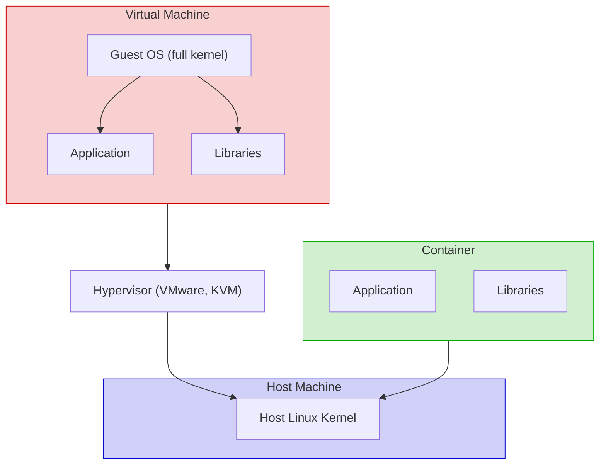

**Key Insight**: Containers share the host kernel. VMs don't. This is why containers start in milliseconds and VMs take minutes.

---

## The Three Pillars of Container Isolation

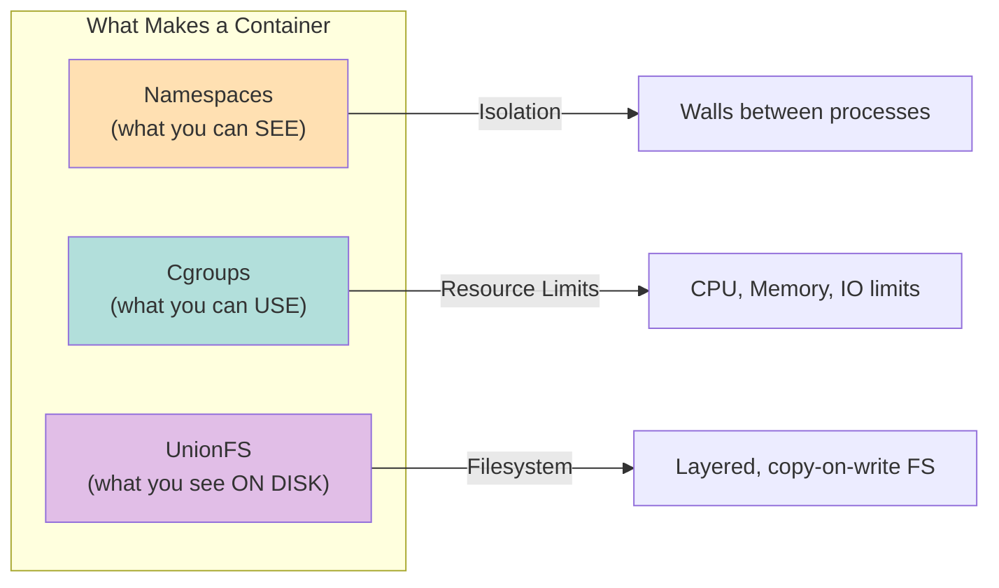

---

# 1. Linux Namespaces — Isolation (What You Can See)

Namespaces give each container its own **isolated view** of system resources. The container thinks it's the only process on the machine.

## The 7 Namespace Types

| Namespace | Flag | What It Isolates | Container Effect |
|-----------|------|------------------|------------------|
| **PID** | `CLONE_NEWPID` | Process IDs | Container sees its process as PID 1 |
| **NET** | `CLONE_NEWNET` | Network stack | Own IP, ports, routing table |
| **MNT** | `CLONE_NEWNS` | Filesystem mounts | Own root filesystem |
| **UTS** | `CLONE_NEWUTS` | Hostname | Own hostname |
| **IPC** | `CLONE_NEWIPC` | Inter-process communication | Isolated shared memory, semaphores |
| **USER** | `CLONE_NEWUSER` | User/Group IDs | Root inside container ≠ root on host |
| **CGROUP** | `CLONE_NEWCGROUP` | Cgroup root | Own cgroup hierarchy view |

### How Namespaces Work — Visual

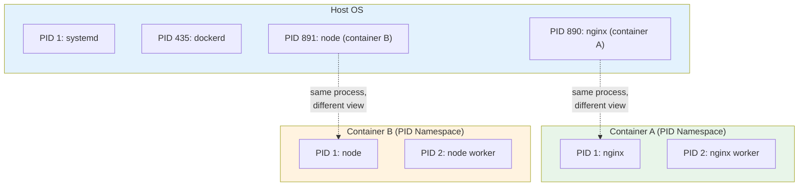

**PID 890 on the host IS PID 1 inside Container A** — it's the same process, just viewed through different namespace lenses.

### PID Namespace Deep Dive

- Container processes see themselves starting from PID 1
- PID 1 inside the container is the **init process** — if it dies, the container dies
- This is why signal handling matters (exec form vs shell form in Dockerfile)
- The host can see ALL container processes, but containers can't see each other

### NET Namespace Deep Dive

Each container gets its own:
- Network interfaces (`eth0`)
- IP address
- Routing table
- iptables rules
- Port space (two containers can both listen on port 80)

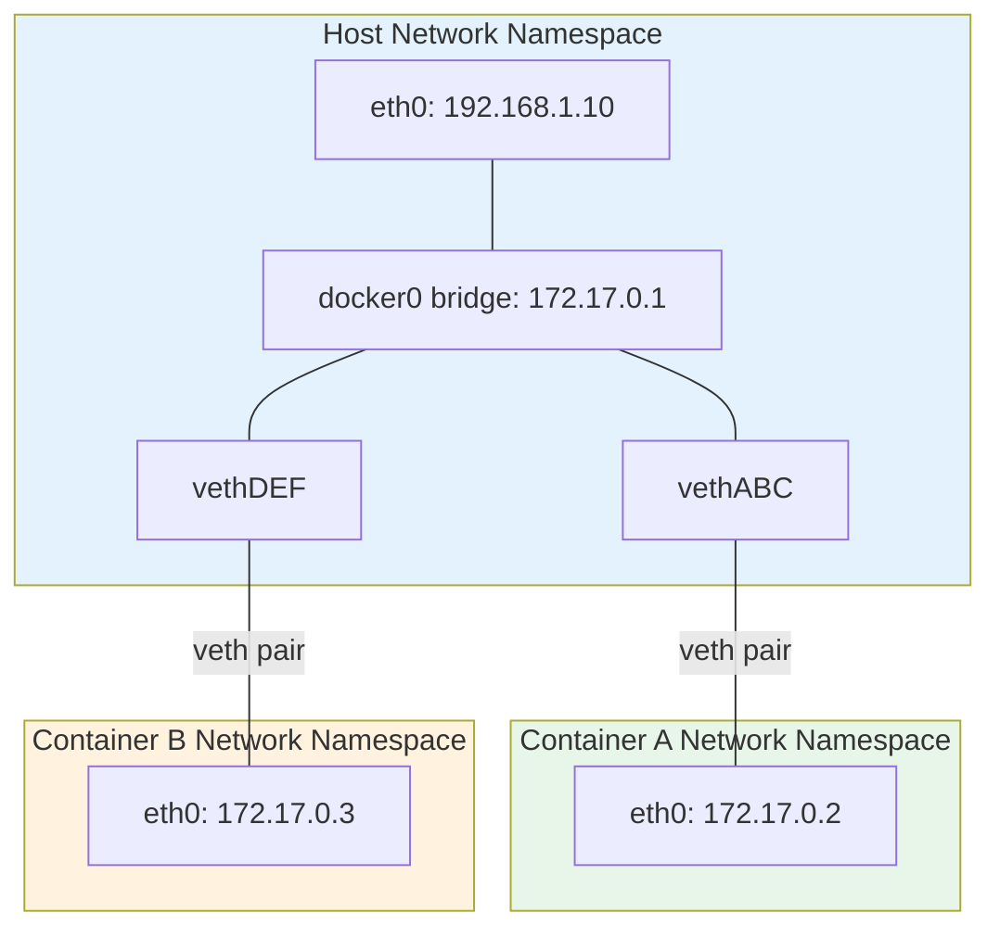

### MNT Namespace

- Each container sees its own filesystem root (via `pivot_root`)
- The container's root (`/`) is actually an overlay mount point on the host
- Container can't see host files unless you bind-mount them

### USER Namespace (Rootless Containers)

- Maps UID 0 (root) inside container to a non-root UID on the host
- This is how **rootless Docker** works
- Even if an attacker breaks out of the container, they're not root on the host

## Hands-on: Inspecting Namespaces

```bash
# Get container's PID on the host
docker inspect --format '{{.State.Pid}}' <container>

# List all namespaces for that process
ls -la /proc/<PID>/ns/
# Output: cgroup, ipc, mnt, net, pid, pid_for_children, user, uts

# Enter a container's network namespace manually
nsenter -t <PID> -n ip addr

# Compare: host sees all processes
ps aux | grep nginx
# Container sees only its own
docker exec <container> ps aux
```

---

# 2. Cgroups — Resource Limits (What You Can Use)

Cgroups (Control Groups) **limit, account for, and isolate** resource usage. Without cgroups, one container could consume ALL host CPU/memory and starve everything else.

## What Cgroups Control

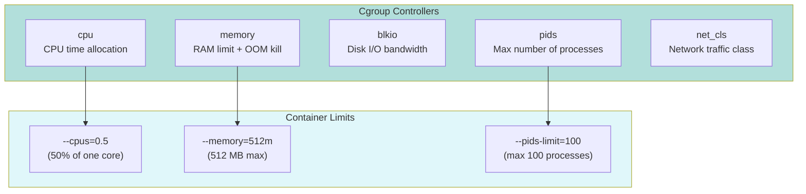

## CPU Limits vs Memory Limits — Critical Difference

| Resource | What Happens When Limit Hit | Effect |
|----------|---------------------------|--------|
| **CPU** | Process is **throttled** | Slows down, but keeps running |
| **Memory** | Process is **OOM-killed** | Container crashes and restarts |

This is one of the **most important things to understand** for production:
- CPU limit exceeded → your app gets slower (throttled), but stays alive
- Memory limit exceeded → Linux OOM killer terminates your process immediately

## How Docker Maps to Cgroups

```bash
# Run container with limits
docker run -d --name limited \
  --cpus="0.5" \
  --memory="256m" \
  --pids-limit=50 \
  nginx

# See the cgroup files created (cgroups v2)
# On the host:
cat /sys/fs/cgroup/docker/<container-id>/cpu.max
# Output: 50000 100000  (50% of one CPU)

cat /sys/fs/cgroup/docker/<container-id>/memory.max
# Output: 268435456  (256 MB in bytes)

# Monitor real-time resource usage
docker stats limited
```

## Cgroups v1 vs v2

| Feature | Cgroups v1 | Cgroups v2 |
|---------|-----------|-----------|
| Structure | Multiple hierarchies | Single unified hierarchy |
| Memory + CPU | Separate controllers | Combined, easier to manage |
| OOM handling | Basic | Improved (PSI support) |
| Used by | Older Docker/K8s | Modern Docker/K8s (default now) |

---

# 3. UnionFS / OverlayFS — Layered Filesystem (What You See on Disk)

You covered this in [2_Docker_images.md](./2_Docker_images.md) and [7_Docker_Storage.md](./7_Docker_Storage.md). Here's the visual mental model connecting it to container internals.

## How OverlayFS Merges Layers

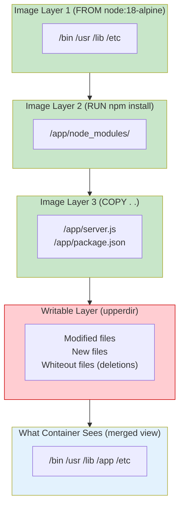

## Copy-on-Write in Action

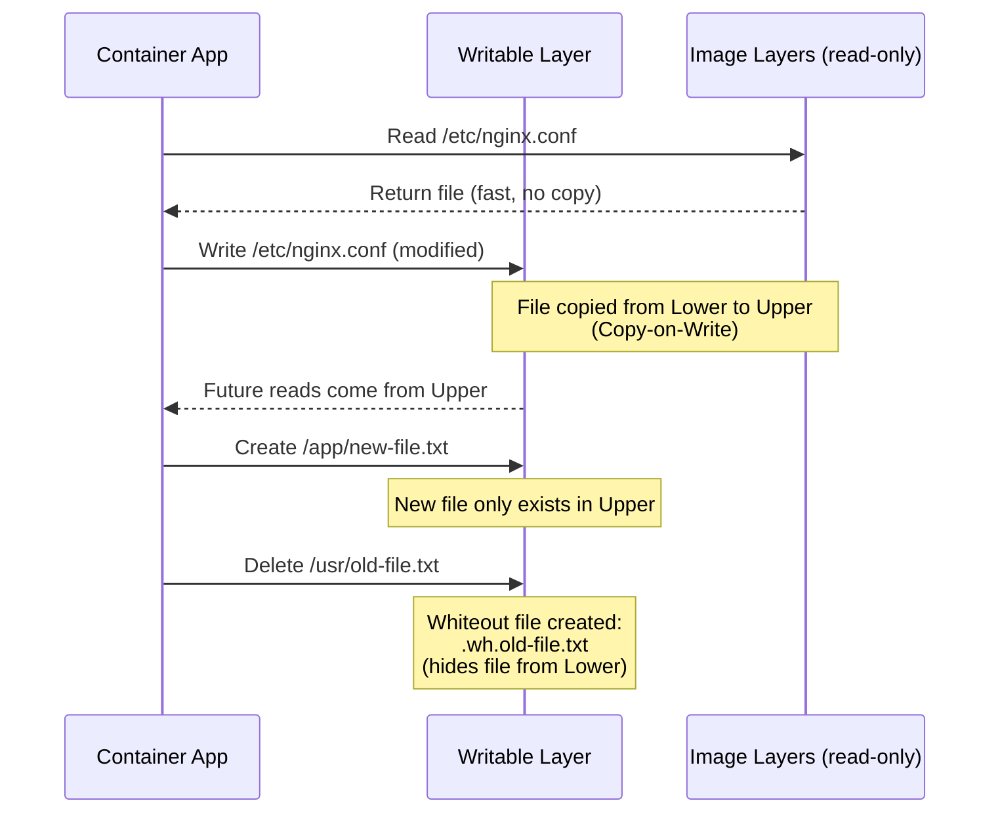

## Why This Matters for Performance

- **Read-heavy workloads**: Fast — reads go directly to image layers (shared, cached)
- **Write-heavy workloads**: Slow — every first write to an existing file triggers a full copy
- **Databases**: MUST use volumes, not the writable layer (CoW is terrible for random writes)

---

# 4. Putting It All Together — Container Creation Flow

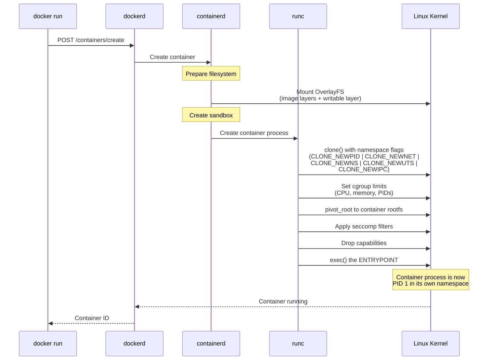

## What Each Component Does

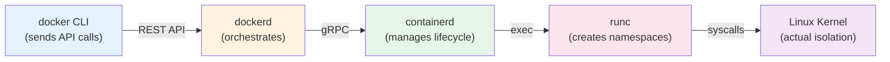

| Component | Role | Analogy |
|-----------|------|---------|
| `docker` CLI | Send commands | You calling a restaurant |
| `dockerd` | Coordinate everything | Restaurant manager |
| `containerd` | Manage container lifecycle | Kitchen manager |
| `runc` | Create the isolated process | Chef who actually cooks |
| Linux Kernel | Provide isolation primitives | Kitchen equipment |

---

# 5. Security Primitives (Beyond Namespaces & Cgroups)

Containers use additional kernel features for defense-in-depth:

### Seccomp (Secure Computing)

Filters which **system calls** a container can make. Docker's default seccomp profile blocks ~44 dangerous syscalls (like `reboot`, `mount`, `kexec_load`).

### Linux Capabilities

Instead of giving containers full root power, Docker drops most capabilities. A container by default can NOT:
- Mount filesystems (`CAP_SYS_ADMIN`)
- Change system time (`CAP_SYS_TIME`)
- Load kernel modules (`CAP_SYS_MODULE`)

```bash
# See capabilities of a container process
docker exec <container> cat /proc/1/status | grep Cap

# Run with all capabilities dropped, add only what you need
docker run --cap-drop ALL --cap-add NET_BIND_SERVICE nginx
```

### AppArmor / SELinux

Mandatory Access Control — even if a process has the right UID, these policies can deny access based on profiles/labels.

---

# 6. Container vs VM — Complete Comparison

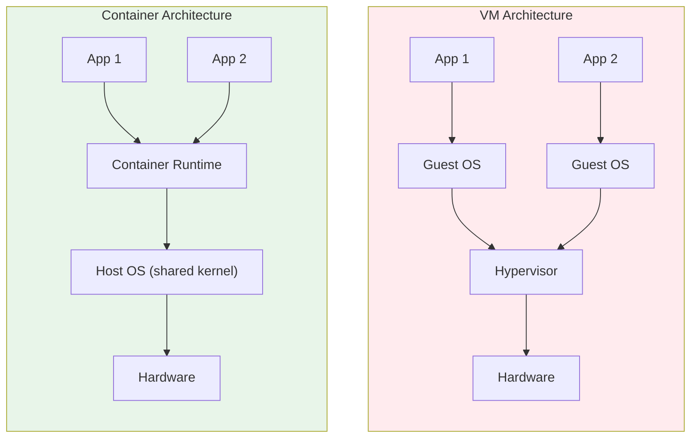

| Aspect | Container | VM |
|--------|-----------|-----|
| **Startup time** | Milliseconds | Minutes |
| **Size** | MBs | GBs |
| **Kernel** | Shared with host | Own kernel |
| **Isolation** | Process-level (namespaces) | Hardware-level (hypervisor) |
| **Performance** | Near-native | ~5-10% overhead |
| **Security** | Weaker (shared kernel) | Stronger (separate kernel) |
| **Density** | 100s per host | 10s per host |
| **Use case** | Microservices, CI/CD | Full OS isolation, legacy apps |

---

# Summary

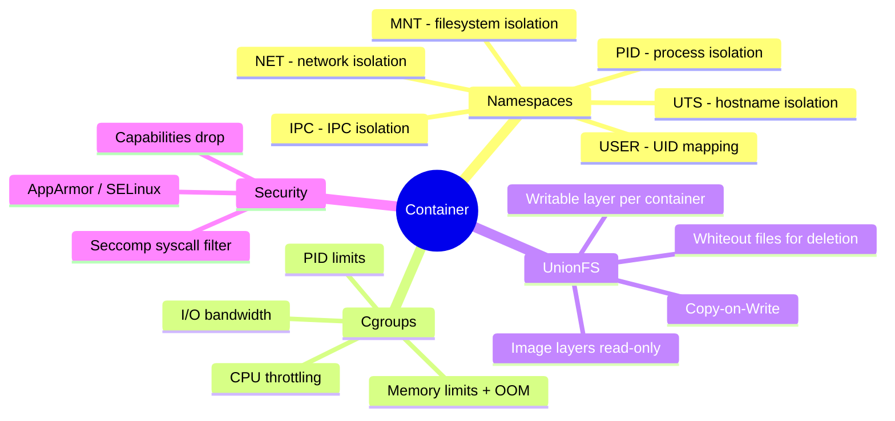

**A container is a Linux process with**: isolated view (namespaces) + resource limits (cgroups) + layered filesystem (UnionFS) + security hardening (seccomp/capabilities).

---

> **Next**: [11_Multi_Stage_Builds.md](./11_Multi_Stage_Builds.md) — Building production-grade Docker images
