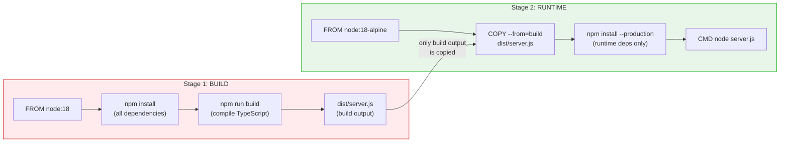
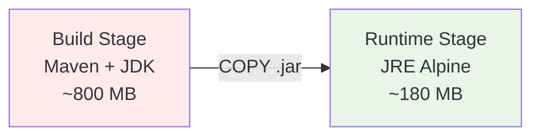
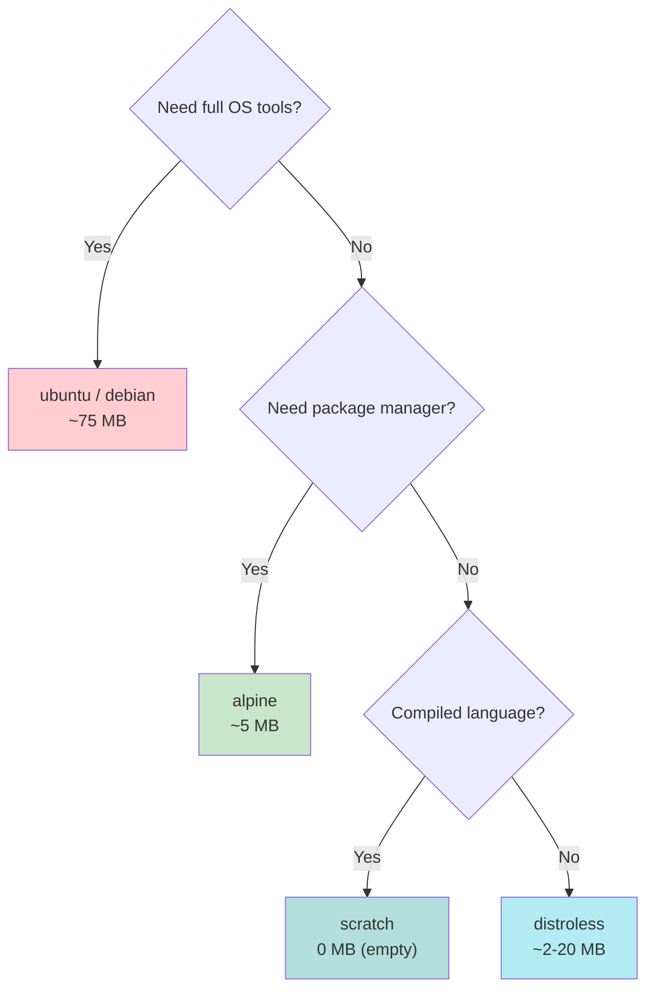
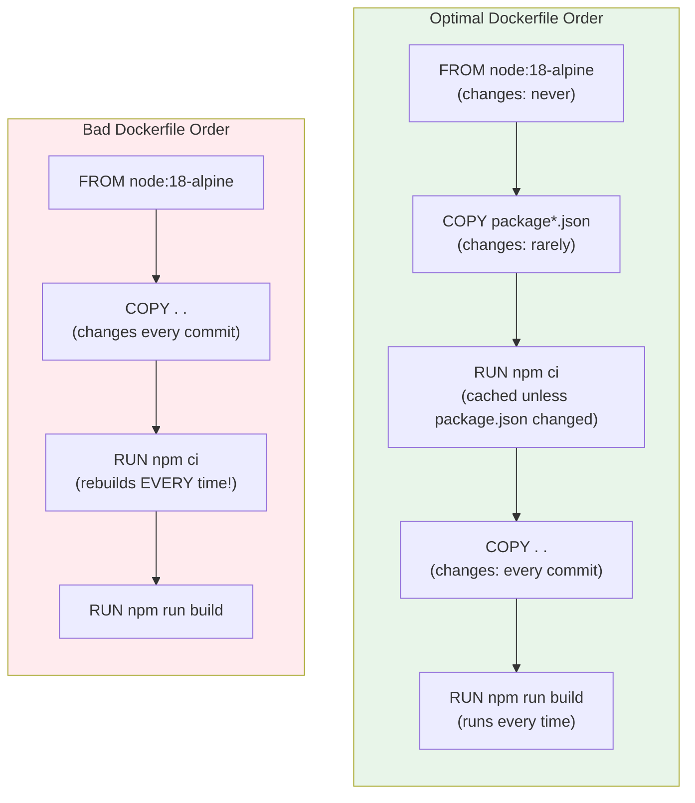
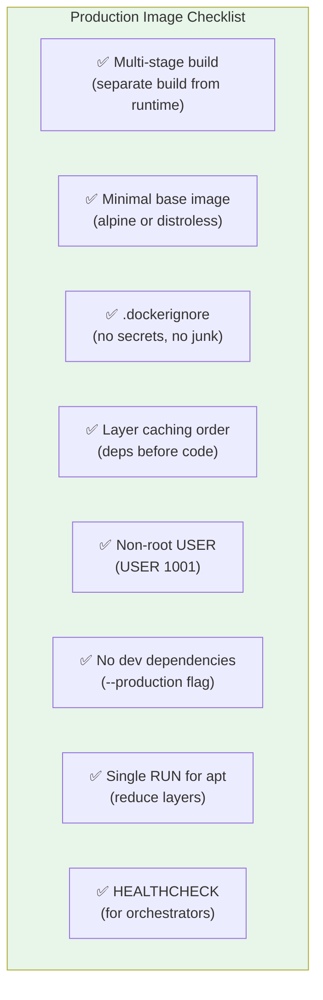
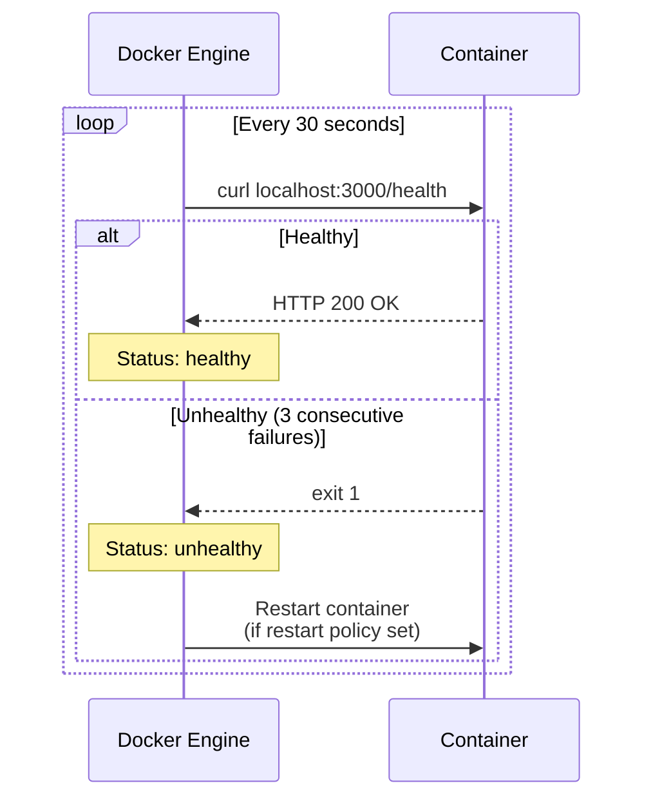

# Multi-Stage Builds & Production-Grade Images

> **Prerequisites**: [2_Docker_images.md](./2_Docker_images.md), [10_Container_Internals.md](./10_Container_Internals.md)  
> **Next**: [12_Docker_Security.md](./12_Docker_Security.md)

You know how to build images. Now learn to build **small, secure, fast** production images using multi-stage builds, layer caching strategy, and base image selection.

---

## Why Image Size Matters

| Problem | Caused By |
|---------|-----------|
| Slow deployments | Large images take longer to pull |
| Higher attack surface | More packages = more CVEs |
| Wasted storage/bandwidth | Bloated images across registries + nodes |
| Slower auto-scaling | New nodes must pull images before pods start |

**Goal**: Ship only what's needed to RUN the app, not what's needed to BUILD it.

---

## The Problem: Single-Stage Builds

```dockerfile
FROM node:18
WORKDIR /app
COPY . .
RUN npm install
RUN npm run build
CMD ["node", "dist/server.js"]
```

This image contains:
- Full Node.js runtime + npm
- All dev dependencies (typescript, eslint, test frameworks)
- Source code (not needed at runtime)
- Build artifacts (webpack cache, etc.)

**Result**: ~1.2 GB image when you only need ~50 MB to run.

---

## The Solution: Multi-Stage Builds



### Dockerfile

```dockerfile
# ---- Stage 1: Build ----
FROM node:18 AS build
WORKDIR /app
COPY package*.json ./
RUN npm ci
COPY . .
RUN npm run build

# ---- Stage 2: Runtime ----
FROM node:18-alpine
WORKDIR /app
COPY --from=build /app/dist ./dist
COPY --from=build /app/node_modules ./node_modules
COPY package*.json ./
EXPOSE 3000
USER 1001
CMD ["node", "dist/server.js"]
```

**Result**: Build stage is ~1.2 GB, final image is ~150 MB. Only the runtime stage ships.

---

## Multi-Stage Build for Different Languages

### Java (Spring Boot)

```dockerfile
# Stage 1: Build with Maven
FROM maven:3.9-eclipse-temurin-21 AS build
WORKDIR /app
COPY pom.xml .
RUN mvn dependency:go-offline    # cache dependencies
COPY src ./src
RUN mvn package -DskipTests

# Stage 2: Runtime with JRE only
FROM eclipse-temurin:21-jre-alpine
COPY --from=build /app/target/*.jar /app/app.jar
EXPOSE 8080
USER 1001
ENTRYPOINT ["java", "-jar", "/app/app.jar"]
```



### Go (Best Case — Scratch Image)

```dockerfile
FROM golang:1.22-alpine AS build
WORKDIR /app
COPY go.mod go.sum ./
RUN go mod download
COPY . .
RUN CGO_ENABLED=0 GOOS=linux go build -o /server .

FROM scratch
COPY --from=build /server /server
EXPOSE 8080
ENTRYPOINT ["/server"]
```

**Result**: Final image is just the Go binary — **~10-15 MB**. `scratch` is literally an empty image.

### Python (Django/FastAPI)

```dockerfile
FROM python:3.12-slim AS build
WORKDIR /app
COPY requirements.txt .
RUN pip install --no-cache-dir --prefix=/install -r requirements.txt

FROM python:3.12-slim
WORKDIR /app
COPY --from=build /install /usr/local
COPY . .
EXPOSE 8000
USER 1001
CMD ["gunicorn", "app.wsgi:application", "--bind", "0.0.0.0:8000"]
```

---

## Base Image Selection



| Base Image | Size | Shell? | Package Manager? | Best For |
|-----------|------|--------|-----------------|----------|
| `ubuntu` | ~75 MB | ✅ | ✅ apt | Development, debugging |
| `debian-slim` | ~50 MB | ✅ | ✅ apt | Smaller general purpose |
| `alpine` | ~5 MB | ✅ | ✅ apk | Most production apps |
| `distroless` | ~2-20 MB | ❌ | ❌ | High-security production |
| `scratch` | 0 MB | ❌ | ❌ | Compiled binaries (Go, Rust) |

### Alpine Gotcha

Alpine uses `musl` libc instead of `glibc`. This can cause issues with:
- Python C extensions
- Node.js native modules
- Some Java libraries

If you hit weird crashes, try `*-slim` (Debian-based) instead of `*-alpine`.

---

## Layer Caching Strategy — The Key to Fast Builds



### The Rule

**Order instructions from LEAST-changing to MOST-changing.** The moment a layer changes, ALL subsequent layers are invalidated and rebuilt.

### Cache-Friendly Patterns

```dockerfile
# 1. System dependencies first (rarely change)
FROM python:3.12-slim
RUN apt-get update && apt-get install -y \
    libpq-dev \
    && rm -rf /var/lib/apt/lists/*

# 2. Language dependencies next (change occasionally)
WORKDIR /app
COPY requirements.txt .
RUN pip install --no-cache-dir -r requirements.txt

# 3. Application code last (changes every commit)
COPY . .

# 4. Build step
RUN python manage.py collectstatic --noinput

CMD ["gunicorn", "app.wsgi:application"]
```

---

## .dockerignore — Don't Send Secrets to the Build

The build context (everything in `.`) is sent to the Docker daemon. A `.dockerignore` file excludes unnecessary files.

```
# .dockerignore
.git
.gitignore
node_modules
dist
*.md
.env
.env.*
docker-compose*.yml
Dockerfile*
.vscode
__pycache__
*.pyc
.pytest_cache
coverage/
.idea
```

**Why this matters**:
- Prevents accidentally including `.env` files with secrets in the image
- Speeds up build context transfer
- Prevents `COPY . .` from invalidating cache due to irrelevant file changes

---

## Image Optimization Checklist



### Reduce Layers — Combine RUN Commands

```dockerfile
# BAD: 3 layers
RUN apt-get update
RUN apt-get install -y curl
RUN rm -rf /var/lib/apt/lists/*

# GOOD: 1 layer, cleanup in same layer
RUN apt-get update && \
    apt-get install -y --no-install-recommends curl && \
    rm -rf /var/lib/apt/lists/*
```

The cleanup (`rm -rf`) must be in the **same RUN** command. If it's in a separate RUN, the large files are already baked into the previous layer.

---

## Analyzing Image Size

```bash
# See image size
docker images myapp

# See layer-by-layer breakdown
docker history myapp --no-trunc

# Best tool: dive (interactive layer explorer)
# Install: https://github.com/wagoodman/dive
dive myapp:latest
```

`dive` shows you:
- Each layer's size and what files were added
- Wasted space (files added then deleted in a later layer)
- Image efficiency score

---

## HEALTHCHECK in Dockerfile

```dockerfile
HEALTHCHECK --interval=30s --timeout=5s --start-period=10s --retries=3 \
  CMD curl -f http://localhost:3000/health || exit 1
```



This is especially important for Docker Compose `depends_on` with `condition: service_healthy`.

---

## Complete Production Dockerfile Template

```dockerfile
# ---- Stage 1: Build ----
FROM node:18-alpine AS build
WORKDIR /app

# Dependencies first (cached layer)
COPY package*.json ./
RUN npm ci --only=production && \
    cp -R node_modules prod_node_modules && \
    npm ci

# Build app
COPY . .
RUN npm run build

# ---- Stage 2: Production ----
FROM node:18-alpine

# Security: non-root user
RUN addgroup -g 1001 appgroup && \
    adduser -u 1001 -G appgroup -s /bin/sh -D appuser

WORKDIR /app

# Only production artifacts
COPY --from=build /app/dist ./dist
COPY --from=build /app/prod_node_modules ./node_modules
COPY --from=build /app/package*.json ./

# Security: drop privileges
USER appuser

# Metadata
EXPOSE 3000

HEALTHCHECK --interval=30s --timeout=5s --retries=3 \
  CMD wget --no-verbose --tries=1 --spider http://localhost:3000/health || exit 1

CMD ["node", "dist/server.js"]
```

---

## Summary

| Technique | Impact |
|-----------|--------|
| Multi-stage build | 5-10x smaller images |
| Alpine base | 10-15x smaller than ubuntu |
| .dockerignore | Faster builds, no secret leaks |
| Layer ordering | Cached builds (seconds vs minutes) |
| Non-root user | Security hardening |
| HEALTHCHECK | Orchestrator-aware container health |
| Combined RUN | Fewer layers, no wasted space |

---

> **Next**: [12_Docker_Security.md](./12_Docker_Security.md) — Securing containers for production
