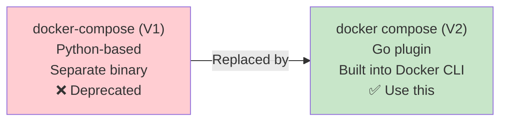
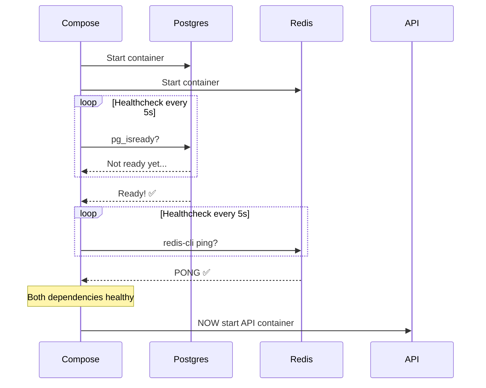
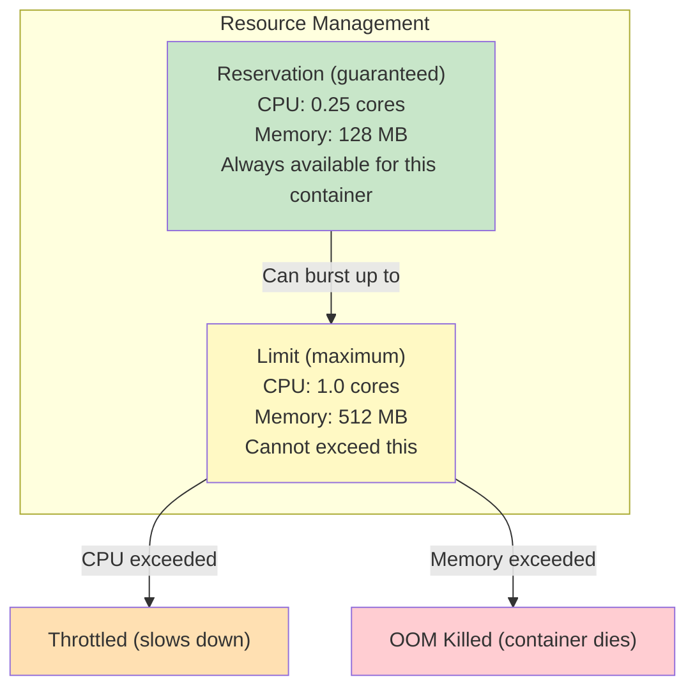
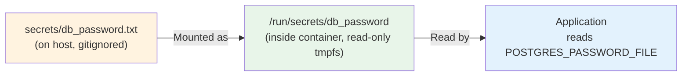
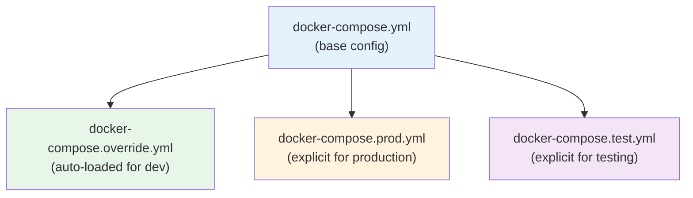

# Docker Compose — Production Patterns

> **Prerequisites**: [4_DockerCompose.md](./4_DockerCompose.md), [12_Docker_Security.md](./12_Docker_Security.md)  
> **Next**: Kubernetes — [../../../Kubernetes/Notes/9_ConfigMaps_and_Secrets.md](../../Kubernetes/Notes/9_ConfigMaps_and_Secrets.md)

You know Compose basics. This doc covers patterns you need for **production-grade** multi-container applications: real healthchecks, resource limits, secrets, profiles, and environment management.

---

## Compose V2 vs V1



Always use `docker compose` (space, not hyphen). The `version:` field in YAML is now **optional and ignored** in V2.

---

# 1. Healthchecks + Dependency Ordering (The Right Way)

### The Problem with `depends_on`

```yaml
# ❌ This only waits for the container to START, not be READY
services:
  api:
    depends_on:
      - db
  db:
    image: postgres
```

The API starts before Postgres is ready to accept connections → crash.

### The Solution: `condition: service_healthy`

```yaml
services:
  api:
    build: .
    depends_on:
      db:
        condition: service_healthy
      redis:
        condition: service_healthy

  db:
    image: postgres:16-alpine
    environment:
      POSTGRES_PASSWORD: ${DB_PASSWORD}
    healthcheck:
      test: ["CMD-SHELL", "pg_isready -U postgres"]
      interval: 5s
      timeout: 3s
      retries: 5
      start_period: 10s

  redis:
    image: redis:7-alpine
    healthcheck:
      test: ["CMD", "redis-cli", "ping"]
      interval: 5s
      timeout: 3s
      retries: 5
```



### Common Healthcheck Commands

| Service | Healthcheck |
|---------|-------------|
| Postgres | `pg_isready -U postgres` |
| MySQL | `mysqladmin ping -h localhost` |
| Redis | `redis-cli ping` |
| MongoDB | `mongosh --eval "db.runCommand('ping')"` |
| Elasticsearch | `curl -f http://localhost:9200/_cluster/health` |
| HTTP API | `curl -f http://localhost:8080/health` |
| gRPC API | `grpc_health_probe -addr=:50051` |

---

# 2. Resource Limits

Without limits, a single container can consume ALL host CPU/memory. In production, always set limits.

```yaml
services:
  api:
    build: .
    deploy:
      resources:
        limits:
          cpus: "1.0"        # Max 1 CPU core
          memory: 512M       # Max 512 MB RAM
        reservations:
          cpus: "0.25"       # Guaranteed 0.25 CPU
          memory: 128M       # Guaranteed 128 MB RAM
```



---

# 3. Secrets Management

Never put passwords in `environment:` in the compose file committed to git.

### Option 1: `.env` File (Simple, Dev/Staging)

```
# .env (gitignored!)
DB_PASSWORD=supersecret
REDIS_URL=redis://redis:6379
API_KEY=abc123
```

```yaml
services:
  api:
    environment:
      - DB_PASSWORD=${DB_PASSWORD}
      - API_KEY=${API_KEY}
```

### Option 2: Docker Secrets (More Secure)

```yaml
services:
  db:
    image: postgres:16-alpine
    environment:
      POSTGRES_PASSWORD_FILE: /run/secrets/db_password
    secrets:
      - db_password

secrets:
  db_password:
    file: ./secrets/db_password.txt    # This file is gitignored
```



---

# 4. Profiles — Run Subsets of Services

```yaml
services:
  api:
    build: .
    ports: ["8080:3000"]

  db:
    image: postgres:16-alpine

  redis:
    image: redis:7-alpine

  # Debug tools — only run when needed
  adminer:
    image: adminer
    ports: ["8081:8080"]
    profiles: ["debug"]

  redis-commander:
    image: rediscommander/redis-commander
    ports: ["8082:8081"]
    profiles: ["debug"]

  # Monitoring — only in production
  prometheus:
    image: prom/prometheus
    profiles: ["monitoring"]
```

```bash
# Normal dev — only api, db, redis start
docker compose up

# With debug tools
docker compose --profile debug up

# With monitoring
docker compose --profile monitoring up

# Everything
docker compose --profile debug --profile monitoring up
```

---

# 5. Multi-Environment Management



### Base: `docker-compose.yml`

```yaml
services:
  api:
    build: .
    depends_on:
      db:
        condition: service_healthy
  db:
    image: postgres:16-alpine
    healthcheck:
      test: ["CMD-SHELL", "pg_isready"]
      interval: 5s
      retries: 5
```

### Dev Override: `docker-compose.override.yml` (auto-loaded)

```yaml
services:
  api:
    volumes:
      - .:/app                    # Live reload
    ports:
      - "8080:3000"
      - "9229:9229"               # Debugger port
    environment:
      NODE_ENV: development
    command: ["npm", "run", "dev"]
```

### Production: `docker-compose.prod.yml`

```yaml
services:
  api:
    ports:
      - "3000:3000"
    environment:
      NODE_ENV: production
    deploy:
      resources:
        limits:
          cpus: "1.0"
          memory: 512M
    restart: unless-stopped
    read_only: true
    tmpfs:
      - /tmp

  db:
    volumes:
      - pgdata:/var/lib/postgresql/data
    restart: unless-stopped

volumes:
  pgdata:
```

```bash
# Dev (auto-loads override)
docker compose up

# Production (explicit)
docker compose -f docker-compose.yml -f docker-compose.prod.yml up -d
```

---

# 6. Logging Configuration

```yaml
services:
  api:
    logging:
      driver: "json-file"
      options:
        max-size: "10m"       # Max 10 MB per log file
        max-file: "3"         # Keep 3 rotated files
```

Without this, container logs grow unbounded and can fill your disk.

---

# 7. Complete Production Compose Example

```yaml
services:
  api:
    build:
      context: .
      dockerfile: Dockerfile
    ports:
      - "8080:3000"
    depends_on:
      db:
        condition: service_healthy
      redis:
        condition: service_healthy
    environment:
      NODE_ENV: production
      DB_HOST: db
      DB_PORT: 5432
      DB_NAME: myapp
      DB_USER: postgres
      DB_PASSWORD_FILE: /run/secrets/db_password
      REDIS_URL: redis://redis:6379
    secrets:
      - db_password
    deploy:
      resources:
        limits:
          cpus: "1.0"
          memory: 512M
        reservations:
          cpus: "0.25"
          memory: 128M
    healthcheck:
      test: ["CMD", "wget", "--spider", "-q", "http://localhost:3000/health"]
      interval: 15s
      timeout: 5s
      retries: 3
      start_period: 30s
    restart: unless-stopped
    read_only: true
    tmpfs:
      - /tmp
    logging:
      driver: "json-file"
      options:
        max-size: "10m"
        max-file: "3"

  db:
    image: postgres:16-alpine
    volumes:
      - pgdata:/var/lib/postgresql/data
    environment:
      POSTGRES_DB: myapp
      POSTGRES_USER: postgres
      POSTGRES_PASSWORD_FILE: /run/secrets/db_password
    secrets:
      - db_password
    healthcheck:
      test: ["CMD-SHELL", "pg_isready -U postgres"]
      interval: 5s
      timeout: 3s
      retries: 5
    restart: unless-stopped
    deploy:
      resources:
        limits:
          cpus: "0.5"
          memory: 256M

  redis:
    image: redis:7-alpine
    command: ["redis-server", "--maxmemory", "128mb", "--maxmemory-policy", "allkeys-lru"]
    healthcheck:
      test: ["CMD", "redis-cli", "ping"]
      interval: 5s
      timeout: 3s
      retries: 5
    restart: unless-stopped

secrets:
  db_password:
    file: ./secrets/db_password.txt

volumes:
  pgdata:
```

---

## Summary

| Pattern | What It Solves |
|---------|---------------|
| `condition: service_healthy` | Start order based on readiness, not just startup |
| `deploy.resources.limits` | Prevent runaway containers eating all resources |
| Docker secrets | Avoid plain-text passwords in compose files |
| Profiles | Run debug/monitoring tools only when needed |
| Override files | Same base config, different envs (dev/prod) |
| Logging limits | Prevent disk fill from unbounded logs |
| `read_only` + `tmpfs` | Prevent malware writes |
| `restart: unless-stopped` | Self-healing for production |

---

> **Docker section complete!** You've covered: basics → images → networking → storage → engine → compose → internals → multi-stage → security → production compose.
>
> **Next up**: Kubernetes intermediate topics starting with [ConfigMaps & Secrets](../../Kubernetes/Notes/9_ConfigMaps_and_Secrets.md)
