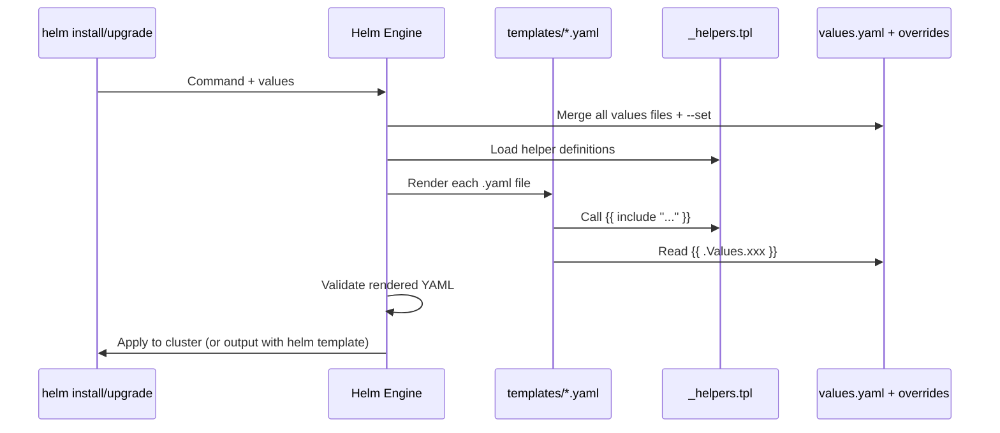
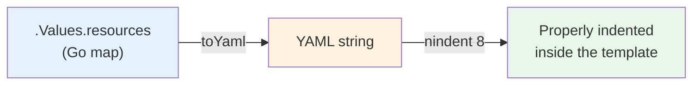
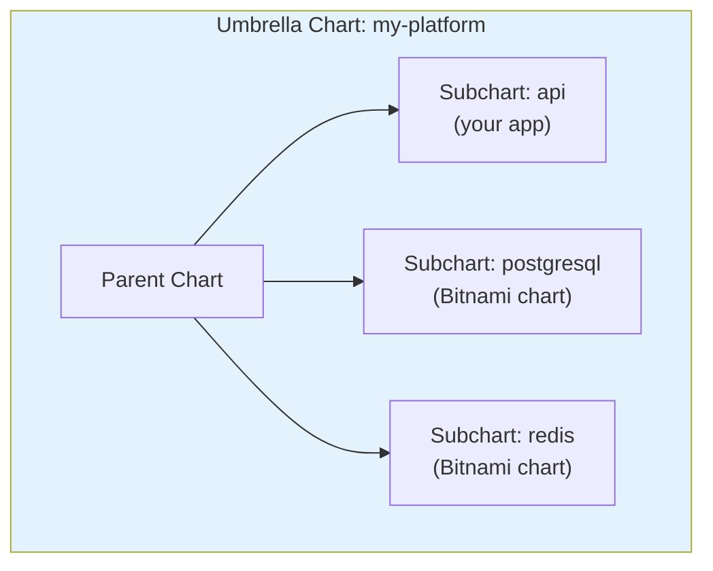
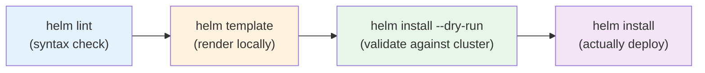

# Helm Advanced Templating — Production Patterns

> **Prerequisites**: [4_Helm_templating_and_merging_values.md](./4_Helm_templating_and_merging_values.md), [5_Helm_lifecycle.md](./5_Helm_lifecycle.md)  
> **Next**: [7_Helm_Production.md](./7_Helm_Production.md)

You know basic templating. This doc covers the patterns you need for **real-world charts**: named templates, flow control, subcharts, library charts, and debugging.

---

## How Helm Rendering Works



---

# 1. Named Templates & _helpers.tpl

Named templates are reusable blocks defined in `_helpers.tpl` and called from any template.

### Define

```yaml
# templates/_helpers.tpl

{{- define "myapp.name" -}}
{{- default .Chart.Name .Values.nameOverride | trunc 63 | trimSuffix "-" }}
{{- end }}

{{- define "myapp.fullname" -}}
{{- if .Values.fullnameOverride }}
{{- .Values.fullnameOverride | trunc 63 | trimSuffix "-" }}
{{- else }}
{{- printf "%s-%s" .Release.Name (include "myapp.name" .) | trunc 63 | trimSuffix "-" }}
{{- end }}
{{- end }}

{{- define "myapp.labels" -}}
helm.sh/chart: {{ printf "%s-%s" .Chart.Name .Chart.Version | replace "+" "_" }}
app.kubernetes.io/name: {{ include "myapp.name" . }}
app.kubernetes.io/instance: {{ .Release.Name }}
app.kubernetes.io/version: {{ .Chart.AppVersion | quote }}
app.kubernetes.io/managed-by: {{ .Release.Service }}
{{- end }}

{{- define "myapp.selectorLabels" -}}
app.kubernetes.io/name: {{ include "myapp.name" . }}
app.kubernetes.io/instance: {{ .Release.Name }}
{{- end }}
```

### Use

```yaml
# templates/deployment.yaml
apiVersion: apps/v1
kind: Deployment
metadata:
  name: {{ include "myapp.fullname" . }}
  labels:
    {{- include "myapp.labels" . | nindent 4 }}
spec:
  selector:
    matchLabels:
      {{- include "myapp.selectorLabels" . | nindent 6 }}
  template:
    metadata:
      labels:
        {{- include "myapp.selectorLabels" . | nindent 8 }}
    spec:
      containers:
        - name: {{ .Chart.Name }}
          image: "{{ .Values.image.repository }}:{{ .Values.image.tag }}"
```

### `include` vs `template`

| Function | Returns String? | Pipe-able? | Use |
|----------|----------------|------------|-----|
| `include` | ✅ Yes | ✅ Yes | Almost always use this |
| `template` | ❌ No (prints directly) | ❌ No | Avoid — can't indent |

```yaml
# ✅ include — can pipe to nindent
labels:
  {{- include "myapp.labels" . | nindent 4 }}

# ❌ template — breaks indentation
labels:
  {{ template "myapp.labels" . }}
```

---

# 2. Flow Control — Conditionals and Loops

### if / else

```yaml
{{- if .Values.ingress.enabled }}
apiVersion: networking.k8s.io/v1
kind: Ingress
metadata:
  name: {{ include "myapp.fullname" . }}
spec:
  rules:
    {{- range .Values.ingress.hosts }}
    - host: {{ .host }}
      http:
        paths:
          {{- range .paths }}
          - path: {{ .path }}
            pathType: {{ .pathType }}
            backend:
              service:
                name: {{ $.Values.service.name }}
                port:
                  number: {{ $.Values.service.port }}
          {{- end }}
    {{- end }}
{{- end }}
```

Note: Inside `range`, the context `.` changes. Use `$` to access the root context.

### Whitespace Control

```yaml
# {{-  trims whitespace BEFORE
# -}}  trims whitespace AFTER

{{- if .Values.debug }}
debug: true
{{- end }}
```

Without `{{-`, you'd get blank lines in the output YAML.

### with (scoped context)

```yaml
{{- with .Values.nodeSelector }}
nodeSelector:
  {{- toYaml . | nindent 2 }}
{{- end }}
```

`with` narrows `.` to `.Values.nodeSelector`. If it's empty/nil, the entire block is skipped.

---

# 3. Working with Complex Values

### toYaml + nindent — The Essential Pattern

When passing complex objects (maps, lists) from values into templates:

```yaml
# values.yaml
resources:
  requests:
    cpu: 250m
    memory: 128Mi
  limits:
    cpu: "1"
    memory: 512Mi

env:
  - name: DB_HOST
    value: postgres
  - name: LOG_LEVEL
    value: info

tolerations:
  - key: "dedicated"
    operator: "Equal"
    value: "gpu"
    effect: "NoSchedule"
```

```yaml
# template
spec:
  containers:
    - name: app
      resources:
        {{- toYaml .Values.resources | nindent 8 }}
      env:
        {{- toYaml .Values.env | nindent 8 }}
  tolerations:
    {{- toYaml .Values.tolerations | nindent 4 }}
```



### `nindent` vs `indent`

| Function | Behavior |
|----------|----------|
| `indent N` | Adds N spaces to every line |
| `nindent N` | Adds a newline first, then indents N spaces |

Use `nindent` almost always — it prevents YAML formatting issues.

---

# 4. Required Values & Defaults

### Fail if value is missing

```yaml
image: {{ required "image.repository is required" .Values.image.repository }}
```

If `image.repository` is not set, `helm install` fails with a clear error.

### Provide defaults

```yaml
replicas: {{ .Values.replicaCount | default 1 }}
type: {{ .Values.service.type | default "ClusterIP" }}
```

---

# 5. Subcharts & Dependencies

For complex apps (API + database + cache), use subcharts:



### Chart.yaml with Dependencies

```yaml
# Chart.yaml
apiVersion: v2
name: my-platform
version: 1.0.0

dependencies:
  - name: postgresql
    version: "13.2.0"
    repository: https://charts.bitnami.com/bitnami
    condition: postgresql.enabled
  - name: redis
    version: "18.4.0"
    repository: https://charts.bitnami.com/bitnami
    condition: redis.enabled
```

```bash
# Download dependencies
helm dependency update
# or
helm dependency build
```

### Passing Values to Subcharts

```yaml
# values.yaml (parent)

# Values for YOUR templates
replicaCount: 3
image:
  repository: myapi

# Values passed to postgresql subchart
postgresql:
  enabled: true
  auth:
    postgresPassword: mypassword
    database: myapp
  primary:
    persistence:
      size: 10Gi

# Values passed to redis subchart
redis:
  enabled: true
  architecture: standalone
```

Subchart values are namespaced by chart name in the parent's values.yaml.

---

# 6. Debugging Templates

### Preview rendered output (no install)

```bash
helm template my-release ./my-chart -f values-prod.yaml
```

### Dry run against cluster (validates API compatibility)

```bash
helm install my-release ./my-chart --dry-run --debug
```

### See the final merged values

```bash
helm get values my-release                # User-supplied values
helm get values my-release --all          # All values (including defaults)
```

### See the rendered manifests of a running release

```bash
helm get manifest my-release
```

### Lint chart for errors

```bash
helm lint ./my-chart
helm lint ./my-chart -f values-prod.yaml
```



### Common Rendering Errors

| Error | Cause | Fix |
|-------|-------|-----|
| `nil pointer evaluating` | Accessing a value that doesn't exist | Use `{{ .Values.x \| default "" }}` or `{{- if .Values.x }}` |
| Wrong indentation | Using `indent` instead of `nindent` | Switch to `nindent` |
| `YAML parse error` | Template output isn't valid YAML | Run `helm template` and inspect output |
| `cannot load Chart.yaml` | Wrong directory or missing file | Check chart structure |

---

# 7. Helm Test

Test your chart after deployment:

```yaml
# templates/tests/test-connection.yaml
apiVersion: v1
kind: Pod
metadata:
  name: "{{ include "myapp.fullname" . }}-test"
  annotations:
    "helm.sh/hook": test
spec:
  containers:
    - name: test
      image: busybox
      command: ['wget']
      args: ['{{ include "myapp.fullname" . }}:{{ .Values.service.port }}']
  restartPolicy: Never
```

```bash
helm test my-release
```

---

## Summary

| Pattern | When to Use |
|---------|------------|
| `_helpers.tpl` | Reusable name/label templates |
| `include` + `nindent` | Insert helpers with proper indentation |
| `toYaml` + `nindent` | Pass complex objects from values |
| `required` | Fail fast on missing required values |
| `default` | Provide safe fallbacks |
| `with` | Scope context to avoid repetition |
| `range` + `$` | Loop through lists, use `$` for root context |
| Subcharts | Compose apps from reusable charts |
| `helm template` | Debug rendering without deploying |
| `helm lint` | Catch syntax errors early |

---

> **Next**: [7_Helm_Production.md](./7_Helm_Production.md) — Production deployment patterns with Helm
