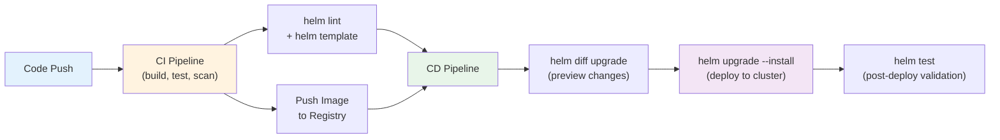
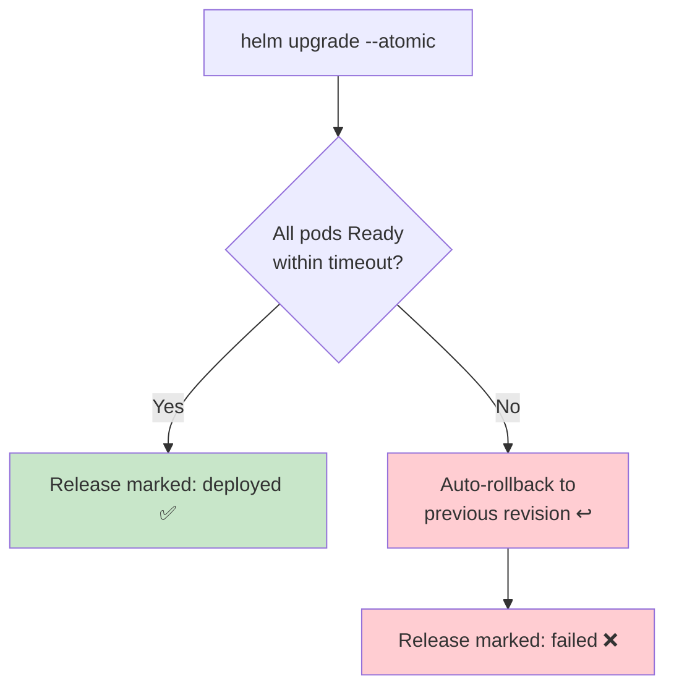
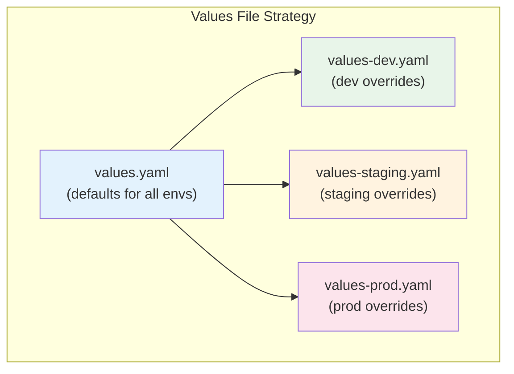
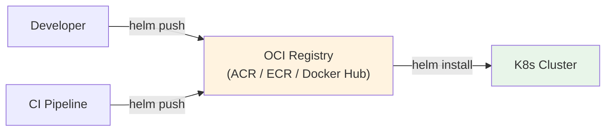
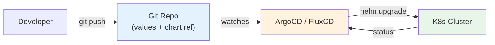
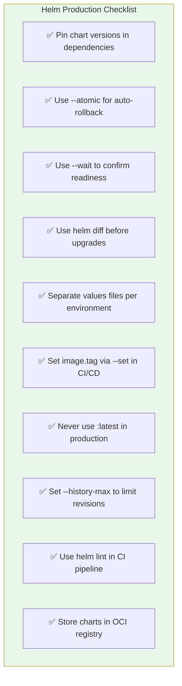
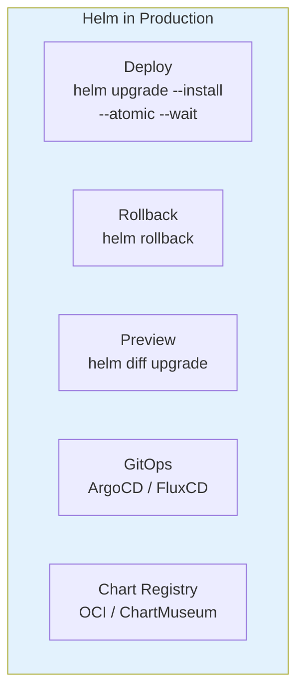

# Helm Production Patterns — CI/CD, GitOps & Best Practices

> **Prerequisites**: [5_Helm_lifecycle.md](./5_Helm_lifecycle.md), [6_Advanced_Templating.md](./6_Advanced_Templating.md)  
> **Connects to**: System Design — Deployment Strategies

This doc covers how Helm is used in real production environments: CI/CD integration, GitOps, chart repositories, versioning, and operational best practices.

---

## Helm in the Deployment Pipeline



---

# 1. `helm upgrade --install` — The Idempotent Deploy

The most important production command. Installs if the release doesn't exist, upgrades if it does.

```bash
helm upgrade --install my-api ./charts/api \
  --namespace production \
  --create-namespace \
  -f values.yaml \
  -f values-prod.yaml \
  --set image.tag=${GIT_SHA} \
  --wait \
  --timeout 5m \
  --atomic
```

### Critical Flags

| Flag | Purpose |
|------|---------|
| `--install` | Create release if it doesn't exist |
| `--wait` | Wait for pods to be Ready before marking success |
| `--timeout 5m` | Fail if not ready within 5 minutes |
| `--atomic` | Auto-rollback on failure |
| `--create-namespace` | Create namespace if missing |
| `--set image.tag=abc123` | Override image tag with commit SHA |

### `--atomic` Flow



---

# 2. Environment Management



### values.yaml (base defaults)

```yaml
replicaCount: 1
image:
  repository: myapp
  tag: latest
  pullPolicy: IfNotPresent

service:
  type: ClusterIP
  port: 80

resources:
  requests:
    cpu: 100m
    memory: 128Mi
  limits:
    cpu: 500m
    memory: 256Mi

ingress:
  enabled: false

autoscaling:
  enabled: false
```

### values-prod.yaml (production overrides)

```yaml
replicaCount: 3

image:
  pullPolicy: Always

resources:
  requests:
    cpu: 500m
    memory: 512Mi
  limits:
    cpu: "2"
    memory: 1Gi

ingress:
  enabled: true
  hosts:
    - host: api.example.com
      paths:
        - path: /
          pathType: Prefix
  tls:
    - secretName: api-tls
      hosts:
        - api.example.com

autoscaling:
  enabled: true
  minReplicas: 3
  maxReplicas: 10
  targetCPUUtilization: 70
```

### Deploy Commands

```bash
# Dev
helm upgrade --install api ./charts/api -f values.yaml -f values-dev.yaml -n dev

# Staging
helm upgrade --install api ./charts/api -f values.yaml -f values-staging.yaml -n staging

# Production
helm upgrade --install api ./charts/api \
  -f values.yaml -f values-prod.yaml \
  --set image.tag=${RELEASE_TAG} \
  -n production --atomic --wait --timeout 5m
```

---

# 3. Rollback Strategy

```bash
# View release history
helm history my-api -n production

# Rollback to previous revision
helm rollback my-api 0 -n production    # 0 = previous revision

# Rollback to specific revision
helm rollback my-api 5 -n production

# Rollback with wait
helm rollback my-api 5 --wait --timeout 3m
```

### History Limit

By default, Helm keeps 10 revisions. In long-running environments, set a limit:

```bash
helm upgrade --install my-api ./chart \
  --history-max 5
```

---

# 4. helm diff — Preview Before Deploy

The `helm-diff` plugin shows exactly what will change before you apply.

```bash
# Install plugin
helm plugin install https://github.com/databus23/helm-diff

# Preview changes
helm diff upgrade my-api ./charts/api \
  -f values.yaml -f values-prod.yaml \
  --set image.tag=${NEW_TAG} \
  -n production
```

Output shows added/removed/changed lines — like `git diff` for Kubernetes manifests.

---

# 5. Chart Repositories

### Using Public Repos

```bash
# Add a repo
helm repo add bitnami https://charts.bitnami.com/bitnami

# Search for charts
helm search repo bitnami/postgresql

# Install from repo
helm install my-db bitnami/postgresql \
  --version 13.2.0 \
  -f db-values.yaml
```

### Hosting Your Own Charts (OCI Registry)

Modern approach — store charts alongside images in OCI registries (ACR, ECR, Docker Hub).

```bash
# Package chart
helm package ./charts/my-api

# Push to OCI registry
helm push my-api-1.0.0.tgz oci://myregistry.azurecr.io/helm

# Install from OCI
helm install my-api oci://myregistry.azurecr.io/helm/my-api --version 1.0.0
```



---

# 6. GitOps with Helm

In GitOps, you don't run `helm upgrade` manually. A tool watches your Git repo and syncs changes.



### ArgoCD Application (Helm-based)

```yaml
apiVersion: argoproj.io/v1alpha1
kind: Application
metadata:
  name: my-api
  namespace: argocd
spec:
  project: default
  source:
    repoURL: https://github.com/org/k8s-configs
    path: charts/my-api
    targetRevision: main
    helm:
      valueFiles:
        - values.yaml
        - values-prod.yaml
  destination:
    server: https://kubernetes.default.svc
    namespace: production
  syncPolicy:
    automated:
      prune: true
      selfHeal: true
```

### FluxCD HelmRelease

```yaml
apiVersion: helm.toolkit.fluxcd.io/v2beta1
kind: HelmRelease
metadata:
  name: my-api
  namespace: production
spec:
  interval: 5m
  chart:
    spec:
      chart: my-api
      version: "1.x"
      sourceRef:
        kind: HelmRepository
        name: my-charts
  values:
    replicaCount: 3
    image:
      tag: "abc123"
```

---

# 7. CI/CD Pipeline Example (GitHub Actions)

```yaml
name: Deploy
on:
  push:
    branches: [main]

jobs:
  deploy:
    runs-on: ubuntu-latest
    steps:
      - uses: actions/checkout@v4

      - name: Build & push image
        run: |
          docker build -t myregistry.azurecr.io/api:${{ github.sha }} .
          docker push myregistry.azurecr.io/api:${{ github.sha }}

      - name: Set up Helm
        uses: azure/setup-helm@v3

      - name: Lint chart
        run: helm lint ./charts/api

      - name: Preview changes
        run: |
          helm diff upgrade api ./charts/api \
            -f values-prod.yaml \
            --set image.tag=${{ github.sha }} \
            -n production

      - name: Deploy
        run: |
          helm upgrade --install api ./charts/api \
            -f values-prod.yaml \
            --set image.tag=${{ github.sha }} \
            -n production \
            --atomic --wait --timeout 5m

      - name: Test
        run: helm test api -n production
```

---

# 8. Production Best Practices Checklist



| Practice | Why |
|----------|-----|
| `--atomic` | Failed deploy auto-rolls back |
| `--wait` | Don't declare success until pods are ready |
| `helm diff` | See changes before applying |
| Pin versions | Reproducible deployments |
| Values per env | Same chart, different configs |
| `image.tag` via `--set` | Immutable deploys tied to git SHA |
| `helm lint` in CI | Catch chart errors before deploy |
| OCI registry | Version charts like container images |

---

## Summary



---

> **Helm section complete!** You've covered: intro → concepts → chart structure → templating → lifecycle → advanced templating → production.
>
> The complete learning path across all three tools is now documented. Refer back to the [ROADMAP.md](../../ROADMAP.md) for the full schedule and system design topics.
