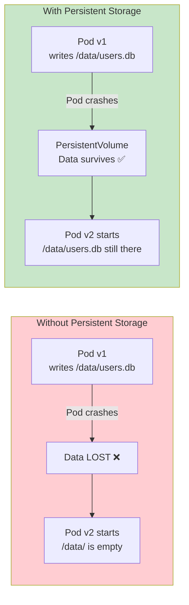
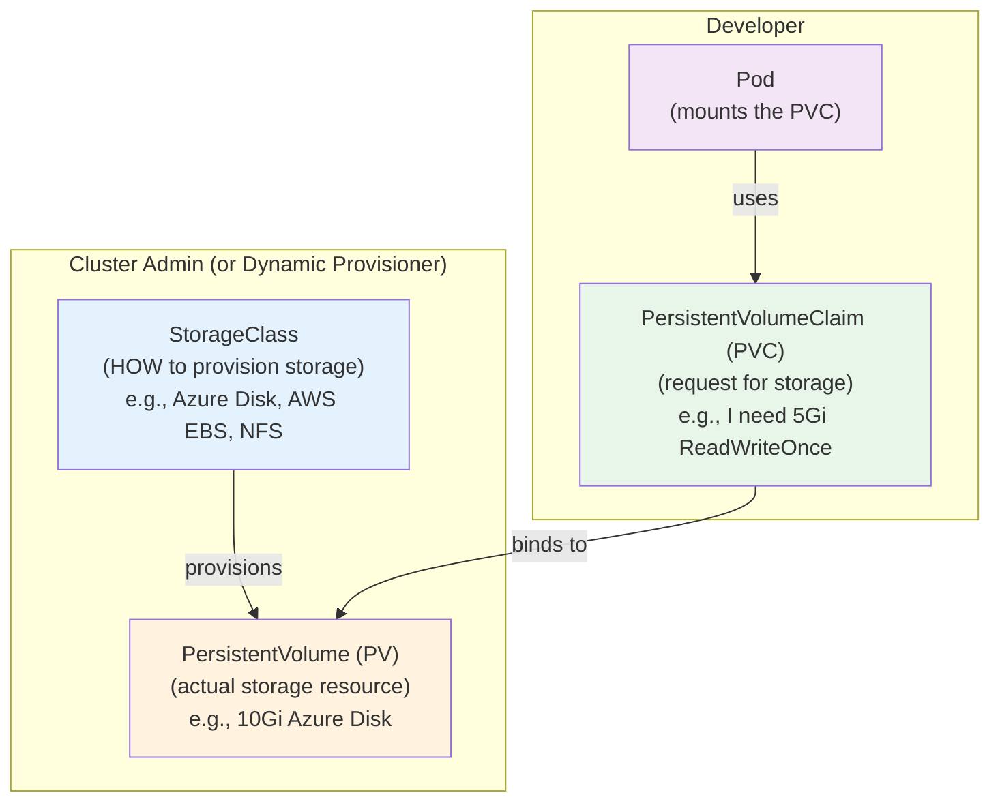
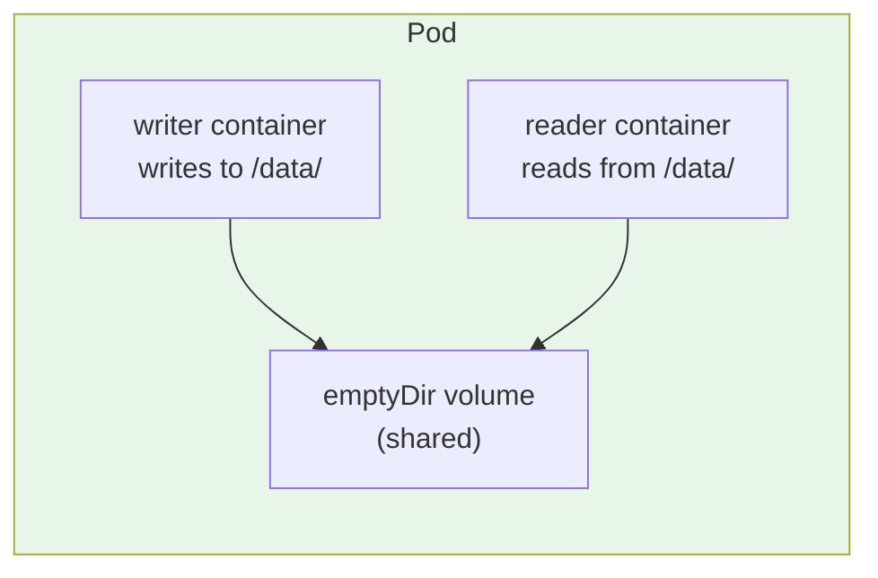
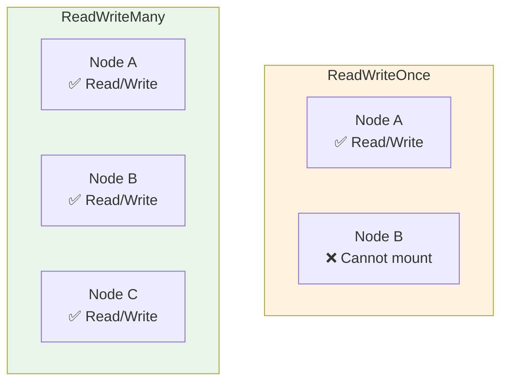
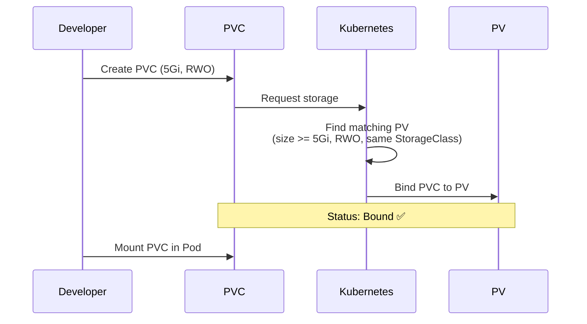
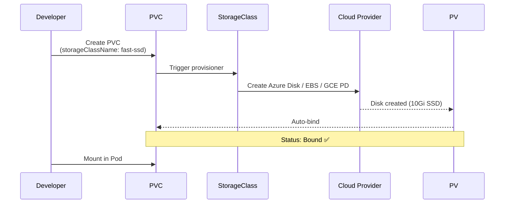
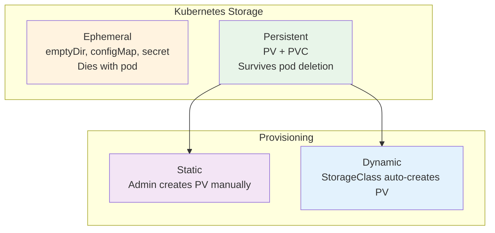

# Kubernetes Storage — PV, PVC, StorageClass

> **Prerequisites**: [9_ConfigMaps_and_Secrets.md](./9_ConfigMaps_and_Secrets.md)  
> **Next**: [11_Workloads_StatefulSet_DaemonSet_Jobs.md](./11_Workloads_StatefulSet_DaemonSet_Jobs.md)

Pods are ephemeral — when they die, all data inside them is lost. Kubernetes storage solves this by decoupling storage lifecycle from pod lifecycle.

---

## The Problem



---

## Storage Hierarchy — The Three Objects



Think of it like renting an apartment:
- **StorageClass** = The type of apartment (luxury, standard, economy)
- **PersistentVolume** = An actual apartment (10Gi disk, Azure Disk)
- **PersistentVolumeClaim** = Your lease/request ("I want a 5Gi apartment, ReadWriteOnce")
- **Pod** = You moving in and using the apartment

---

# 1. Volume Types in Kubernetes

### Ephemeral Volumes (die with pod)

| Type | Purpose | Use Case |
|------|---------|----------|
| `emptyDir` | Temp storage shared between containers | Sidecar file sharing, cache |
| `configMap` | Mount ConfigMap as files | Config files |
| `secret` | Mount Secret as files | Credentials, TLS certs |

### Persistent Volumes (survive pod deletion)

| Type | Provider | Use Case |
|------|----------|----------|
| `awsElasticBlockStore` | AWS EBS | AWS persistent disk |
| `azureDisk` | Azure Managed Disk | Azure persistent disk |
| `azureFile` | Azure Files (SMB) | Shared storage (ReadWriteMany) |
| `gcePersistentDisk` | GCP PD | GCP persistent disk |
| `nfs` | NFS server | On-prem shared storage |
| `hostPath` | Node's filesystem | Testing ONLY (not production) |
| `csi` | Any CSI driver | Modern, extensible interface |

---

# 2. emptyDir — Ephemeral Shared Storage

```yaml
apiVersion: v1
kind: Pod
metadata:
  name: shared-pod
spec:
  containers:
    - name: writer
      image: busybox
      command: ["sh", "-c", "echo hello > /data/message; sleep 3600"]
      volumeMounts:
        - name: shared
          mountPath: /data

    - name: reader
      image: busybox
      command: ["sh", "-c", "cat /data/message; sleep 3600"]
      volumeMounts:
        - name: shared
          mountPath: /data

  volumes:
    - name: shared
      emptyDir: {}
```



**emptyDir lives only as long as the pod.** Pod deleted → data gone.

---

# 3. PersistentVolume (PV) — The Actual Storage

A PV represents a piece of storage provisioned in the cluster.

```yaml
apiVersion: v1
kind: PersistentVolume
metadata:
  name: my-pv
spec:
  capacity:
    storage: 10Gi
  accessModes:
    - ReadWriteOnce
  persistentVolumeReclaimPolicy: Retain
  storageClassName: standard
  hostPath:                      # Only for testing!
    path: /mnt/data
```

### Access Modes

| Mode | Abbreviation | Meaning |
|------|-------------|---------|
| `ReadWriteOnce` | RWO | One node can read/write |
| `ReadOnlyMany` | ROX | Many nodes can read |
| `ReadWriteMany` | RWX | Many nodes can read/write |
| `ReadWriteOncePod` | RWOP | One pod can read/write (K8s 1.27+) |



| Access Mode | Storage Types That Support It |
|------------|------------------------------|
| RWO | AWS EBS, Azure Disk, GCE PD (most block storage) |
| RWX | NFS, Azure Files, AWS EFS, CephFS |

### Reclaim Policies

| Policy | What Happens When PVC Deleted |
|--------|-------------------------------|
| `Retain` | PV and data kept (manual cleanup) |
| `Delete` | PV and underlying storage deleted |
| `Recycle` | Data wiped, PV reused (deprecated) |

---

# 4. PersistentVolumeClaim (PVC) — Developer's Storage Request

A PVC is how a developer **requests** storage without knowing the underlying infrastructure.

```yaml
apiVersion: v1
kind: PersistentVolumeClaim
metadata:
  name: my-pvc
spec:
  accessModes:
    - ReadWriteOnce
  resources:
    requests:
      storage: 5Gi
  storageClassName: standard
```

### Binding Process



### Using PVC in a Pod

```yaml
apiVersion: v1
kind: Pod
metadata:
  name: db-pod
spec:
  containers:
    - name: postgres
      image: postgres:16-alpine
      volumeMounts:
        - name: db-storage
          mountPath: /var/lib/postgresql/data
  volumes:
    - name: db-storage
      persistentVolumeClaim:
        claimName: my-pvc
```

---

# 5. StorageClass — Dynamic Provisioning

Without StorageClass, an admin must manually create PVs. StorageClass enables **automatic PV creation** when a PVC is submitted.

```yaml
apiVersion: storage.k8s.io/v1
kind: StorageClass
metadata:
  name: fast-ssd
provisioner: disk.csi.azure.com      # Azure Disk CSI
parameters:
  skuName: Premium_LRS               # SSD
  cachingMode: ReadOnly
reclaimPolicy: Delete
allowVolumeExpansion: true
volumeBindingMode: WaitForFirstConsumer
```

### Dynamic Provisioning Flow



### PVC with StorageClass

```yaml
apiVersion: v1
kind: PersistentVolumeClaim
metadata:
  name: fast-storage
spec:
  accessModes:
    - ReadWriteOnce
  storageClassName: fast-ssd        # References StorageClass
  resources:
    requests:
      storage: 20Gi
```

No manual PV creation needed — the StorageClass provisions it automatically.

### volumeBindingMode

| Mode | Behavior | Use Case |
|------|----------|----------|
| `Immediate` | PV created immediately | Default, simple |
| `WaitForFirstConsumer` | PV created when pod is scheduled | Topology-aware (ensures disk in same zone as pod) |

**Always use `WaitForFirstConsumer`** in multi-zone clusters to avoid pod stuck in Pending because the disk is in a different zone.

---

# 6. Complete Example — Postgres with Persistent Storage

```yaml
# StorageClass (usually pre-configured by cloud provider)
apiVersion: storage.k8s.io/v1
kind: StorageClass
metadata:
  name: managed-ssd
provisioner: disk.csi.azure.com
parameters:
  skuName: Premium_LRS
reclaimPolicy: Retain
volumeBindingMode: WaitForFirstConsumer
allowVolumeExpansion: true
---
# PVC
apiVersion: v1
kind: PersistentVolumeClaim
metadata:
  name: postgres-data
spec:
  accessModes:
    - ReadWriteOnce
  storageClassName: managed-ssd
  resources:
    requests:
      storage: 20Gi
---
# Deployment
apiVersion: apps/v1
kind: Deployment
metadata:
  name: postgres
spec:
  replicas: 1
  selector:
    matchLabels:
      app: postgres
  template:
    metadata:
      labels:
        app: postgres
    spec:
      containers:
        - name: postgres
          image: postgres:16-alpine
          ports:
            - containerPort: 5432
          env:
            - name: POSTGRES_PASSWORD
              valueFrom:
                secretKeyRef:
                  name: db-credentials
                  key: password
            - name: PGDATA
              value: /var/lib/postgresql/data/pgdata
          volumeMounts:
            - name: data
              mountPath: /var/lib/postgresql/data
          resources:
            requests:
              cpu: 250m
              memory: 256Mi
            limits:
              cpu: "1"
              memory: 512Mi
      volumes:
        - name: data
          persistentVolumeClaim:
            claimName: postgres-data
```

---

# 7. Storage Debugging

```bash
# Check PV status
kubectl get pv

# Check PVC status (should be "Bound")
kubectl get pvc

# Why is PVC stuck in Pending?
kubectl describe pvc my-pvc
# Look for events like:
# - no persistent volumes available
# - storageclass not found
# - waiting for first consumer

# Check StorageClasses available
kubectl get storageclass
kubectl get sc

# Check what's mounted inside a pod
kubectl exec -it my-pod -- df -h
kubectl exec -it my-pod -- mount | grep data

# Expand a PVC (if StorageClass allows)
kubectl edit pvc my-pvc
# Change spec.resources.requests.storage to larger value
```

### Common Issues

| Symptom | Cause | Fix |
|---------|-------|-----|
| PVC stuck `Pending` | No matching PV / wrong StorageClass | Check `kubectl describe pvc` events |
| PVC `Pending` in multi-zone | `Immediate` binding, disk in wrong zone | Use `WaitForFirstConsumer` |
| Pod can't start after reschedule | RWO volume bound to different node | Use StatefulSet or check node affinity |
| Data lost after pod restart | Using `emptyDir` instead of PVC | Switch to PVC |

---

## Summary



| Object | Who Creates | Purpose |
|--------|------------|---------|
| StorageClass | Cluster admin | Define HOW storage is provisioned |
| PersistentVolume | Admin or auto-provisioned | The actual disk |
| PersistentVolumeClaim | Developer | Request for storage ("I need 10Gi") |
| Volume mount in Pod | Developer | Attach PVC to container path |

---

> **Next**: [11_Workloads_StatefulSet_DaemonSet_Jobs.md](./11_Workloads_StatefulSet_DaemonSet_Jobs.md) — Beyond Deployments: workload types for every use case
