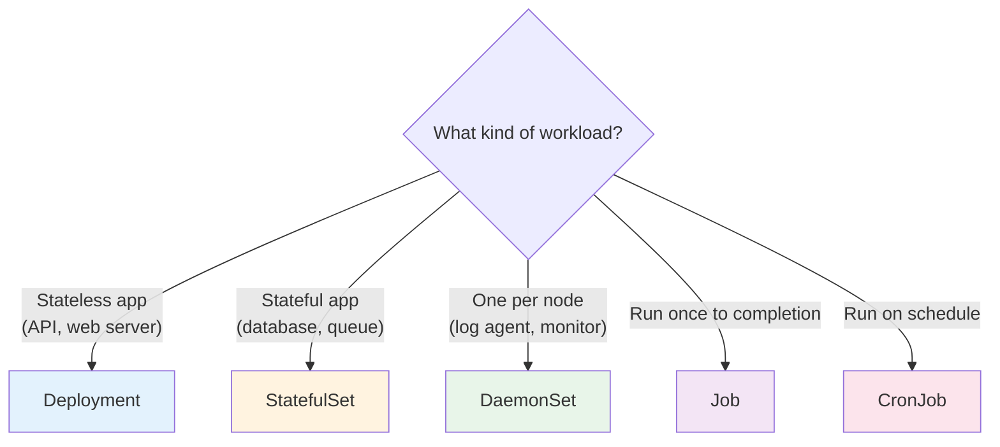
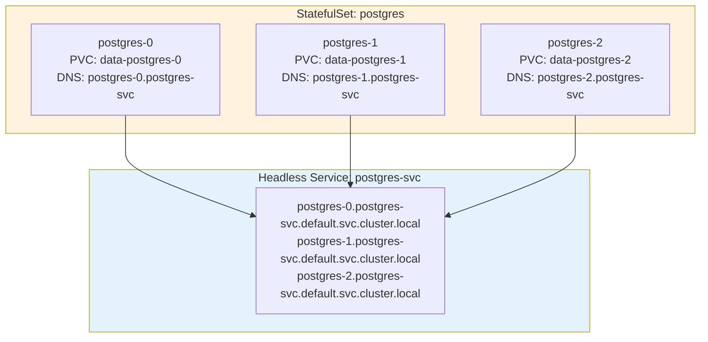
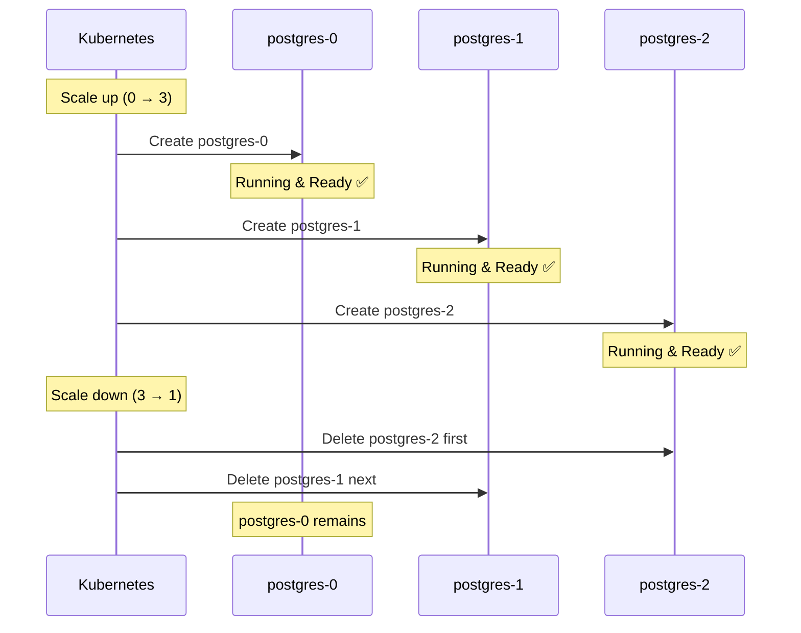
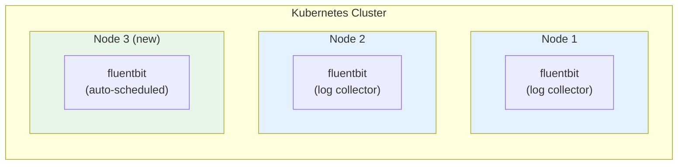
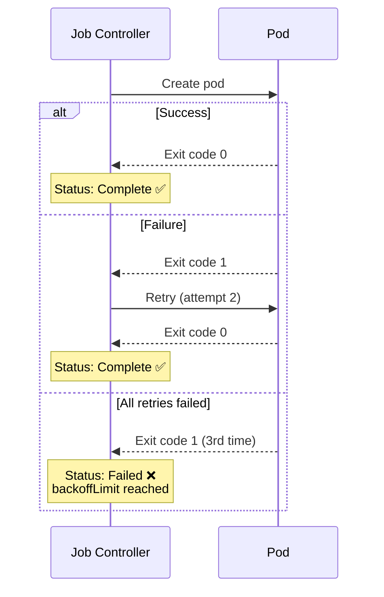
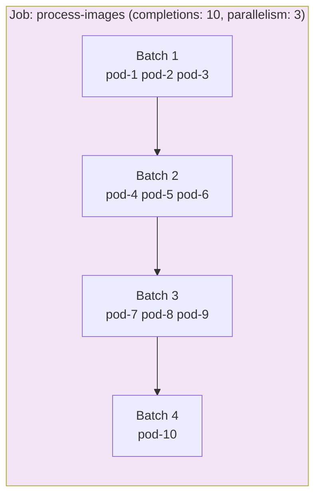
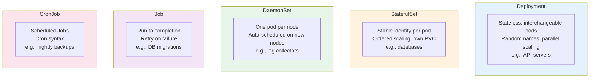

# Workloads Beyond Deployments — StatefulSet, DaemonSet, Job, CronJob

> **Prerequisites**: [6_Deployments.md](./6_Deployments.md), [10_Storage_PV_PVC.md](./10_Storage_PV_PVC.md)  
> **Next**: [12_Scheduling_Scaling_HPA.md](./12_Scheduling_Scaling_HPA.md)

Deployments are perfect for **stateless** apps. But what about databases, per-node agents, batch processing, and scheduled tasks? Kubernetes has a workload type for each.

---

## Choosing the Right Workload



---

# 1. StatefulSet — For Stateful Applications

StatefulSets manage pods that need **stable identity** and **persistent storage** — databases, caches, message queues.

## Deployment vs StatefulSet

| Feature | Deployment | StatefulSet |
|---------|-----------|-------------|
| Pod names | Random (`myapp-7b4f9-x2k3`) | Ordered (`myapp-0`, `myapp-1`, `myapp-2`) |
| Startup order | All at once (parallel) | Sequential (0 → 1 → 2) |
| Storage | Shared or ephemeral | Each pod gets its own PVC |
| Network identity | Random, changes on restart | Stable DNS per pod |
| Scaling down | Any pod can be deleted | Deletes in reverse order (2 → 1 → 0) |
| Use case | Stateless APIs | Databases, Kafka, Redis Cluster |

## How StatefulSet Pods Get Identity



Each pod gets:
- **Stable name**: `<statefulset>-<ordinal>` (e.g., `postgres-0`)
- **Stable DNS**: `<pod>.<headless-service>.<namespace>.svc.cluster.local`
- **Own PVC**: `<volumeClaimTemplate-name>-<statefulset>-<ordinal>`

Even if `postgres-1` is deleted and recreated, it gets the SAME name, DNS, and PVC.

## StatefulSet YAML

```yaml
apiVersion: v1
kind: Service
metadata:
  name: postgres-svc
spec:
  clusterIP: None                  # Headless service (required for StatefulSet)
  selector:
    app: postgres
  ports:
    - port: 5432
---
apiVersion: apps/v1
kind: StatefulSet
metadata:
  name: postgres
spec:
  serviceName: postgres-svc       # Must match headless service
  replicas: 3
  selector:
    matchLabels:
      app: postgres
  template:
    metadata:
      labels:
        app: postgres
    spec:
      containers:
        - name: postgres
          image: postgres:16-alpine
          ports:
            - containerPort: 5432
          env:
            - name: POSTGRES_PASSWORD
              valueFrom:
                secretKeyRef:
                  name: pg-secret
                  key: password
          volumeMounts:
            - name: data
              mountPath: /var/lib/postgresql/data
  volumeClaimTemplates:            # Each pod gets its own PVC
    - metadata:
        name: data
      spec:
        accessModes: ["ReadWriteOnce"]
        storageClassName: managed-ssd
        resources:
          requests:
            storage: 10Gi
```

### Startup and Shutdown Order



---

# 2. DaemonSet — One Pod Per Node

DaemonSets ensure **exactly one pod runs on every node** (or a subset of nodes). When new nodes join, the pod is automatically added.

## Use Cases



| DaemonSet Use Case | Example |
|-------------------|---------|
| Log collection | Fluent Bit, Fluentd, Filebeat |
| Monitoring agent | Prometheus Node Exporter, Datadog Agent |
| Network plugin | Calico, Cilium, kube-proxy |
| Storage plugin | CSI node driver |
| Security agent | Falco, Twistlock |

## DaemonSet YAML

```yaml
apiVersion: apps/v1
kind: DaemonSet
metadata:
  name: fluentbit
  namespace: logging
spec:
  selector:
    matchLabels:
      app: fluentbit
  template:
    metadata:
      labels:
        app: fluentbit
    spec:
      containers:
        - name: fluentbit
          image: fluent/fluent-bit:latest
          volumeMounts:
            - name: varlog
              mountPath: /var/log
              readOnly: true
          resources:
            limits:
              cpu: 200m
              memory: 128Mi
      volumes:
        - name: varlog
          hostPath:
            path: /var/log
      tolerations:                    # Run on ALL nodes including masters
        - key: node-role.kubernetes.io/control-plane
          effect: NoSchedule
```

### Run DaemonSet on Specific Nodes Only

```yaml
spec:
  template:
    spec:
      nodeSelector:
        disktype: ssd               # Only nodes with this label
```

---

# 3. Job — Run to Completion

Jobs run a pod **once** (or a fixed number of times) and track successful completions. Unlike Deployments, Jobs finish and don't restart.

## Job YAML

```yaml
apiVersion: batch/v1
kind: Job
metadata:
  name: db-migration
spec:
  backoffLimit: 3                    # Retry up to 3 times on failure
  activeDeadlineSeconds: 300         # Timeout after 5 minutes
  template:
    spec:
      containers:
        - name: migrate
          image: myapp:latest
          command: ["python", "manage.py", "migrate"]
      restartPolicy: Never           # Don't restart on failure (let Job retry)
```

### Job Lifecycle



### Parallel Jobs

```yaml
spec:
  completions: 10                   # Total tasks to complete
  parallelism: 3                    # Run 3 pods at a time
```



---

# 4. CronJob — Scheduled Jobs

CronJobs create Jobs on a schedule (like Linux cron).

## CronJob YAML

```yaml
apiVersion: batch/v1
kind: CronJob
metadata:
  name: db-backup
spec:
  schedule: "0 2 * * *"             # Every day at 2 AM
  concurrencyPolicy: Forbid         # Don't run if previous is still running
  successfulJobsHistoryLimit: 3
  failedJobsHistoryLimit: 1
  jobTemplate:
    spec:
      template:
        spec:
          containers:
            - name: backup
              image: postgres:16-alpine
              command: ["pg_dump", "-h", "postgres-svc", "-U", "postgres", "-d", "mydb"]
          restartPolicy: OnFailure
```

### Cron Schedule Format

```
┌───────────── minute (0-59)
│ ┌───────────── hour (0-23)
│ │ ┌───────────── day of month (1-31)
│ │ │ ┌───────────── month (1-12)
│ │ │ │ ┌───────────── day of week (0-6, Sun=0)
│ │ │ │ │
* * * * *
```

| Schedule | Meaning |
|----------|---------|
| `*/5 * * * *` | Every 5 minutes |
| `0 * * * *` | Every hour |
| `0 2 * * *` | Daily at 2 AM |
| `0 0 * * 0` | Weekly on Sunday midnight |
| `0 0 1 * *` | Monthly on 1st at midnight |

### Concurrency Policies

| Policy | Behavior |
|--------|----------|
| `Allow` | Multiple jobs can run simultaneously (default) |
| `Forbid` | Skip new job if previous is still running |
| `Replace` | Kill running job and start new one |

---

# 5. All Workloads — Visual Comparison



## Useful Commands

```bash
# StatefulSet
kubectl get statefulsets
kubectl get sts                             # short form
kubectl describe sts postgres
kubectl scale sts postgres --replicas=5
kubectl rollout status sts postgres

# DaemonSet
kubectl get daemonsets
kubectl get ds
kubectl describe ds fluentbit
kubectl rollout status ds fluentbit

# Jobs
kubectl get jobs
kubectl describe job db-migration
kubectl logs job/db-migration

# CronJobs
kubectl get cronjobs
kubectl get cj
kubectl describe cj db-backup
kubectl create job manual-backup --from=cronjob/db-backup   # Trigger manually
```

---

## Summary

| Workload | When to Use | Pods Created | Scaling |
|----------|------------|--------------|---------|
| **Deployment** | Stateless apps | Random names, parallel | Horizontal (replicas) |
| **StatefulSet** | Databases, queues | Ordered names, sequential | Ordered, with own PVCs |
| **DaemonSet** | Per-node agents | One per node | Automatic with nodes |
| **Job** | One-time tasks | Run to completion | completions + parallelism |
| **CronJob** | Scheduled tasks | Creates Jobs on schedule | concurrencyPolicy |

---

> **Next**: [12_Scheduling_Scaling_HPA.md](./12_Scheduling_Scaling_HPA.md) — How K8s decides where pods run and how to auto-scale
