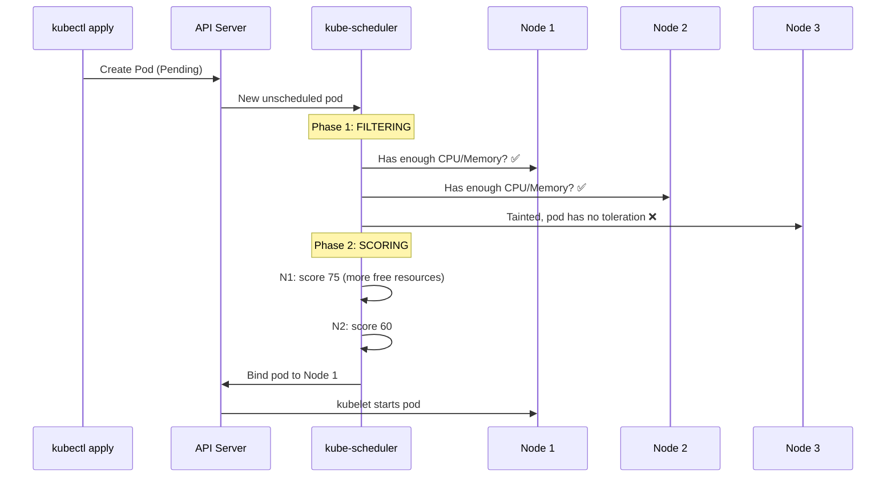
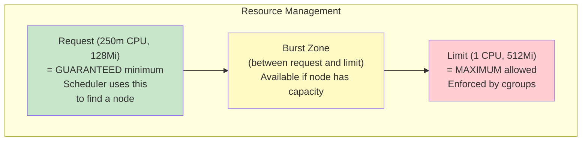
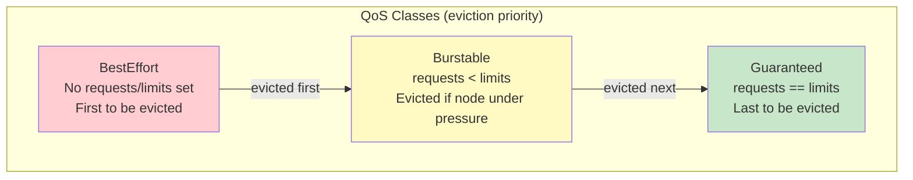
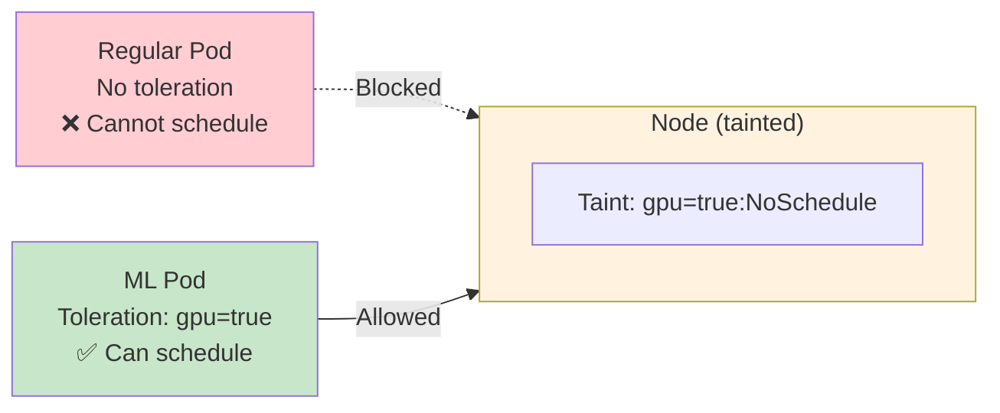
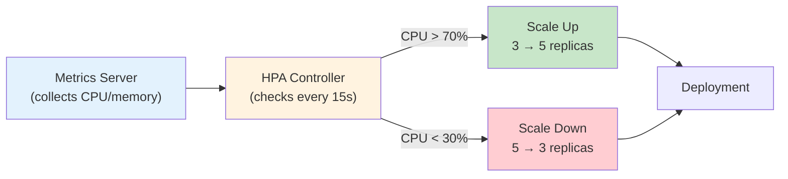
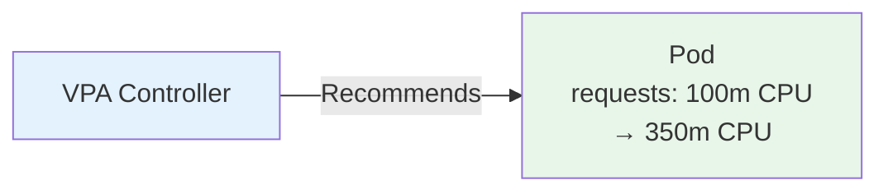
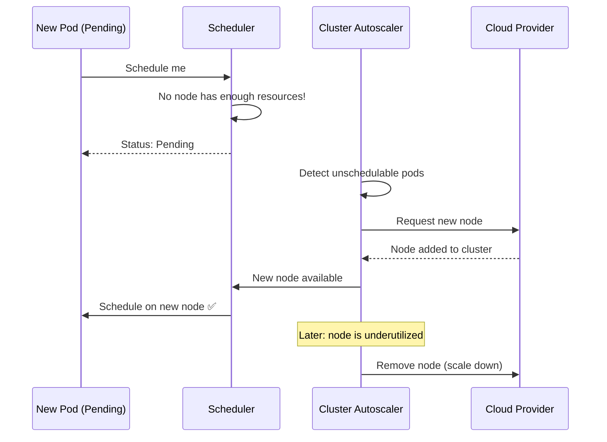
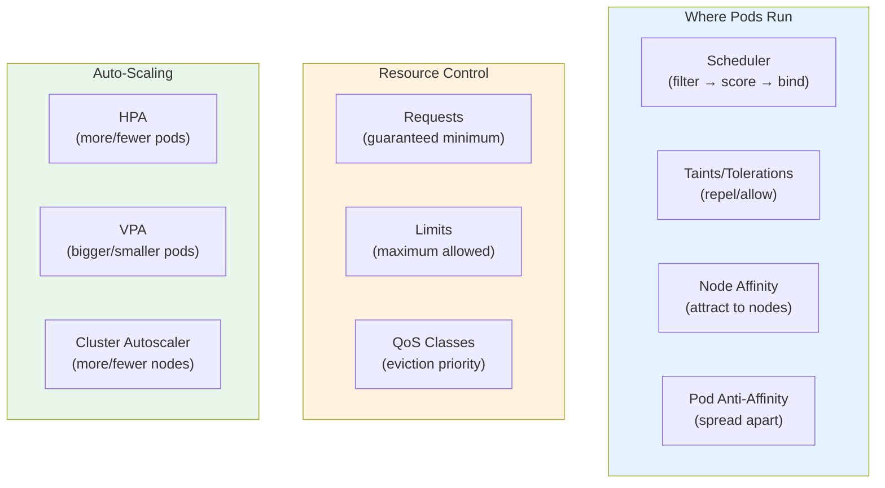

# Scheduling, Resource Management & Auto-Scaling

> **Prerequisites**: [2_Kubernetes_Architecture.md](./2_Kubernetes_Architecture.md), [6_Deployments.md](./6_Deployments.md)  
> **Next**: [13_RBAC_Security.md](./13_RBAC_Security.md)

How does Kubernetes decide WHERE a pod runs? And how does it scale pods up/down based on load? This doc covers the scheduler, resource requests/limits, and auto-scaling.

---

# 1. The Kubernetes Scheduler

When you create a pod, the scheduler decides which node it runs on.



### Scheduling Phases

| Phase | What Happens | Example |
|-------|-------------|---------|
| **Filtering** | Eliminate nodes that can't run the pod | Not enough CPU, tainted, wrong zone |
| **Scoring** | Rank remaining nodes | More free resources = higher score |
| **Binding** | Assign pod to best-scoring node | Pod moves from Pending → Running |

---

# 2. Resource Requests and Limits

```yaml
spec:
  containers:
    - name: app
      image: myapp
      resources:
        requests:              # Guaranteed resources (for scheduling)
          cpu: 250m            # 250 millicores = 0.25 CPU
          memory: 128Mi        # 128 MiB
        limits:                # Maximum allowed (for enforcement)
          cpu: "1"             # 1 full CPU core
          memory: 512Mi        # 512 MiB
```



### CPU vs Memory — What Happens at the Limit

| Resource | At Limit | Effect |
|----------|----------|--------|
| **CPU** | Throttled | Pod slows down but stays alive |
| **Memory** | OOM Killed | Pod is terminated and restarted |

### CPU Units

| Value | Meaning |
|-------|---------|
| `1` | 1 full CPU core |
| `500m` | 0.5 CPU cores (50%) |
| `250m` | 0.25 CPU cores (25%) |
| `100m` | 0.1 CPU cores (10%) |

### Memory Units

| Value | Meaning |
|-------|---------|
| `128Mi` | 128 MiB (mebibytes) |
| `1Gi` | 1 GiB |
| `256M` | 256 MB (megabytes, slightly different) |

### QoS Classes (Quality of Service)

Kubernetes assigns a QoS class based on your requests/limits:



| QoS Class | Condition | Eviction Priority |
|-----------|-----------|-------------------|
| **Guaranteed** | requests == limits for all containers | Last (safest) |
| **Burstable** | At least one request set, but limits differ | Middle |
| **BestEffort** | No requests or limits at all | First (least safe) |

**Production rule**: Always set requests AND limits.

---

# 3. Taints and Tolerations

Taints on nodes **repel** pods. Tolerations on pods **allow** them to schedule on tainted nodes.



### Taint a Node

```bash
# Add taint
kubectl taint nodes node1 gpu=true:NoSchedule

# Remove taint
kubectl taint nodes node1 gpu=true:NoSchedule-
```

### Pod with Toleration

```yaml
spec:
  tolerations:
    - key: "gpu"
      operator: "Equal"
      value: "true"
      effect: "NoSchedule"
```

### Taint Effects

| Effect | Behavior |
|--------|----------|
| `NoSchedule` | New pods without toleration can't schedule here |
| `PreferNoSchedule` | Scheduler avoids this node but doesn't guarantee |
| `NoExecute` | Existing pods without toleration are evicted |

---

# 4. Node Affinity and Anti-Affinity

More expressive than nodeSelector — lets you say "prefer nodes with SSD" or "require nodes in us-east-1".

### Node Affinity (attract pods to specific nodes)

```yaml
spec:
  affinity:
    nodeAffinity:
      requiredDuringSchedulingIgnoredDuringExecution:    # Hard requirement
        nodeSelectorTerms:
          - matchExpressions:
              - key: topology.kubernetes.io/zone
                operator: In
                values: ["us-east-1a", "us-east-1b"]
      preferredDuringSchedulingIgnoredDuringExecution:   # Soft preference
        - weight: 80
          preference:
            matchExpressions:
              - key: disktype
                operator: In
                values: ["ssd"]
```

### Pod Anti-Affinity (spread pods apart)

```yaml
spec:
  affinity:
    podAntiAffinity:
      requiredDuringSchedulingIgnoredDuringExecution:
        - labelSelector:
            matchLabels:
              app: api
          topologyKey: kubernetes.io/hostname
```

This ensures no two `app: api` pods run on the same node — great for high availability.

---

# 5. Horizontal Pod Autoscaler (HPA)

HPA automatically adjusts the number of pod replicas based on CPU, memory, or custom metrics.



### Prerequisites

```bash
# Metrics Server must be installed
kubectl top pods       # If this works, metrics server is running
kubectl top nodes
```

### HPA YAML

```yaml
apiVersion: autoscaling/v2
kind: HorizontalPodAutoscaler
metadata:
  name: api-hpa
spec:
  scaleTargetRef:
    apiVersion: apps/v1
    kind: Deployment
    name: api
  minReplicas: 2
  maxReplicas: 10
  metrics:
    - type: Resource
      resource:
        name: cpu
        target:
          type: Utilization
          averageUtilization: 70       # Scale when avg CPU > 70%
    - type: Resource
      resource:
        name: memory
        target:
          type: Utilization
          averageUtilization: 80       # Scale when avg memory > 80%
  behavior:
    scaleDown:
      stabilizationWindowSeconds: 300  # Wait 5 min before scaling down
```

### HPA CLI

```bash
# Create HPA quickly
kubectl autoscale deployment api --min=2 --max=10 --cpu-percent=70

# Check HPA status
kubectl get hpa

# Watch HPA in action
kubectl get hpa -w
```

### How HPA Calculates Replicas

```
desiredReplicas = ceil(currentReplicas × (currentMetricValue / targetMetricValue))
```

Example: 3 replicas, current CPU = 90%, target = 70%
```
desired = ceil(3 × (90/70)) = ceil(3.86) = 4
```

---

# 6. Vertical Pod Autoscaler (VPA)

VPA adjusts **CPU/memory requests** per pod (not replica count).



VPA is useful when you don't know the right resource requests. It monitors actual usage and recommends (or auto-applies) better values.

**Note**: HPA and VPA should NOT target the same metric (e.g., both scaling on CPU). Use HPA for horizontal scaling and VPA for right-sizing.

---

# 7. Cluster Autoscaler

Scales **nodes** up/down based on pod scheduling needs.



| Autoscaler | What It Scales | When |
|-----------|---------------|------|
| **HPA** | Pod replicas | Metric threshold crossed |
| **VPA** | Pod resource requests | Right-sizing |
| **Cluster Autoscaler** | Cluster nodes | Pods unschedulable / nodes underutilized |

---

# 8. Pod Topology Spread

Distribute pods evenly across zones/nodes for availability:

```yaml
spec:
  topologySpreadConstraints:
    - maxSkew: 1
      topologyKey: topology.kubernetes.io/zone
      whenUnsatisfiable: DoNotSchedule
      labelSelector:
        matchLabels:
          app: api
```

This ensures pods are evenly spread across availability zones.

---

## Summary



---

> **Next**: [13_RBAC_Security.md](./13_RBAC_Security.md) — Controlling who can do what in your cluster
