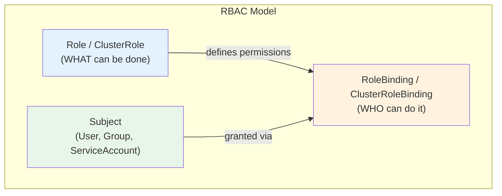
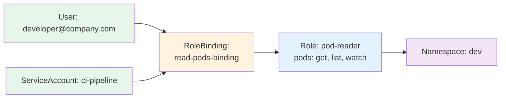
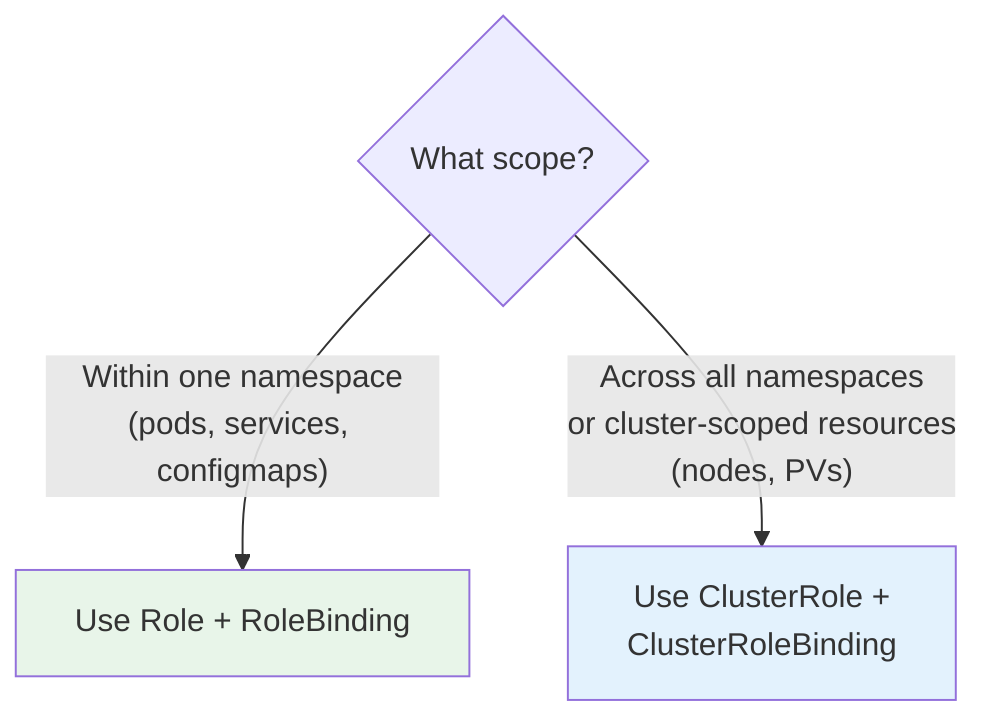
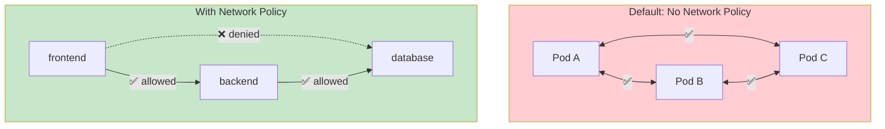
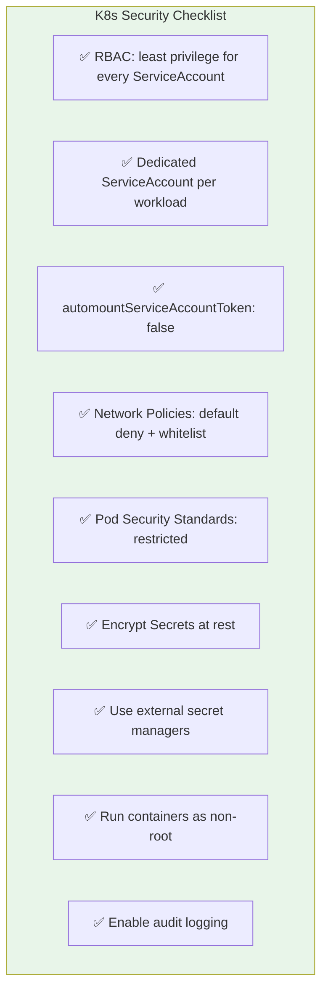

# RBAC & Kubernetes Security

> **Prerequisites**: [2_Kubernetes_Architecture.md](./2_Kubernetes_Architecture.md), [9_ConfigMaps_and_Secrets.md](./9_ConfigMaps_and_Secrets.md)  
> **Next**: [14_Ingress_Deep_Dive.md](./14_Ingress_Deep_Dive.md)

RBAC (Role-Based Access Control) controls **who** can do **what** on **which resources** in your cluster. Without it, any user or service account can do anything — dangerous in production.

---

## The Four RBAC Objects



| Object | Scope | Purpose |
|--------|-------|---------|
| **Role** | Namespace | Permissions within one namespace |
| **ClusterRole** | Cluster-wide | Permissions across all namespaces |
| **RoleBinding** | Namespace | Binds Role to a subject in a namespace |
| **ClusterRoleBinding** | Cluster-wide | Binds ClusterRole to a subject cluster-wide |

---

# 1. Role — Namespace-Scoped Permissions

```yaml
apiVersion: rbac.authorization.k8s.io/v1
kind: Role
metadata:
  name: pod-reader
  namespace: dev
rules:
  - apiGroups: [""]               # "" = core API group
    resources: ["pods"]
    verbs: ["get", "list", "watch"]

  - apiGroups: [""]
    resources: ["pods/log"]
    verbs: ["get"]
```

### Common Verbs

| Verb | Action |
|------|--------|
| `get` | Read a specific resource |
| `list` | List all resources |
| `watch` | Stream changes |
| `create` | Create a resource |
| `update` | Modify a resource |
| `patch` | Partially modify |
| `delete` | Delete a resource |
| `*` | All verbs (admin) |

### Common API Groups

| API Group | Resources |
|-----------|-----------|
| `""` (core) | pods, services, configmaps, secrets, nodes |
| `apps` | deployments, statefulsets, daemonsets, replicasets |
| `batch` | jobs, cronjobs |
| `networking.k8s.io` | ingresses, networkpolicies |
| `rbac.authorization.k8s.io` | roles, rolebindings, clusterroles |

---

# 2. RoleBinding — Attach Role to Subject

```yaml
apiVersion: rbac.authorization.k8s.io/v1
kind: RoleBinding
metadata:
  name: read-pods-binding
  namespace: dev
subjects:
  - kind: User
    name: developer@company.com
    apiGroup: rbac.authorization.k8s.io
  - kind: ServiceAccount
    name: ci-pipeline
    namespace: dev
roleRef:
  kind: Role
  name: pod-reader
  apiGroup: rbac.authorization.k8s.io
```



---

# 3. ClusterRole & ClusterRoleBinding

For cluster-wide permissions (nodes, PVs, namespaces, etc.):

```yaml
apiVersion: rbac.authorization.k8s.io/v1
kind: ClusterRole
metadata:
  name: cluster-viewer
rules:
  - apiGroups: [""]
    resources: ["nodes", "namespaces", "persistentvolumes"]
    verbs: ["get", "list", "watch"]
  - apiGroups: ["apps"]
    resources: ["deployments"]
    verbs: ["get", "list", "watch"]
---
apiVersion: rbac.authorization.k8s.io/v1
kind: ClusterRoleBinding
metadata:
  name: viewer-binding
subjects:
  - kind: Group
    name: platform-team
    apiGroup: rbac.authorization.k8s.io
roleRef:
  kind: ClusterRole
  name: cluster-viewer
  apiGroup: rbac.authorization.k8s.io
```

### Role vs ClusterRole Decision



---

# 4. ServiceAccounts

Every pod runs as a ServiceAccount. By default, pods use the `default` ServiceAccount, which may have too many permissions.

### Create a Dedicated ServiceAccount

```yaml
apiVersion: v1
kind: ServiceAccount
metadata:
  name: api-service
  namespace: production
---
apiVersion: rbac.authorization.k8s.io/v1
kind: Role
metadata:
  name: api-role
  namespace: production
rules:
  - apiGroups: [""]
    resources: ["configmaps", "secrets"]
    verbs: ["get"]
---
apiVersion: rbac.authorization.k8s.io/v1
kind: RoleBinding
metadata:
  name: api-binding
  namespace: production
subjects:
  - kind: ServiceAccount
    name: api-service
    namespace: production
roleRef:
  kind: Role
  name: api-role
  apiGroup: rbac.authorization.k8s.io
```

### Use ServiceAccount in Pod

```yaml
spec:
  serviceAccountName: api-service
  automountServiceAccountToken: false    # Don't mount token unless needed
  containers:
    - name: api
      image: myapi:latest
```

---

# 5. Network Policies — Pod-Level Firewall

By default, all pods can talk to all pods. Network Policies restrict this.



### Network Policy YAML

```yaml
apiVersion: networking.k8s.io/v1
kind: NetworkPolicy
metadata:
  name: db-policy
  namespace: production
spec:
  podSelector:
    matchLabels:
      app: database
  policyTypes:
    - Ingress
  ingress:
    - from:
        - podSelector:
            matchLabels:
              app: backend
      ports:
        - protocol: TCP
          port: 5432
```

This says: **Only pods with label `app: backend` can reach the database on port 5432.** Everything else is denied.

### Default Deny All

Best practice — start with deny-all, then whitelist:

```yaml
apiVersion: networking.k8s.io/v1
kind: NetworkPolicy
metadata:
  name: deny-all
  namespace: production
spec:
  podSelector: {}                 # Applies to ALL pods
  policyTypes:
    - Ingress
    - Egress
```

Then add specific allow rules for each service.

---

# 6. Pod Security Standards

Control what pods are allowed to do at the namespace level:

| Level | What's Allowed |
|-------|---------------|
| **Privileged** | Everything (no restrictions) |
| **Baseline** | Blocks known privilege escalations |
| **Restricted** | Most restrictive, production-recommended |

### Apply via Namespace Labels

```yaml
apiVersion: v1
kind: Namespace
metadata:
  name: production
  labels:
    pod-security.kubernetes.io/enforce: restricted
    pod-security.kubernetes.io/warn: restricted
```

Under `restricted`, pods must:
- Run as non-root
- Drop all capabilities
- Use read-only root filesystem
- Not use hostNetwork/hostPID/hostIPC

---

# 7. Security Best Practices Checklist



---

## Useful Commands

```bash
# Check what you can do
kubectl auth can-i create pods
kubectl auth can-i delete deployments --namespace=production

# Check what a ServiceAccount can do
kubectl auth can-i list secrets --as=system:serviceaccount:dev:ci-pipeline

# List roles and bindings
kubectl get roles -n dev
kubectl get rolebindings -n dev
kubectl get clusterroles
kubectl get clusterrolebindings

# Describe a role
kubectl describe role pod-reader -n dev

# Create role/binding via CLI
kubectl create role pod-manager --verb=get,list,create --resource=pods -n dev
kubectl create rolebinding dev-access --role=pod-manager --user=dev@company.com -n dev
```

---

## Summary

| Concept | Purpose | Scope |
|---------|---------|-------|
| **Role** | Define permissions | Namespace |
| **ClusterRole** | Define cluster-wide permissions | Cluster |
| **RoleBinding** | Assign Role to user/SA | Namespace |
| **ClusterRoleBinding** | Assign ClusterRole cluster-wide | Cluster |
| **ServiceAccount** | Identity for pods | Namespace |
| **NetworkPolicy** | Pod-to-pod firewall rules | Namespace |
| **Pod Security Standards** | Restrict pod capabilities | Namespace |

---

> **Next**: [14_Ingress_Deep_Dive.md](./14_Ingress_Deep_Dive.md) — Exposing applications to the outside world with L7 routing
