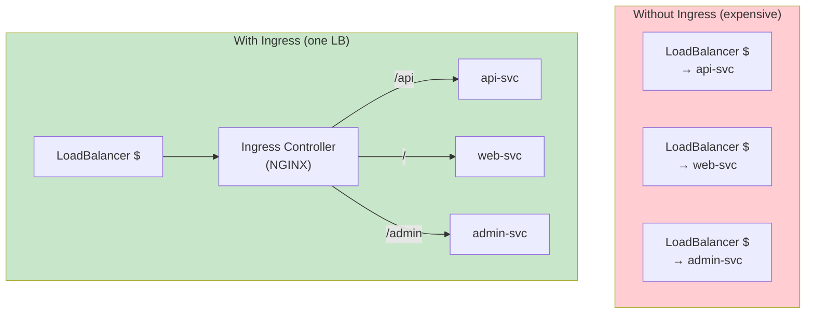
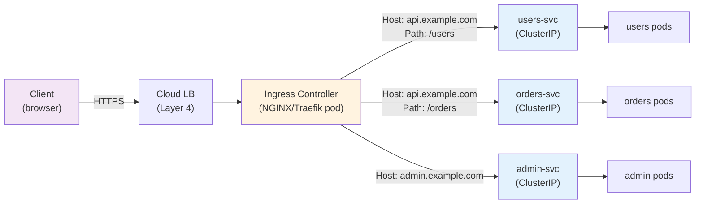
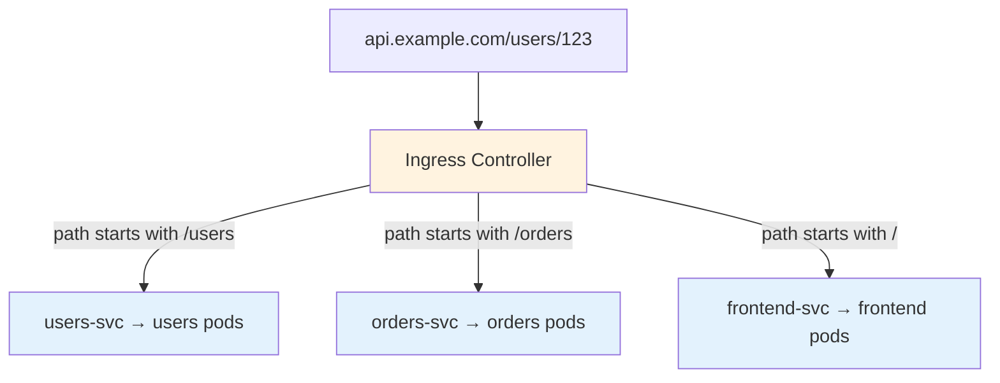
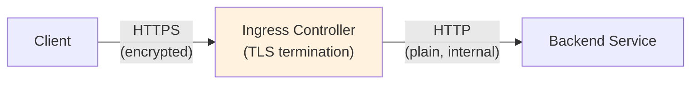
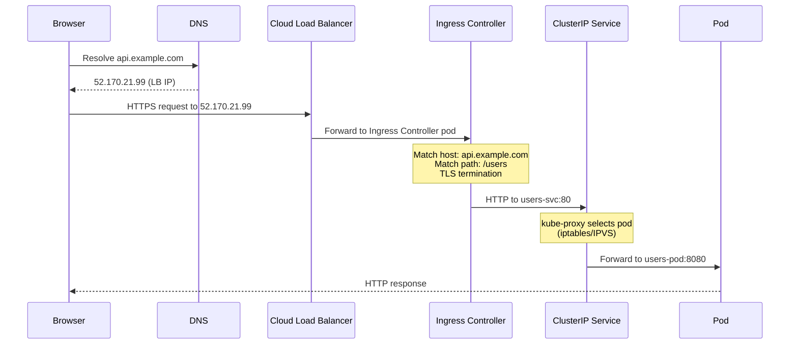

# Ingress — Layer 7 Routing & External Access

> **Prerequisites**: [8_Services.md](./8_Services.md), [7_Networking.md](./7_Networking.md)  
> **Next**: [15_Debugging_Troubleshooting.md](./15_Debugging_Troubleshooting.md)

Ingress provides **HTTP/HTTPS routing** from outside the cluster to internal services. Instead of one LoadBalancer per service ($$$), one Ingress handles all routing.

---

## Why Ingress? The Problem with LoadBalancer Services



| Approach | Cost | Features |
|----------|------|----------|
| LoadBalancer per service | $$$ (one LB per service) | L4 only, no path routing |
| Ingress | $ (one LB total) | L7 routing, TLS, path/host rules |

---

## How Ingress Works



Two components:
1. **Ingress Resource** (YAML) — defines routing rules
2. **Ingress Controller** (running pod) — implements the rules (NGINX, Traefik, etc.)

---

# 1. Ingress Controller — Must Be Installed First

Kubernetes does NOT include an Ingress Controller by default. You must install one.

| Controller | Backed By | Best For |
|-----------|----------|----------|
| **NGINX Ingress** | NGINX | Most popular, general purpose |
| **Traefik** | Traefik | Automatic TLS, modern features |
| **HAProxy** | HAProxy | High performance |
| **AWS ALB** | AWS Application LB | AWS-native |
| **Azure AGIC** | Azure App Gateway | Azure-native |
| **Istio Gateway** | Istio/Envoy | Service mesh environments |

### Install NGINX Ingress Controller

```bash
# Using Helm
helm repo add ingress-nginx https://kubernetes.github.io/ingress-nginx
helm install ingress-nginx ingress-nginx/ingress-nginx \
  --namespace ingress-nginx --create-namespace

# Verify
kubectl get pods -n ingress-nginx
kubectl get svc -n ingress-nginx
```

The controller creates a LoadBalancer service — this is your single entry point.

---

# 2. Path-Based Routing

Route traffic based on URL path:

```yaml
apiVersion: networking.k8s.io/v1
kind: Ingress
metadata:
  name: api-ingress
  annotations:
    nginx.ingress.kubernetes.io/rewrite-target: /
spec:
  ingressClassName: nginx
  rules:
    - host: api.example.com
      http:
        paths:
          - path: /users
            pathType: Prefix
            backend:
              service:
                name: users-svc
                port:
                  number: 80
          - path: /orders
            pathType: Prefix
            backend:
              service:
                name: orders-svc
                port:
                  number: 80
          - path: /
            pathType: Prefix
            backend:
              service:
                name: frontend-svc
                port:
                  number: 80
```



### Path Types

| Type | Matching |
|------|---------|
| `Prefix` | Matches path prefix (`/api` matches `/api`, `/api/v1`, `/api/users`) |
| `Exact` | Exact match only (`/api` matches only `/api`) |
| `ImplementationSpecific` | Depends on Ingress Controller |

---

# 3. Host-Based Routing

Route traffic based on hostname:

```yaml
apiVersion: networking.k8s.io/v1
kind: Ingress
metadata:
  name: multi-host-ingress
spec:
  ingressClassName: nginx
  rules:
    - host: app.example.com
      http:
        paths:
          - path: /
            pathType: Prefix
            backend:
              service:
                name: web-svc
                port:
                  number: 80
    - host: api.example.com
      http:
        paths:
          - path: /
            pathType: Prefix
            backend:
              service:
                name: api-svc
                port:
                  number: 80
    - host: admin.example.com
      http:
        paths:
          - path: /
            pathType: Prefix
            backend:
              service:
                name: admin-svc
                port:
                  number: 80
```

---

# 4. TLS / HTTPS Termination



### Create TLS Secret

```bash
kubectl create secret tls my-tls-secret \
  --cert=cert.pem \
  --key=key.pem \
  -n default
```

### Ingress with TLS

```yaml
apiVersion: networking.k8s.io/v1
kind: Ingress
metadata:
  name: secure-ingress
spec:
  ingressClassName: nginx
  tls:
    - hosts:
        - app.example.com
        - api.example.com
      secretName: my-tls-secret
  rules:
    - host: app.example.com
      http:
        paths:
          - path: /
            pathType: Prefix
            backend:
              service:
                name: web-svc
                port:
                  number: 80
```

### Automatic TLS with cert-manager

```bash
# Install cert-manager
kubectl apply -f https://github.com/cert-manager/cert-manager/releases/download/v1.13.0/cert-manager.yaml

# Create ClusterIssuer for Let's Encrypt
```

```yaml
apiVersion: cert-manager.io/v1
kind: ClusterIssuer
metadata:
  name: letsencrypt-prod
spec:
  acme:
    server: https://acme-v02.api.letsencrypt.org/directory
    email: admin@example.com
    privateKeySecretRef:
      name: letsencrypt-prod
    solvers:
      - http01:
          ingress:
            class: nginx
```

Then annotate your Ingress:

```yaml
metadata:
  annotations:
    cert-manager.io/cluster-issuer: letsencrypt-prod
```

cert-manager automatically issues and renews TLS certificates.

---

# 5. Common Annotations

| Annotation | Purpose |
|-----------|---------|
| `nginx.ingress.kubernetes.io/rewrite-target: /` | Rewrite URL path |
| `nginx.ingress.kubernetes.io/ssl-redirect: "true"` | Force HTTPS |
| `nginx.ingress.kubernetes.io/proxy-body-size: "50m"` | Max upload size |
| `nginx.ingress.kubernetes.io/rate-limit: "10"` | Rate limiting |
| `nginx.ingress.kubernetes.io/cors-allow-origin: "*"` | CORS headers |
| `nginx.ingress.kubernetes.io/affinity: "cookie"` | Session affinity |

---

# 6. Complete Traffic Flow



---

# 7. Debugging Ingress

```bash
# Check Ingress resources
kubectl get ingress
kubectl describe ingress api-ingress

# Check Ingress Controller logs
kubectl logs -n ingress-nginx -l app.kubernetes.io/name=ingress-nginx

# Check Ingress Controller service (external IP)
kubectl get svc -n ingress-nginx

# Test from inside cluster
kubectl run test --image=busybox -it --rm -- wget -qO- http://users-svc

# Check if backend endpoints exist
kubectl get endpoints users-svc
```

### Common Issues

| Symptom | Cause | Fix |
|---------|-------|-----|
| 404 Not Found | Wrong path or pathType | Check path rules and rewrite annotations |
| 503 Service Unavailable | No healthy endpoints | Check `kubectl get endpoints` |
| Connection refused | Ingress Controller not running | Check `kubectl get pods -n ingress-nginx` |
| TLS error | Wrong secret or missing cert | Check `kubectl describe ingress`, verify secret |
| No external IP | LoadBalancer pending | Check cloud provider config / quotas |

---

## Summary

| Concept | Purpose |
|---------|---------|
| **Ingress Resource** | Define routing rules (YAML) |
| **Ingress Controller** | Implement rules (NGINX pod) |
| **Path routing** | `/api` → api-svc, `/` → web-svc |
| **Host routing** | `api.example.com` vs `admin.example.com` |
| **TLS termination** | HTTPS at Ingress, HTTP internally |
| **cert-manager** | Auto-issue Let's Encrypt certificates |

---

> **Next**: [15_Debugging_Troubleshooting.md](./15_Debugging_Troubleshooting.md) — How to debug anything in Kubernetes
