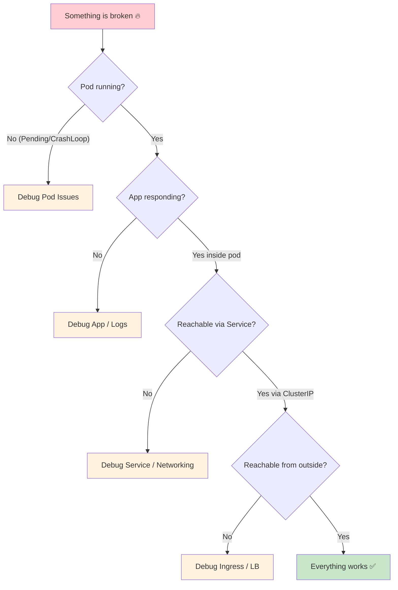
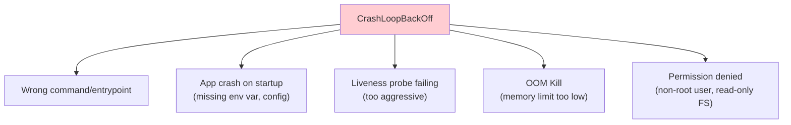
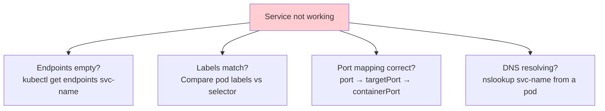
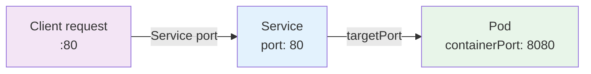
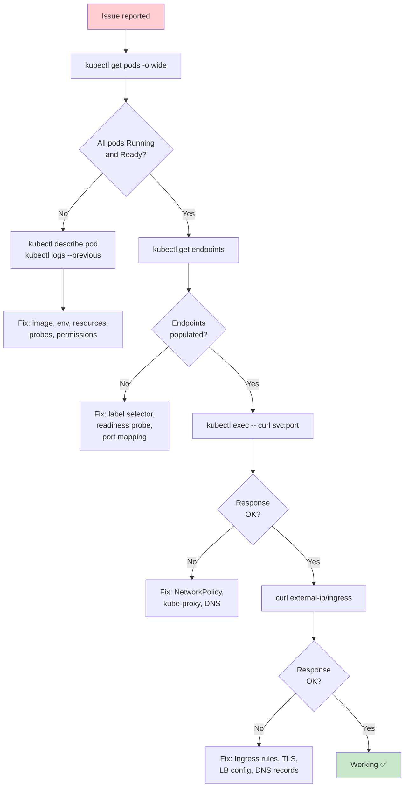

# Kubernetes Debugging & Troubleshooting

> **Prerequisites**: All previous K8s notes  
> **Next**: Helm — [../../Helm/Notes/6_Advanced_Templating.md](../../Helm/Notes/6_Advanced_Templating.md)

When things break in K8s (and they will), you need a systematic approach. This doc covers the mental framework and tools for debugging pods, services, networking, and storage.

---

## The Debugging Mental Model



**Debug from the inside out**: Pod → App → Service → Ingress.

---

# 1. Debugging Pods

## Pod Status Reference

| Status | Meaning | Action |
|--------|---------|--------|
| `Pending` | Can't be scheduled | Check events, resources, taints |
| `ContainerCreating` | Image pulling or volume mounting | Check image name, pull secrets, PVC |
| `Running` | All containers started | Check logs if app misbehaving |
| `CrashLoopBackOff` | Container keeps crashing | Check logs, command, health probes |
| `ImagePullBackOff` | Can't pull image | Check image name, registry access, pull secrets |
| `Evicted` | Node under resource pressure | Check node resources |
| `OOMKilled` | Container exceeded memory limit | Increase memory limit |
| `Error` | Container exited with error | Check logs |

## Step-by-Step Pod Debug

```bash
# Step 1: What's the pod status?
kubectl get pods -o wide

# Step 2: WHY is it in that status?
kubectl describe pod <pod-name>
# Look at:
#   - Events section (bottom) — scheduling, pulling, failures
#   - Conditions section — Ready, Initialized, ContainersReady
#   - Container status — state, reason, exit code

# Step 3: Check logs
kubectl logs <pod-name>
kubectl logs <pod-name> --previous       # Logs from crashed container
kubectl logs <pod-name> -c <container>   # Specific container in multi-container pod

# Step 4: Get into the container
kubectl exec -it <pod-name> -- sh
# Check: can the app reach its dependencies?
# wget -qO- http://db-svc:5432
# nslookup db-svc
# env | grep DB

# Step 5: Run a debug container (if main container has no shell)
kubectl debug -it <pod-name> --image=busybox --target=<container-name>
```

## Common Pod Issues

### CrashLoopBackOff



```bash
# Check why it crashed
kubectl describe pod <pod> | grep -A5 "Last State"
kubectl logs <pod> --previous

# Check if OOM killed
kubectl describe pod <pod> | grep OOMKilled
```

### ImagePullBackOff

```bash
# Check image name is correct
kubectl describe pod <pod> | grep Image

# Check pull secrets
kubectl get pod <pod> -o yaml | grep imagePullSecrets

# Test image pull manually
docker pull <image>

# For private registries, verify secret exists
kubectl get secret <pull-secret> -o yaml
```

### Pending Pod

```bash
# Check events
kubectl describe pod <pod>

# Common reasons:
# - Insufficient CPU/memory on any node
kubectl describe nodes | grep -A5 "Allocated resources"

# - PVC not bound
kubectl get pvc

# - Node taints without tolerations
kubectl describe nodes | grep Taint

# - Node selector / affinity mismatch
kubectl get nodes --show-labels
```

---

# 2. Debugging Services



```bash
# Step 1: Does the service have endpoints?
kubectl get endpoints <service-name>
# If EMPTY → labels don't match OR pods aren't ready

# Step 2: Check label matching
kubectl get pods --show-labels
kubectl describe svc <service-name>
# Compare "Selector" with pod labels

# Step 3: Check port mapping
kubectl describe svc <service-name>
# Port: 80 (service port)
# TargetPort: 8080 (container port)
# Are these correct?

# Step 4: Test from inside the cluster
kubectl run test-pod --image=busybox -it --rm -- sh
# Inside:
wget -qO- http://<service-name>:<port>
nslookup <service-name>
nslookup <service-name>.<namespace>.svc.cluster.local
```

### Port Mapping Confusion



| Field | Where | What |
|-------|-------|------|
| `port` | Service | What clients connect to |
| `targetPort` | Service | Where traffic is forwarded to (container port) |
| `containerPort` | Pod | What the app listens on |

`port` → `targetPort` must be correct. `containerPort` is informational but should match `targetPort`.

---

# 3. Debugging Networking

```bash
# Test DNS resolution
kubectl exec -it <pod> -- nslookup <service-name>

# Test connectivity to a service
kubectl exec -it <pod> -- curl -v http://<service-name>:<port>

# Check kube-proxy is running
kubectl get pods -n kube-system | grep kube-proxy

# Check Network Policies blocking traffic
kubectl get networkpolicies -A

# Run a network debug pod
kubectl run netdebug --image=nicolaka/netshoot -it --rm -- bash
# Inside: dig, nslookup, curl, ping, traceroute, tcpdump all available
```

---

# 4. Debugging Storage

```bash
# PVC stuck in Pending?
kubectl describe pvc <pvc-name>
# Check events for:
# - StorageClass not found
# - No matching PV
# - Volume in wrong zone

# Check PV binding
kubectl get pv
kubectl get pvc

# Check if volume is mounted inside pod
kubectl exec -it <pod> -- df -h
kubectl exec -it <pod> -- mount | grep <mount-path>

# Check if pod can write
kubectl exec -it <pod> -- touch /data/test-file
```

---

# 5. Debugging Nodes

```bash
# Node status
kubectl get nodes
kubectl describe node <node-name>

# Check conditions
kubectl get nodes -o wide

# Check resource pressure
kubectl top nodes
kubectl describe node <node> | grep -A10 "Conditions"

# Check allocated vs capacity
kubectl describe node <node> | grep -A10 "Allocated resources"

# Check events
kubectl get events --sort-by=.metadata.creationTimestamp
```

### Node Conditions

| Condition | True Means |
|-----------|-----------|
| `Ready` | Node is healthy |
| `MemoryPressure` | Low memory |
| `DiskPressure` | Low disk space |
| `PIDPressure` | Too many processes |
| `NetworkUnavailable` | Network not configured |

---

# 6. Essential Debug Toolkit

```bash
# Quick status check
kubectl get all                           # Everything in current namespace
kubectl get all -A                        # Everything in all namespaces
kubectl get events --sort-by=.metadata.creationTimestamp

# Resource usage
kubectl top pods
kubectl top nodes

# Watch resources live
kubectl get pods -w
kubectl get events -w

# Get YAML of any resource
kubectl get <resource> <name> -o yaml

# Diff between desired and actual
kubectl diff -f manifest.yaml

# Dry run (test without applying)
kubectl apply -f manifest.yaml --dry-run=client
kubectl apply -f manifest.yaml --dry-run=server

# Force delete stuck resources
kubectl delete pod <pod> --force --grace-period=0
```

---

# 7. Debugging Decision Tree



---

## Quick Reference

| Problem | First Command |
|---------|--------------|
| Pod not starting | `kubectl describe pod <pod>` |
| App crashing | `kubectl logs <pod> --previous` |
| Service unreachable | `kubectl get endpoints <svc>` |
| DNS not resolving | `kubectl exec -- nslookup <svc>` |
| PVC stuck Pending | `kubectl describe pvc <pvc>` |
| Node issues | `kubectl describe node <node>` |
| Everything | `kubectl get events --sort-by=.metadata.creationTimestamp` |

---

> **Kubernetes section complete!** You've covered: intro → architecture → pods → YAML → ReplicaSets → Deployments → networking → services → configmaps/secrets → storage → workloads → scheduling → RBAC → ingress → debugging.
>
> **Next up**: Helm advanced topics starting with [Advanced Templating](../../Helm/Notes/6_Advanced_Templating.md)
