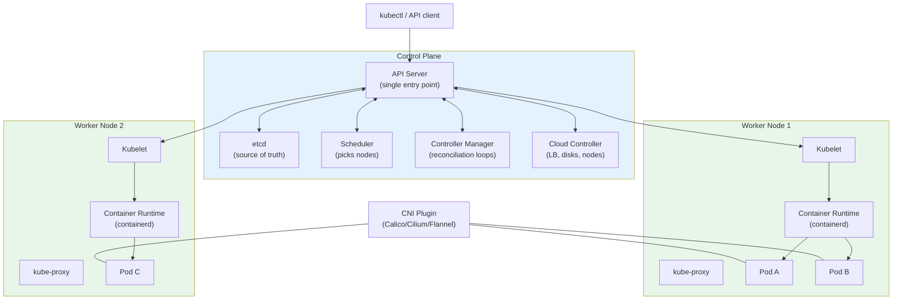
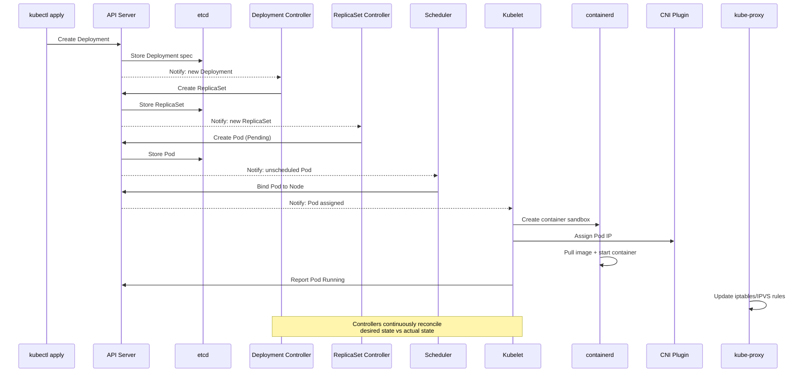

Great — let's go **deep into Kubernetes architecture**, but still keep everything clear and intuitive.
Think of this as the foundation that will make the rest of Kubernetes very easy.

---

# 🏛️ **Kubernetes Architecture — Deep Dive**

At a high level, Kubernetes is a **distributed system** with two major parts:

---

# 🧠 1. **Control Plane**

(Brain of Kubernetes)

# 🔧 2. **Worker Nodes**

(Machines where your containers actually run)

---

Let’s break both down.

---

# 🧠 **1. CONTROL PLANE — The Brain**

The control plane is responsible for:

* Deciding **what** should run
* **Where** it should run
* Making sure the cluster matches the desired state
* Handling failures
* Managing the cluster API

It has 4 core components:

---

## 🧩 **1.1 API Server (kube-apiserver)**

**Heart of Kubernetes. Everything talks to the API Server.**

### Functions:

* Accepts requests from kubectl or external clients
* Validates and stores objects in etcd
* Acts as a **gatekeeper** for security, RBAC, authentication

### Why it's important:

Every component — controller manager, scheduler, kubelets — communicates ONLY through the API server.
No component talks directly to each other.

👉 **API Server = Single entry point for the cluster**

---

## 🧩 **1.2 etcd (key-value database)**

**The source of truth** for the entire cluster.

Stores:

* Pod definitions
* Configurations
* Secrets
* Service objects
* Node states
* Everything!

### Why etcd is critical:

If etcd is lost, the cluster loses its brain.
This is why:

* It must be backed up
* Runs as a highly available cluster
* Needs SSDs and low latency

👉 **etcd = “The memory” of Kubernetes**

---

## 🧩 **1.3 Scheduler (kube-scheduler)**

Responsible for deciding **which node** should run a pod.

### What it checks:

* Node CPU/memory availability
* Taints & tolerations
* Affinity rules
* Pod resource requests/limits
* Node conditions
* Pod topology spread

### How it works:

1. Pod lands in “Pending” state in API server
2. Scheduler picks the best node
3. Updates API server with the decision
4. Kubelet on that node creates the container

👉 **Scheduler = “Matchmaker” between pods and nodes**

---

## 🧩 **1.4 Controller Manager (kube-controller-manager)**

Runs multiple controllers that continuously watch the cluster and ensure the desired state.

Examples:

### **Deployment Controller**

Ensures the number of pod replicas matches the spec.

### **Node Controller**

Checks node health and marks nodes NotReady.

### **ReplicaSet Controller**

Ensures correct number of Pods are running.

### **Job / CronJob Controller**

Ensures completions exist.

### **EndpointSlice Controller**

Manages services endpoints.

### How they behave:

Controllers continuously watch the API server → detect differences → correct them.

👉 **Controller Manager = “Automation engine” that keeps everything running properly**

---

## (Optional but relevant) **Cloud Controller Manager**

Used in cloud environments like AWS, Azure, GCP.

Responsible for:

* Provisioning load balancers
* Managing cloud volumes (EBS, Azure Disk)
* Node lifecycle in cloud

---

# 🧑‍🏭 **2. WORKER NODES — Where Containers Actually Run**

Each worker node runs 3 main components:

---

## 🧩 **2.1 Kubelet**

Agent on every node.

### Responsibilities:

* Talks to API server
* Runs containers via container runtime
* Reports node & pod status
* Executes health checks (liveness, readiness, startup)

👉 **Kubelet = “Node manager”**

---

## 🧩 **2.2 Container Runtime**

This is what actually runs your containers.

Supported runtimes:

* containerd (default)
* CRI-O
* Docker (deprecated for direct usage)

Kubelet talks to the runtime via CRI (Container Runtime Interface).

👉 **Container Runtime = “Container engine”**

---

## 🧩 **2.3 Kube-Proxy**

Networking component.

### Responsibilities:

* Maintains network rules on each node
* Implements service cluster IP routing
* Handles load balancing across pods

Before, kube-proxy used iptables, now often uses IPVS.

👉 **Kube-Proxy = “Network traffic manager”**

---

# 🔌 Network & CNI Layer (Important)

Kubernetes doesn’t implement container networking itself.
It uses the **Container Network Interface (CNI)**.

Examples:

* Calico
* Weave
* Flannel
* Cilium

A CNI plugin gives:

* Pod IPs
* Cross-node communication
* Network policies
* Overlay or BGP routing

👉 **CNI = “Network provider” for Kubernetes**

---

# 📦 Kubernetes Object Storage (Desired State Model)

When you apply a YAML file, say a Deployment:

1. API Server receives it
2. Stores it in etcd
3. Controllers notice the new desired state
4. Scheduler selects a node
5. Kubelet runs the containers
6. Kube-Proxy sets up networking
7. CNI assigns IPs
8. Controller Manager keeps watching & fixing deviations

👉 **Kubernetes continuously reconciles desired state vs. actual state**

---

# 📊 Putting it all together (flow diagram in words)

1. **kubectl apply** → API Server
2. API Server → saves to etcd
3. Deployment Controller → creates ReplicaSet
4. ReplicaSet → creates Pods
5. Scheduler → picks nodes
6. Kubelet → starts containers
7. CNI → assigns IPs
8. kube-proxy → sets service networking
9. Controllers keep monitoring
10. If a pod dies → kubelet restarts
11. If a node dies → scheduler reschedules pods elsewhere

---

# 📊 Architecture Diagram (Visual)

# 📊 Deployment Flow (Visual)

---
