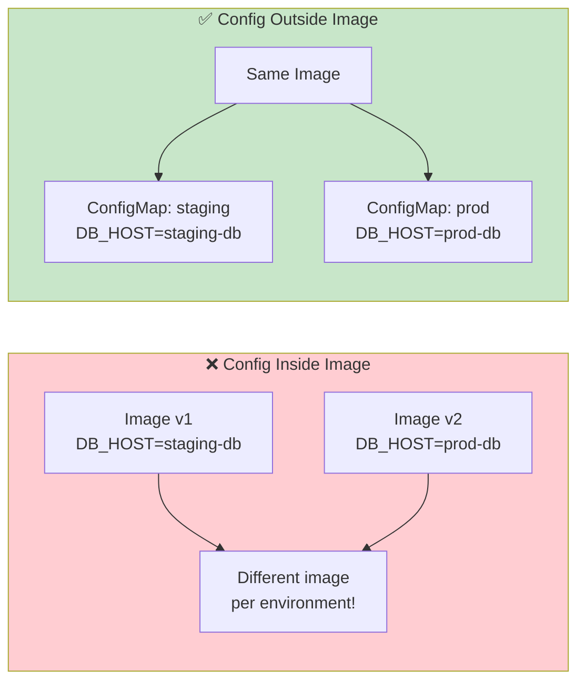
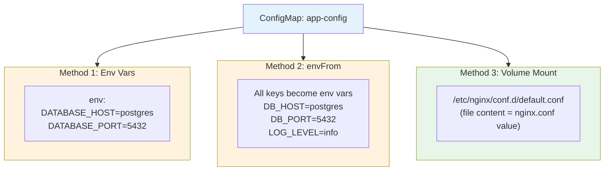
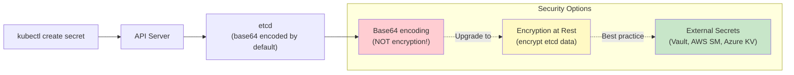
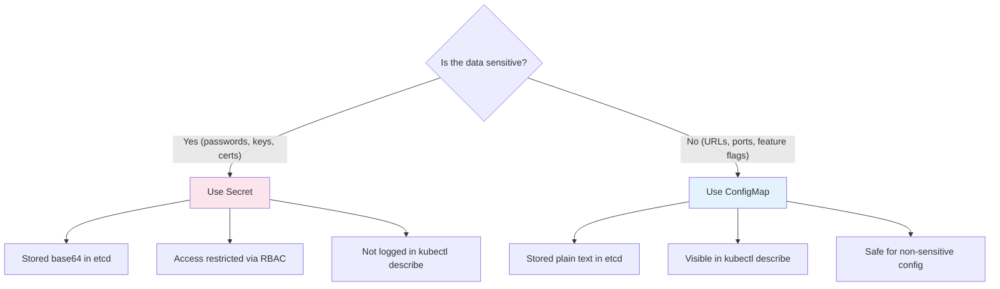
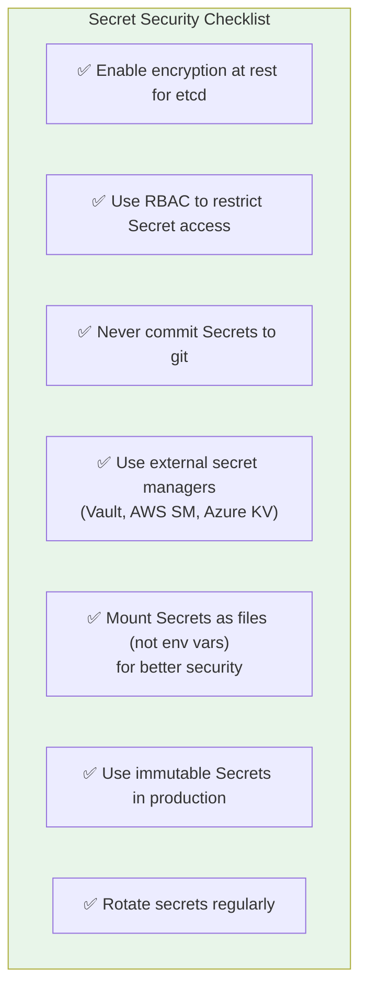

# ConfigMaps & Secrets — Externalizing Configuration

> **Prerequisites**: [3_pods.md](./3_pods.md), [6_Deployments.md](./6_Deployments.md)  
> **Next**: [10_Storage_PV_PVC.md](./10_Storage_PV_PVC.md)

Hard-coding config inside container images is bad practice. ConfigMaps and Secrets let you **decouple configuration from code** — change behavior without rebuilding images.

---

## Why Externalize Configuration?



**One image, many environments.** ConfigMaps/Secrets provide the environment-specific values.

---

# 1. ConfigMaps — Non-Sensitive Configuration

A ConfigMap holds **key-value pairs** that pods consume as environment variables or mounted files.

## Creating ConfigMaps

### From literal values

```bash
kubectl create configmap app-config \
  --from-literal=DB_HOST=postgres \
  --from-literal=DB_PORT=5432 \
  --from-literal=LOG_LEVEL=info
```

### From a file

```bash
# config.properties
DB_HOST=postgres
DB_PORT=5432
LOG_LEVEL=info

kubectl create configmap app-config --from-file=config.properties
```

### From YAML (declarative — preferred)

```yaml
apiVersion: v1
kind: ConfigMap
metadata:
  name: app-config
  namespace: default
data:
  DB_HOST: "postgres"
  DB_PORT: "5432"
  LOG_LEVEL: "info"
  # Multi-line config file
  nginx.conf: |
    server {
      listen 80;
      server_name localhost;
      location / {
        proxy_pass http://backend:8080;
      }
    }
```

```bash
kubectl apply -f configmap.yaml
```

---

## Consuming ConfigMaps in Pods

### Method 1: Environment Variables (individual keys)

```yaml
apiVersion: v1
kind: Pod
metadata:
  name: myapp
spec:
  containers:
    - name: app
      image: myapp:latest
      env:
        - name: DATABASE_HOST
          valueFrom:
            configMapKeyRef:
              name: app-config
              key: DB_HOST
        - name: DATABASE_PORT
          valueFrom:
            configMapKeyRef:
              name: app-config
              key: DB_PORT
```

### Method 2: All keys as environment variables

```yaml
spec:
  containers:
    - name: app
      image: myapp:latest
      envFrom:
        - configMapRef:
            name: app-config
```

All keys in `app-config` become environment variables.

### Method 3: Volume mount (as files)

```yaml
spec:
  containers:
    - name: nginx
      image: nginx
      volumeMounts:
        - name: config-volume
          mountPath: /etc/nginx/conf.d
  volumes:
    - name: config-volume
      configMap:
        name: app-config
        items:
          - key: nginx.conf
            path: default.conf
```

Each key becomes a file inside the mount path.



### When to Use Which Method

| Method | Best For | Auto-Update? |
|--------|----------|-------------|
| `env` (individual) | Selective keys, renaming | ❌ Requires pod restart |
| `envFrom` | All keys at once | ❌ Requires pod restart |
| Volume mount | Config files (nginx.conf, etc.) | ✅ Updates automatically (~60s) |

---

# 2. Secrets — Sensitive Configuration

Secrets are like ConfigMaps, but for **sensitive data**: passwords, API keys, TLS certificates.

## How Secrets Are Stored



> **Important**: Base64 is NOT encryption. Anyone with `kubectl get secret -o yaml` can decode it. Enable encryption at rest or use external secret managers in production.

## Creating Secrets

### From literal values

```bash
kubectl create secret generic db-credentials \
  --from-literal=DB_USER=admin \
  --from-literal=DB_PASSWORD=s3cur3P@ss!
```

### From YAML (values must be base64-encoded)

```bash
# Encode values
echo -n 'admin' | base64         # YWRtaW4=
echo -n 's3cur3P@ss!' | base64   # czNjdXIzUEBzcyE=
```

```yaml
apiVersion: v1
kind: Secret
metadata:
  name: db-credentials
type: Opaque
data:
  DB_USER: YWRtaW4=
  DB_PASSWORD: czNjdXIzUEBzcyE=
```

### Using `stringData` (plain text — K8s encodes for you)

```yaml
apiVersion: v1
kind: Secret
metadata:
  name: db-credentials
type: Opaque
stringData:
  DB_USER: admin
  DB_PASSWORD: "s3cur3P@ss!"
```

## Consuming Secrets in Pods

### As environment variables

```yaml
spec:
  containers:
    - name: app
      image: myapp
      env:
        - name: DB_USER
          valueFrom:
            secretKeyRef:
              name: db-credentials
              key: DB_USER
        - name: DB_PASSWORD
          valueFrom:
            secretKeyRef:
              name: db-credentials
              key: DB_PASSWORD
```

### As mounted files

```yaml
spec:
  containers:
    - name: app
      image: myapp
      volumeMounts:
        - name: secret-volume
          mountPath: /etc/secrets
          readOnly: true
  volumes:
    - name: secret-volume
      secret:
        secretName: db-credentials
```

Files created:
```
/etc/secrets/DB_USER      → contains "admin"
/etc/secrets/DB_PASSWORD   → contains "s3cur3P@ss!"
```

## Secret Types

| Type | Purpose | Example |
|------|---------|---------|
| `Opaque` | Generic key-value pairs | DB passwords, API keys |
| `kubernetes.io/tls` | TLS certificate + key | HTTPS termination |
| `kubernetes.io/dockerconfigjson` | Docker registry credentials | Private image pulls |
| `kubernetes.io/basic-auth` | Username + password | Basic HTTP auth |

### TLS Secret Example

```bash
kubectl create secret tls my-tls \
  --cert=cert.pem \
  --key=key.pem
```

### Docker Registry Secret

```bash
kubectl create secret docker-registry regcred \
  --docker-server=myregistry.azurecr.io \
  --docker-username=user \
  --docker-password=pass
```

Used in pod spec:

```yaml
spec:
  imagePullSecrets:
    - name: regcred
```

---

# 3. ConfigMap vs Secret — When to Use Which



| Aspect | ConfigMap | Secret |
|--------|-----------|--------|
| Data type | Non-sensitive | Sensitive |
| Storage | Plain text in etcd | Base64 in etcd |
| Size limit | 1 MB | 1 MB |
| Visible in `describe` | ✅ Yes | ❌ Values hidden |
| RBAC | Standard | Should be restricted |
| Use for | DB_HOST, LOG_LEVEL, config files | DB_PASSWORD, API_KEY, TLS certs |

---

# 4. Immutable ConfigMaps & Secrets

For production stability, mark them immutable — prevents accidental changes:

```yaml
apiVersion: v1
kind: ConfigMap
metadata:
  name: app-config
data:
  DB_HOST: "postgres"
immutable: true
```

Once set, you can't edit this ConfigMap. You must delete and recreate it.

**Benefits**:
- Protects against accidental config changes in production
- Improves performance (kubelet stops watching for updates)

---

# 5. Common Patterns

### Pattern 1: Separate ConfigMaps per Environment

```
configmaps/
├── base-config.yaml        # Shared across all envs
├── dev-config.yaml          # Dev-specific overrides
├── staging-config.yaml      # Staging-specific
└── prod-config.yaml         # Production-specific
```

### Pattern 2: ConfigMap for Config File + Secret for Credentials

```yaml
spec:
  containers:
    - name: app
      envFrom:
        - secretRef:
            name: db-credentials     # Passwords from Secret
        - configMapRef:
            name: app-config         # Non-sensitive from ConfigMap
      volumeMounts:
        - name: nginx-conf
          mountPath: /etc/nginx/conf.d
  volumes:
    - name: nginx-conf
      configMap:
        name: nginx-config           # Config file from ConfigMap
```

---

# 6. Useful Commands

```bash
# List ConfigMaps
kubectl get configmaps
kubectl get cm                              # short form

# Describe (shows data)
kubectl describe cm app-config

# View raw YAML
kubectl get cm app-config -o yaml

# List Secrets
kubectl get secrets

# Describe (hides values)
kubectl describe secret db-credentials

# Decode a secret value
kubectl get secret db-credentials -o jsonpath='{.data.DB_PASSWORD}' | base64 -d

# Edit ConfigMap
kubectl edit cm app-config

# Delete
kubectl delete cm app-config
kubectl delete secret db-credentials
```

---

# 7. Production Security Checklist



### Why Mount as Files > Env Vars?

- Env vars appear in `docker inspect`, crash dumps, logs
- Mounted files are only accessible in the filesystem
- Files can be updated without pod restart (volume mount)

---

## Summary

| Concept | Purpose | Key Point |
|---------|---------|-----------|
| ConfigMap | Non-sensitive config | Decouple config from image |
| Secret | Sensitive config | Base64 ≠ encryption, use RBAC |
| env/envFrom | Inject as env vars | Requires pod restart on change |
| Volume mount | Inject as files | Auto-updates (~60s), more secure for secrets |
| Immutable | Prevent changes | Production safety |

---

> **Next**: [10_Storage_PV_PVC.md](./10_Storage_PV_PVC.md) — Persistent storage for stateful applications
