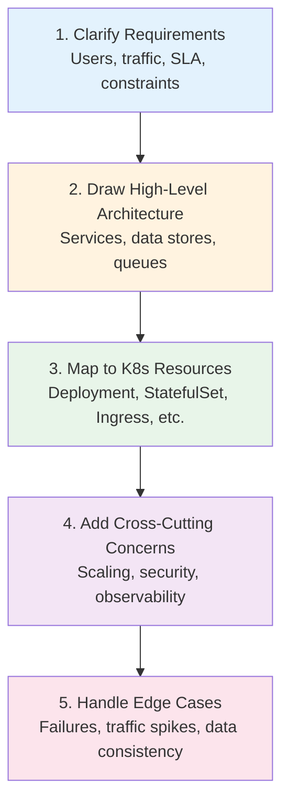
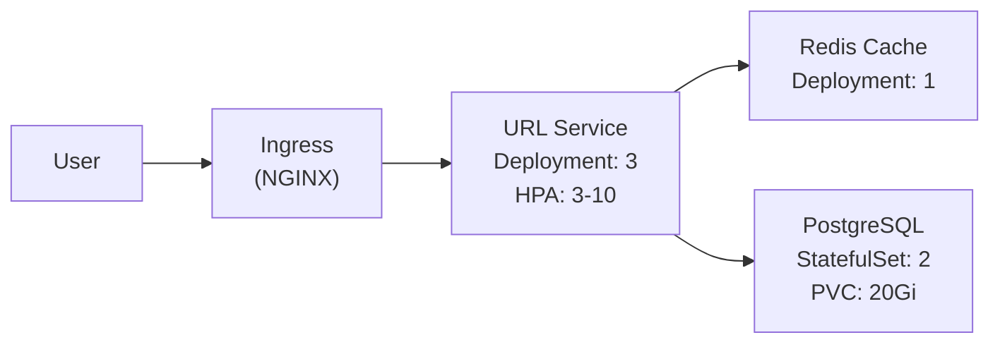
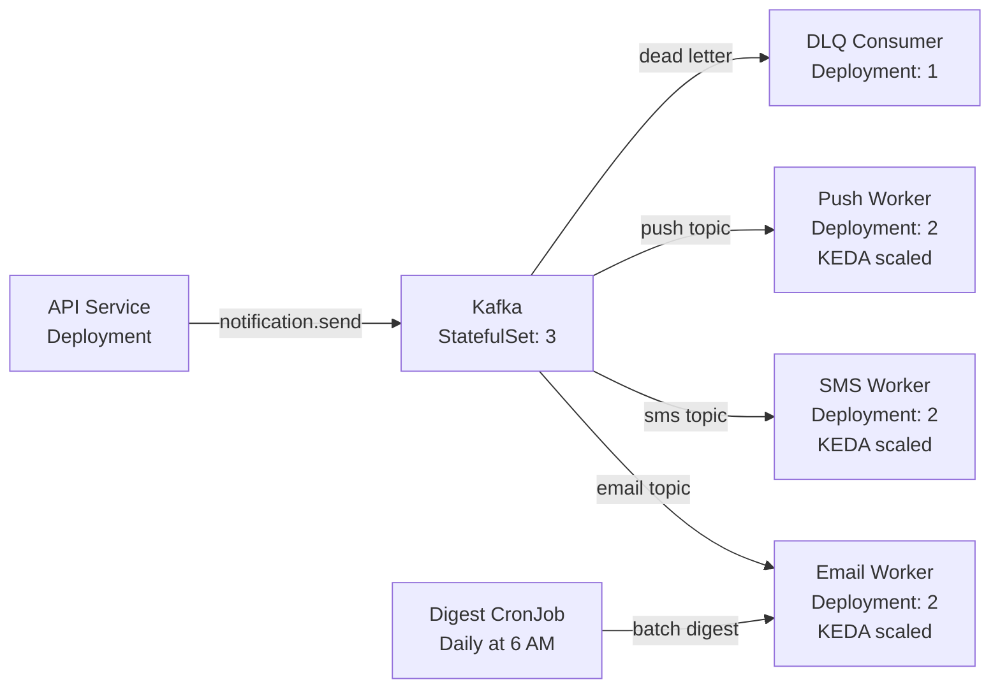
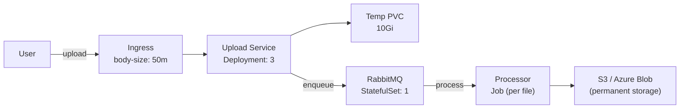
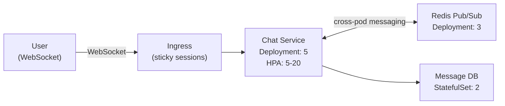
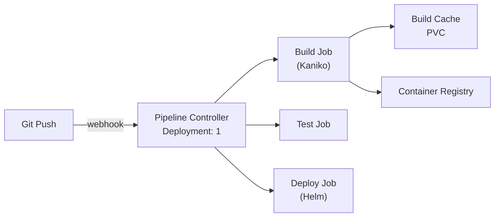
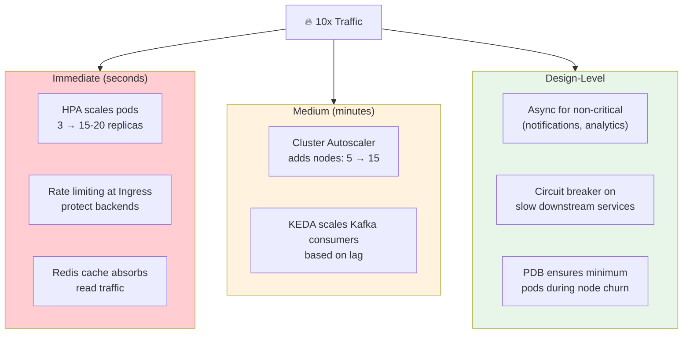

# System Design Interview Scenarios → K8s Design

> **Prerequisites**: All previous System Design notes  
> **Connects to**: [ROADMAP.md](../../ROADMAP.md) — Interview Topics Checklist

This doc covers common system design interview questions and shows how to map your design to Kubernetes primitives. For each scenario, we provide the **architecture, K8s resources, and key design decisions**.

---

## How to Approach K8s System Design Questions

---

# Scenario 1: URL Shortener

**"Design a URL shortener like bit.ly"**

| Component | K8s Resource | Details |
|-----------|-------------|---------|
| URL Service | Deployment + HPA | Scale on CPU (70%), 3-10 replicas |
| PostgreSQL | StatefulSet + PVC | Primary + read replica, 20Gi SSD |
| Redis | Deployment | Cache for hot URLs (read-heavy) |
| Ingress | Ingress (NGINX) | TLS, rate limiting (prevent abuse) |
| Config | ConfigMap | CACHE_TTL, DB_HOST |
| Secrets | Secret | DB_PASSWORD, REDIS_PASSWORD |

**Key decisions**:
- Read-heavy → Redis cache in front of DB
- Short URLs are immutable → high cache hit rate
- Rate limit at Ingress to prevent spam

---

# Scenario 2: Notification System

**"Design a system that sends emails, SMS, and push notifications"**

| Component | K8s Resource | Details |
|-----------|-------------|---------|
| Kafka | StatefulSet (3) + PVC (50Gi) | Event bus, 3 brokers |
| Workers | Deployment + KEDA | Scale on Kafka lag, not CPU |
| Dead Letter Consumer | Deployment (1) | Process failed messages |
| Daily Digest | CronJob | `0 6 * * *` — sends daily summary |

**Key decisions**:
- Async (pub/sub) → decouple sender from delivery
- KEDA auto-scales consumers based on queue lag
- Dead letter queue for failed messages (retry later)
- CronJob for scheduled batch notifications

---

# Scenario 3: File Upload Service

**"Design a service for uploading and processing files (images, documents)"**

| Component | K8s Resource | Details |
|-----------|-------------|---------|
| Upload Service | Deployment (3) | Receives files, stores temporarily |
| Temp Storage | PVC (ReadWriteMany) | NFS/Azure Files for shared access |
| RabbitMQ | StatefulSet (1) + PVC | Job queue |
| File Processor | Job | One Job per file (resize, scan, convert) |
| Permanent Storage | ExternalName Service → S3 | Not in K8s |
| Ingress | Ingress + annotation | `proxy-body-size: 50m` |

**Key decisions**:
- Async processing → user doesn't wait for resize/scan
- Job per file → parallel processing, auto-retry on failure
- RWX PVC for temp storage (shared between upload + processor pods)

---

# Scenario 4: Chat Application

**"Design a real-time chat application"**

| Component | K8s Resource | Details |
|-----------|-------------|---------|
| Chat Service | Deployment + HPA | WebSocket connections, scale on connections |
| Redis | Deployment (3, Sentinel) | Pub/Sub for cross-pod message delivery |
| Message DB | StatefulSet + PVC | Persist messages (Postgres/MongoDB) |
| Ingress | Ingress + annotations | `affinity: cookie` (sticky sessions for WebSocket) |

**Key decisions**:
- WebSocket → sticky sessions at Ingress
- Redis pub/sub → when user A is on pod-1 and user B is on pod-3, Redis broadcasts
- HPA scales on custom metric (active WebSocket connections)

---

# Scenario 5: CI/CD Pipeline

**"Design a CI/CD system that builds, tests, and deploys code"**

| Component | K8s Resource | Details |
|-----------|-------------|---------|
| Pipeline Controller | Deployment (1) | Tekton / Argo Workflows |
| Build | Job (Kaniko) | Build container image without Docker daemon |
| Test | Job | Run test suite |
| Deploy | Job (Helm) | `helm upgrade --install --atomic` |
| Build Cache | PVC (ReadWriteMany) | Cache layers across builds |
| ServiceAccount | RBAC-scoped | Only deploy to specific namespaces |
| NetworkPolicy | Isolate build pods | Build pods can't access production |

**Key decisions**:
- Jobs for each stage (auto-retry, parallelism)
- Kaniko for in-cluster builds (no Docker-in-Docker security risk)
- RBAC: CI/CD ServiceAccount can only create/update Deployments, not delete
- NetworkPolicy: build namespace isolated from production

---

# Scenario 6: Handle 10x Traffic Spike

**"Your e-commerce platform is getting 10x normal traffic during a flash sale. How do you handle it?"**

### What You'd Say in an Interview

1. **HPA** auto-scales pods based on CPU (responds in ~15-30s)
2. **Cluster Autoscaler** adds nodes when pods are Pending (~2-5 min)
3. **Rate limiting** at Ingress to protect from abuse
4. **Redis cache** to reduce DB load (most reads are cache hits)
5. **Kafka** buffers async work (emails, analytics) — prevents backpressure
6. **Circuit breaker** on downstream services (prevent cascade if payment API is slow)
7. **PDB** ensures minimum pods during the node scaling churn
8. **topologySpreadConstraints** spreads pods across AZs for resilience

---

## Interview Quick Reference

| Question | Key Points to Cover |
|----------|-------------------|
| "Design X on K8s" | Workload types + communication + scaling + security |
| "How to handle failures?" | Probes + circuit breaker + retry + PDB + multi-AZ |
| "How to deploy safely?" | Rolling update / canary + readiness probe + rollback |
| "How to secure it?" | NetworkPolicy + RBAC + mTLS + Pod Security + secrets |
| "How to monitor it?" | Prometheus (metrics) + Fluent Bit (logs) + Jaeger (traces) |
| "How to scale it?" | HPA (pods) + KEDA (queue) + CA (nodes) + cache + async |
| "Sync vs async?" | Sync for user-facing, async for background + fan-out |
| "Database design?" | StatefulSet + PVC for in-cluster, ExternalName for managed |

---

## Summary

The key to system design on K8s:

1. **Every box on the whiteboard** → K8s workload (Deployment, StatefulSet, Job, CronJob, DaemonSet)
2. **Every arrow** → Communication (ClusterIP sync, Kafka async)
3. **Every concern** → K8s primitive (HPA scaling, NetworkPolicy security, Prometheus observability)
4. **Always mention** → How it handles failure, how it scales, how it's secured

---

> **System Design section complete!**  
> Full learning path: Docker → Kubernetes → Helm → System Design  
> Refer to [ROADMAP.md](../../ROADMAP.md) for the complete schedule and interview checklist.
