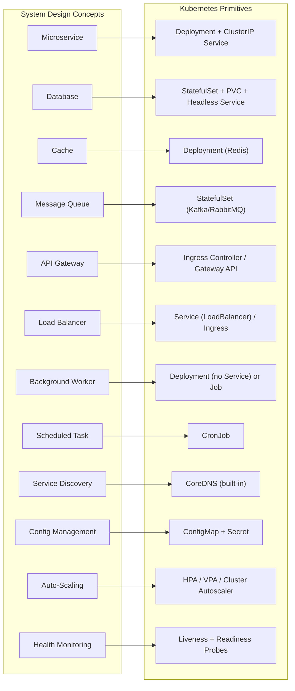
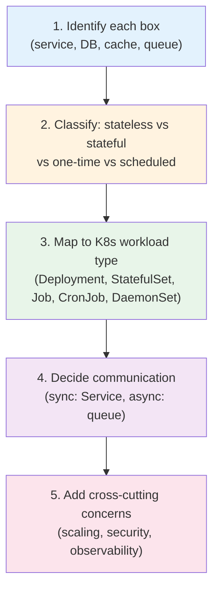
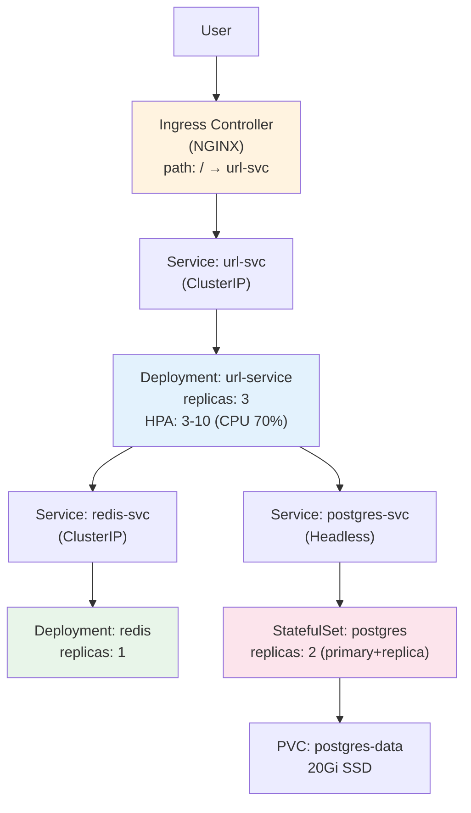
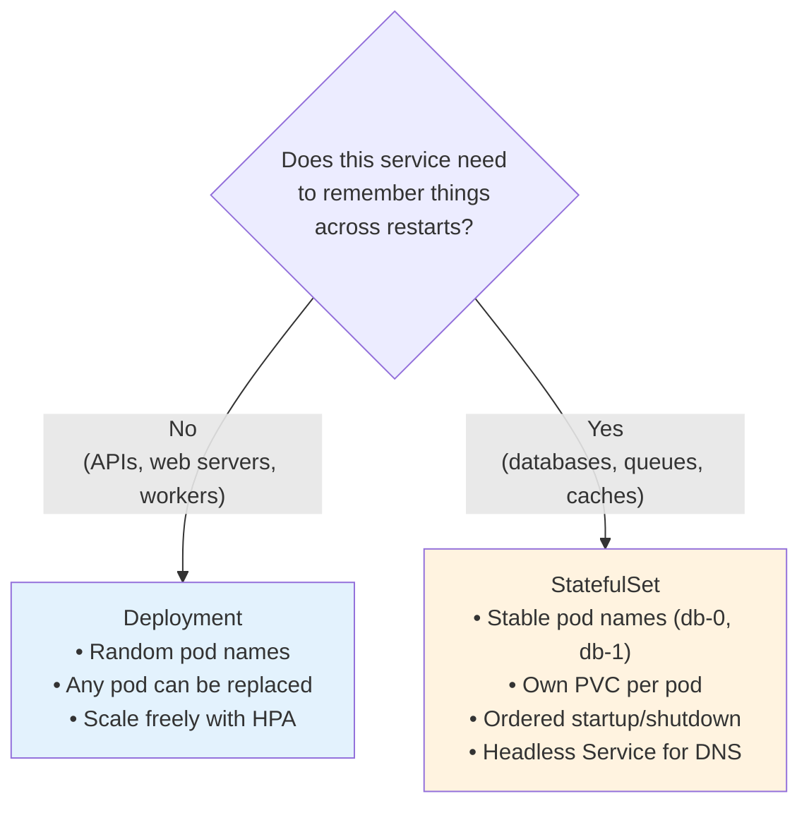

# System Design → Kubernetes Mapping

> **Prerequisites**: All Docker, K8s, and Helm notes  
> **Next**: [2_Distributed_Networking_Layers.md](./2_Distributed_Networking_Layers.md)

In interviews, you're not asked "what is a Deployment" — you're asked "design the backend for a ride-sharing app." This doc bridges **system design thinking** with **Kubernetes primitives** so you can translate any whiteboard design into a real architecture.

---

## The Translation Table

Every system design concept maps to a specific K8s primitive. Once you internalize this table, you can design any system on K8s.



---

## Full Translation Reference

| System Design Concept | K8s Primitive | Why |
|----------------------|---------------|-----|
| **Stateless Service** (API, web) | Deployment + Service (ClusterIP) | Pods are interchangeable, HPA can scale freely |
| **Stateful Service** (DB, queue) | StatefulSet + PVC + Headless Service | Stable identity, ordered ops, own storage per pod |
| **API Gateway** | Ingress Controller (NGINX/Traefik) or Gateway API | L7 routing, TLS, rate limiting, auth |
| **Load Balancer** | Service (type: LoadBalancer) or Ingress | Distributes traffic to pods |
| **Service Discovery** | CoreDNS (automatic) | `svc.namespace.svc.cluster.local` — zero config |
| **Config Management** | ConfigMap + Secret | Decouple config from code, env-specific overrides |
| **Secret Management** | Secret + External Secrets Operator + Vault | Encrypted at rest, RBAC-controlled |
| **Auto-Scaling** | HPA (pods) / VPA (right-size) / Cluster Autoscaler (nodes) | Scale at every layer |
| **Health Monitoring** | Liveness + Readiness + Startup Probes | Auto-restart unhealthy, remove from LB if not ready |
| **Background Worker** | Deployment (no Service exposed) | Processes queue messages, no inbound traffic |
| **One-Time Task** | Job | DB migration, data import, backfill |
| **Scheduled Task** | CronJob | Nightly reports, cleanup, backups |
| **Message Queue** | StatefulSet (Kafka/RabbitMQ) or managed service | Stable storage, ordered pods |
| **Cache Layer** | Deployment (Redis/Memcached) | Stateless enough for Deployment, or StatefulSet for persistence |
| **Log Aggregation** | DaemonSet (Fluent Bit/Fluentd) → ELK/Loki | One collector per node, scrapes all pod logs |
| **Metrics Collection** | DaemonSet (node-exporter) + Prometheus (Deployment) | Node metrics + app metrics |
| **Distributed Tracing** | Deployment (Jaeger/Tempo) + OpenTelemetry SDK | Request journey across services |
| **Service Mesh** | Istio / Linkerd (sidecar injection) | mTLS, retries, traffic splitting without code |
| **Circuit Breaker** | Service Mesh (Istio DestinationRule) or app-level (Resilience4j) | Prevent cascading failures |
| **Rate Limiting** | Ingress annotations or Service Mesh | Protect backends from overload |
| **Blue-Green Deploy** | Two Deployments + Service selector switch | Instant rollback |
| **Canary Deploy** | Argo Rollouts / Istio traffic splitting | Gradual traffic shift |

---

## The Mental Framework: From Whiteboard to YAML

When you see a system design diagram, follow this process:



---

## Example: URL Shortener → K8s

### Whiteboard Design
```
User → API Gateway → URL Service → Database
                         ↓
                       Cache (Redis)
```

### K8s Translation



| Component | K8s Resource | Config |
|-----------|-------------|--------|
| API Gateway | Ingress (NGINX) | TLS, rate limiting |
| URL Service | Deployment + HPA | 3-10 replicas, CPU-based |
| Redis Cache | Deployment | 1 replica, or StatefulSet for persistence |
| PostgreSQL | StatefulSet + PVC | Primary + replica, 20Gi SSD |
| Config | ConfigMap | DB_HOST, CACHE_TTL |
| Credentials | Secret | DB_PASSWORD, REDIS_PASSWORD |
| Monitoring | HPA + Probes | Liveness: /healthz, Readiness: /ready |

---

## Stateless vs Stateful — The Key Decision



### When to Use Managed Services vs In-Cluster

| Factor | In-Cluster (StatefulSet) | Managed Service (RDS, ElastiCache) |
|--------|--------------------------|-------------------------------------|
| **Cost** | Cheaper (compute only) | More expensive |
| **Ops burden** | You manage backups, failover | Provider manages everything |
| **Latency** | Lower (same cluster network) | Slightly higher (cross VPC possible) |
| **Best for** | Dev/staging, small-medium scale | Production at scale |
| **K8s mapping** | StatefulSet + PVC | ExternalName Service (DNS pointer) |

### Pointing to a Managed Service

```yaml
apiVersion: v1
kind: Service
metadata:
  name: database
spec:
  type: ExternalName
  externalName: mydb.abc123.us-east-1.rds.amazonaws.com
```

Now your pods can call `database:5432` and it resolves to the managed RDS endpoint — same code works for in-cluster and managed.

---

## Summary

The key insight: **Every box on a system design whiteboard has a direct K8s equivalent.** Master the translation table above, and you can turn any design into infrastructure.

| Design Phase | What to Decide | K8s Tools |
|-------------|----------------|-----------|
| **Workload type** | Stateless / stateful / batch / scheduled | Deployment / StatefulSet / Job / CronJob |
| **Communication** | Sync / async | Service / Ingress / Message Queue |
| **Data** | Persistent / ephemeral | PVC + StorageClass / emptyDir |
| **Scaling** | By CPU / by queue depth / manual | HPA / KEDA / replicas |
| **Security** | Who talks to whom | NetworkPolicy / RBAC / Secrets |
| **Observability** | Metrics / logs / traces | Prometheus / Fluent Bit / Jaeger |

---

> **Next**: [2_Distributed_Networking_Layers.md](./2_Distributed_Networking_Layers.md) — The 4 layers of network traffic in K8s
