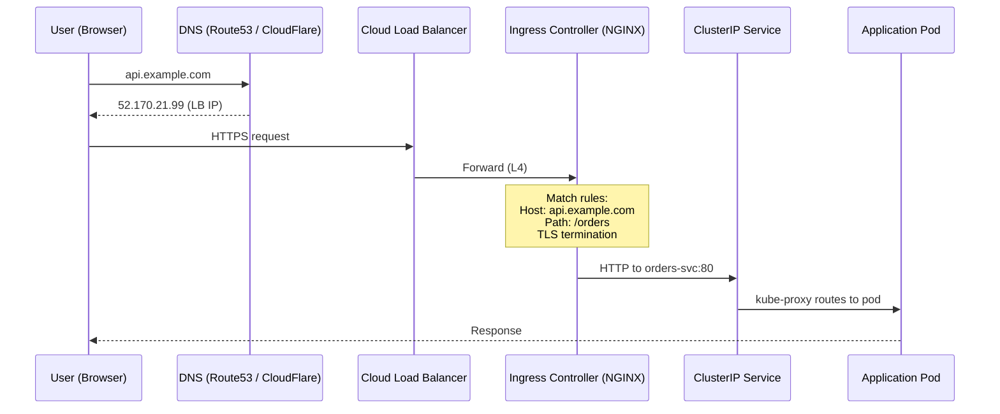
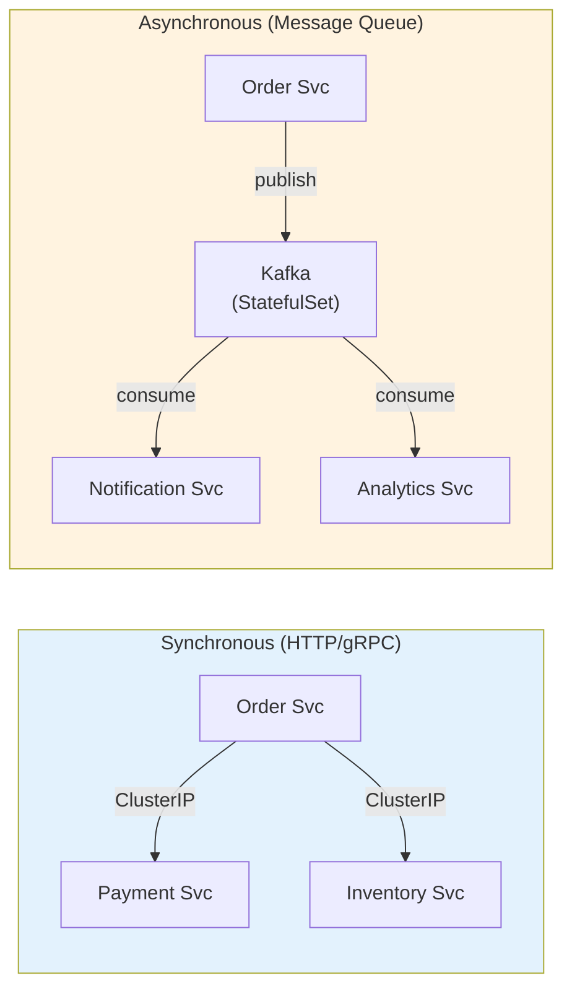
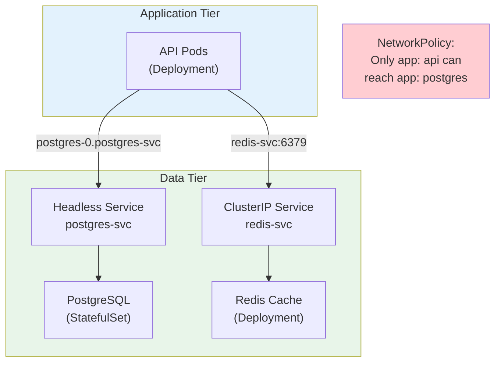
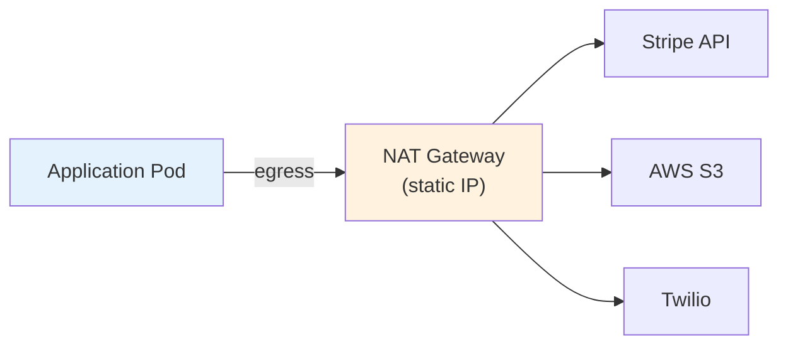
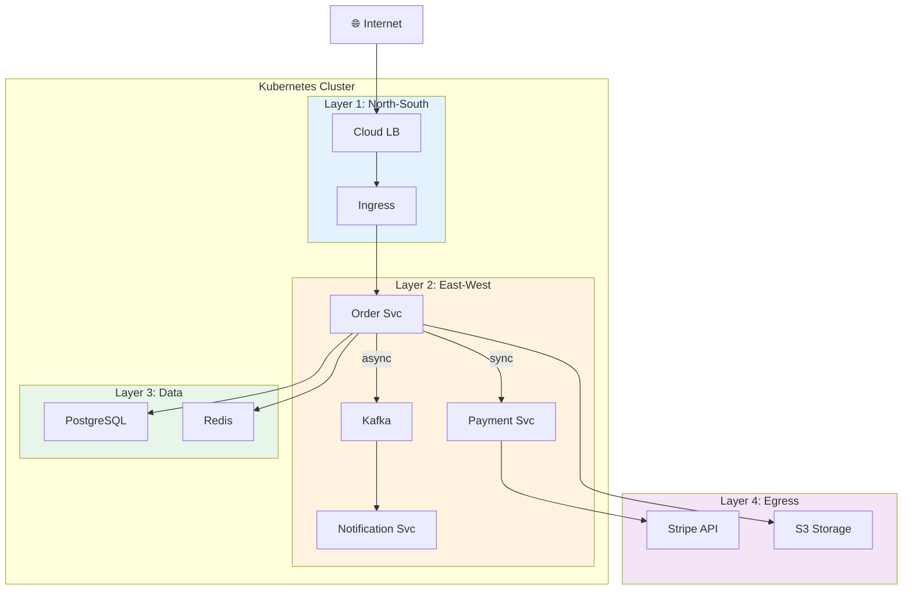

# Designing Networking for Distributed Systems — The 4 Layers

> **Prerequisites**: [1_System_Design_K8s_Mapping.md](./1_System_Design_K8s_Mapping.md), [K8s Networking](../../Kubernetes/Notes/7_Networking.md), [K8s Services](../../Kubernetes/Notes/8_Services.md)  
> **Next**: [3_Sync_vs_Async_Communication.md](./3_Sync_vs_Async_Communication.md)

In any Kubernetes-based distributed system, network traffic falls into **4 distinct layers**. Each has different design decisions, security requirements, and tooling.

---

## The 4 Layers of Network Traffic

```mermaid
graph TB
    subgraph L1["Layer 1: North-South<br/>(External → Cluster)"]
        Internet["Internet"] --> DNS["DNS"] --> LB["Cloud LB"] --> Ingress["Ingress Controller"] --> Svc1["Service"]
    end

    subgraph L2["Layer 2: East-West<br/>(Service → Service)"]
        SvcA["Service A"] -->|"ClusterIP / gRPC"| SvcB["Service B"]
        SvcA -->|"Message Queue"| Queue["Kafka / RabbitMQ"]
        Queue --> SvcC["Service C"]
    end

    subgraph L3["Layer 3: Service → Data Store"]
        SvcD["Backend Pod"] -->|"Headless Service"| DB["Database<br/>(StatefulSet)"]
        SvcD -->|"ClusterIP"| Cache["Redis Cache"]
    end

    subgraph L4["Layer 4: Cluster → External<br/>(Egress)"]
        SvcE["Pod"] -->|"NAT Gateway"| ExtAPI["External API<br/>(Stripe, Twilio)"]
    end

    style L1 fill:#E3F2FD
    style L2 fill:#FFF3E0
    style L3 fill:#E8F5E9
    style L4 fill:#F3E5F5
```



---

# Layer 1: North-South Traffic (External → Cluster)

Traffic from the internet into your cluster. This is the **entry point** for all user requests.

## The Full Path



## Design Decisions

| Decision | Options | Recommendation |
|----------|---------|----------------|
| **How many Ingress?** | One per domain / one global | One per domain (api., app., admin.) |
| **TLS termination** | At Ingress / at Pod | At Ingress (simpler, use cert-manager) |
| **Rate limiting** | Ingress annotations / API gateway | Ingress-level for global, app-level for per-user |
| **DDoS protection** | Cloud WAF / Cloudflare | Before the LB (Cloudflare / AWS Shield) |
| **Authentication** | Ingress auth / app-level | OAuth2-proxy sidecar or app-level JWT |

## K8s Resources Involved

```yaml
# Ingress with production annotations
apiVersion: networking.k8s.io/v1
kind: Ingress
metadata:
  name: api-ingress
  annotations:
    cert-manager.io/cluster-issuer: letsencrypt-prod
    nginx.ingress.kubernetes.io/rate-limit: "100"
    nginx.ingress.kubernetes.io/ssl-redirect: "true"
    nginx.ingress.kubernetes.io/proxy-body-size: "10m"
spec:
  ingressClassName: nginx
  tls:
    - hosts: [api.example.com]
      secretName: api-tls
  rules:
    - host: api.example.com
      http:
        paths:
          - path: /orders
            pathType: Prefix
            backend:
              service:
                name: orders-svc
                port:
                  number: 80
          - path: /users
            pathType: Prefix
            backend:
              service:
                name: users-svc
                port:
                  number: 80
```

---

# Layer 2: East-West Traffic (Service → Service)

Internal communication between microservices. This is the **most complex** layer in a distributed system.



## Design Decisions

| Decision | Options | When to Use |
|----------|---------|-------------|
| **Sync vs Async** | HTTP/gRPC vs Message Queue | Sync: need immediate response. Async: fire-and-forget, fan-out |
| **Direct call vs API gateway** | Service-to-service vs through gateway | Direct for internal; gateway for external-facing |
| **Retries** | App-level / Service mesh | Service mesh (Istio) if many services; app-level if few |
| **mTLS** | Service mesh / manual certs | Service mesh for >10 services |
| **Protocol** | HTTP/REST vs gRPC | gRPC for internal (faster, typed). REST for external (simpler) |

## Service-to-Service Call Pattern

```yaml
# Service A calls Service B using DNS
# No hardcoded IPs — just service names!

# From inside a pod:
# curl http://payment-svc.production.svc.cluster.local:80/charge
# Or simply: curl http://payment-svc:80/charge (same namespace)
```

---

# Layer 3: Service → Data Store

Traffic from application pods to databases, caches, and queues.



## Design Decisions

| Decision | Options | Recommendation |
|----------|---------|----------------|
| **In-cluster vs managed** | StatefulSet vs RDS/Cloud SQL | Managed for production (less ops burden) |
| **Connection pooling** | App-level / sidecar (PgBouncer) | Sidecar PgBouncer for high-connection apps |
| **Read replicas** | Headless Service DNS / separate Services | Headless: `postgres-0` = primary, `postgres-1` = replica |
| **Access control** | NetworkPolicy | Only backend pods should reach DB |
| **Backup** | CronJob | `pg_dump` CronJob writing to PVC or S3 |

## Network Policy: Isolate the Data Tier

```yaml
apiVersion: networking.k8s.io/v1
kind: NetworkPolicy
metadata:
  name: db-access
  namespace: production
spec:
  podSelector:
    matchLabels:
      app: postgres
  policyTypes: [Ingress]
  ingress:
    - from:
        - podSelector:
            matchLabels:
              app: api        # Only API pods can reach the database
      ports:
        - port: 5432
```

---

# Layer 4: Cluster → External (Egress)

Traffic from your pods to external services (Stripe API, Twilio, S3, etc.).



## Design Decisions

| Decision | Options | Why |
|----------|---------|-----|
| **Static egress IP** | NAT Gateway | Partners often whitelist IPs |
| **Egress restrictions** | NetworkPolicy (egress rules) | Prevent pods from calling unauthorized endpoints |
| **Egress gateway** | Istio Egress Gateway | Audit + control all outbound traffic |
| **Circuit breaker** | App-level / Istio | External APIs can be unreliable |

## Egress NetworkPolicy: Restrict Outbound

```yaml
apiVersion: networking.k8s.io/v1
kind: NetworkPolicy
metadata:
  name: api-egress
spec:
  podSelector:
    matchLabels:
      app: api
  policyTypes: [Egress]
  egress:
    - to:
        - podSelector:
            matchLabels:
              app: postgres     # Allow DB access
      ports:
        - port: 5432
    - to:
        - podSelector:
            matchLabels:
              app: redis        # Allow cache access
      ports:
        - port: 6379
    - to:                        # Allow DNS
        - namespaceSelector: {}
          podSelector:
            matchLabels:
              k8s-app: kube-dns
      ports:
        - port: 53
          protocol: UDP
```

---

## All 4 Layers — Visual Summary



---

## Summary

| Layer | Direction | K8s Tools | Security |
|-------|-----------|-----------|----------|
| **1. North-South** | External → Cluster | Ingress, LoadBalancer, cert-manager | TLS, WAF, rate limiting |
| **2. East-West** | Service → Service | ClusterIP, DNS, gRPC | mTLS (mesh), NetworkPolicy |
| **3. Data** | Service → DB/Cache | Headless Service, PVC | NetworkPolicy, encryption |
| **4. Egress** | Cluster → External | NAT Gateway, ExternalName | Egress NetworkPolicy, audit |

---

> **Next**: [3_Sync_vs_Async_Communication.md](./3_Sync_vs_Async_Communication.md) — The core design decision: when to use sync vs async
