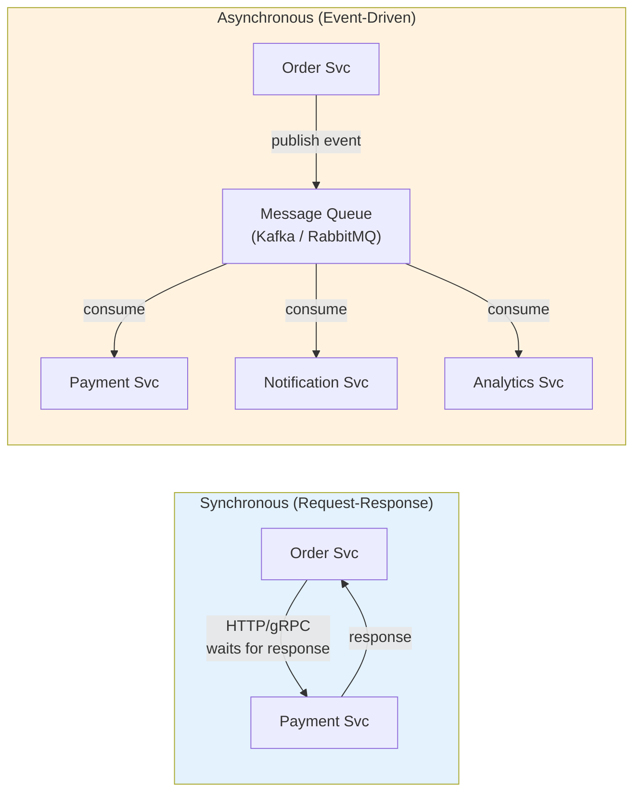
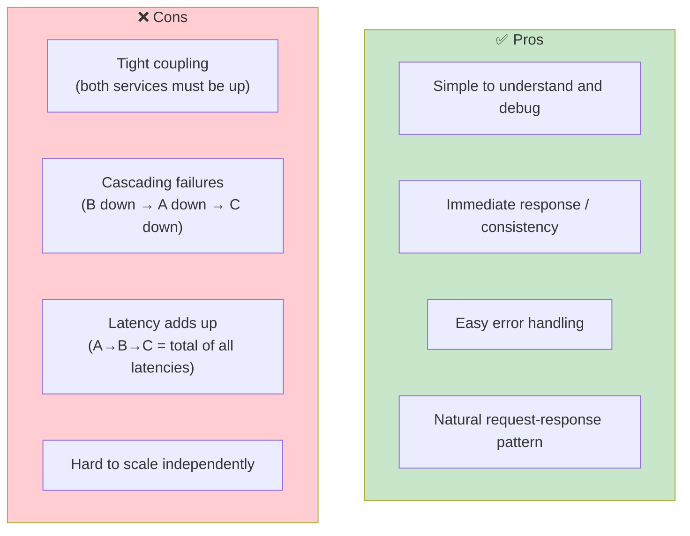
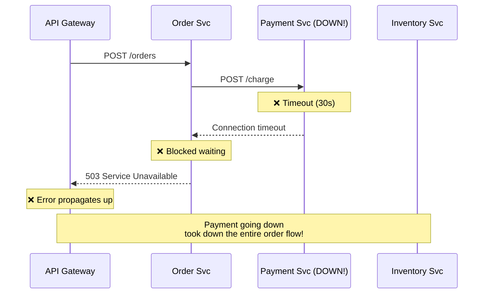
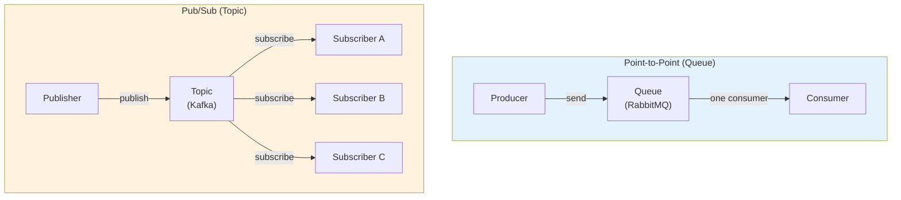
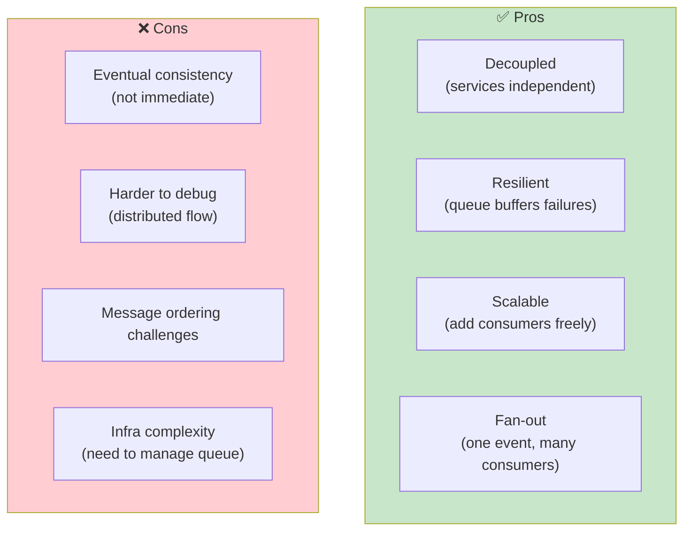
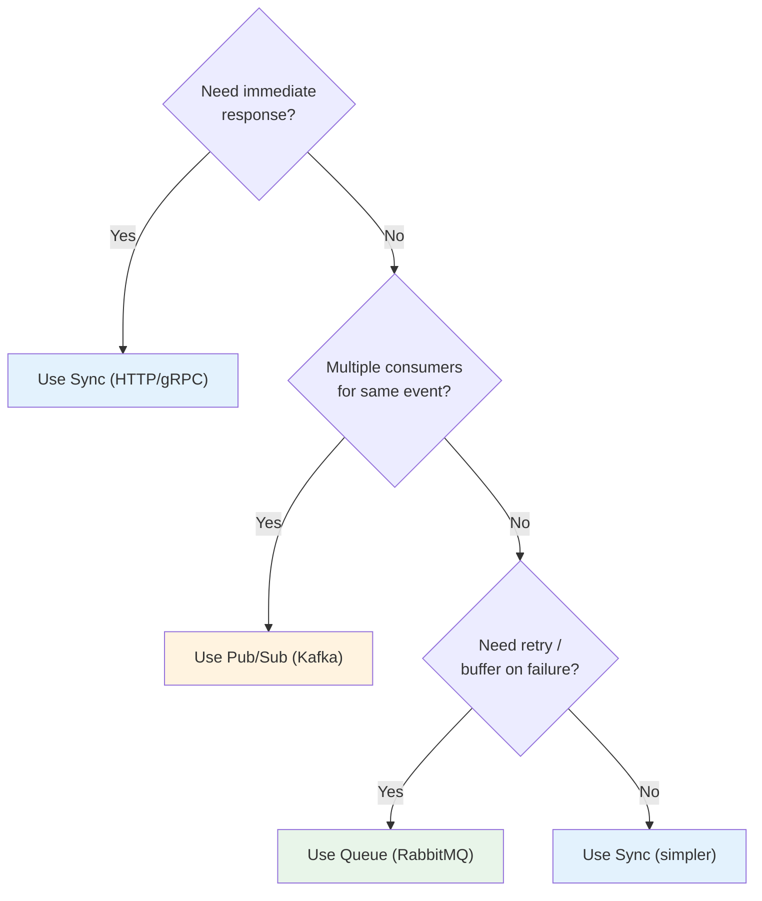
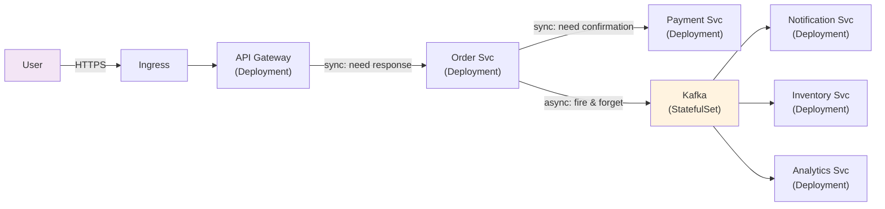
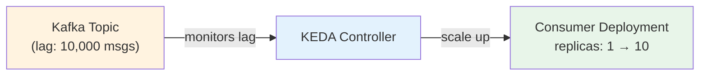

# Sync vs Async Communication — The Core Design Decision

> **Prerequisites**: [2_Distributed_Networking_Layers.md](./2_Distributed_Networking_Layers.md)  
> **Next**: [4_Service_Mesh.md](./4_Service_Mesh.md)

In a microservices architecture, how services talk to each other is the **single most impactful design decision**. Get it wrong, and you get cascading failures, tight coupling, and systems that can't scale.

---

## The Two Models



---

# 1. Synchronous Communication

Service A calls Service B and **waits** for the response before continuing.

## Protocols

| Protocol | Format | Use Case | K8s Service |
|----------|--------|----------|-------------|
| **HTTP/REST** | JSON | External APIs, simple internal calls | ClusterIP |
| **gRPC** | Protobuf (binary) | Internal high-performance calls | ClusterIP (HTTP/2) |
| **GraphQL** | JSON | Frontend → backend aggregation | ClusterIP + Ingress |

## In Kubernetes

```yaml
# Service A calls Service B
# Just use the DNS name!
# http://payment-svc:80/charge
# Or fully qualified: http://payment-svc.production.svc.cluster.local:80/charge

apiVersion: v1
kind: Service
metadata:
  name: payment-svc
spec:
  selector:
    app: payment
  ports:
    - port: 80
      targetPort: 8080
```

## Pros and Cons



## The Cascading Failure Problem



**Solution**: Circuit breaker + timeout + retry (covered in [5_Resilience_Patterns.md](./5_Resilience_Patterns.md))

---

# 2. Asynchronous Communication

Service A sends a message to a queue/topic and **doesn't wait**. Service B processes it independently.

## Patterns



| Pattern | Tool | Use Case |
|---------|------|----------|
| **Queue** (one consumer) | RabbitMQ, SQS | Task processing, work distribution |
| **Pub/Sub** (many consumers) | Kafka, SNS/SQS | Event broadcasting, fan-out |
| **Event Streaming** | Kafka | Event sourcing, log aggregation |

## In Kubernetes

```yaml
# Kafka as StatefulSet
apiVersion: apps/v1
kind: StatefulSet
metadata:
  name: kafka
spec:
  serviceName: kafka-headless
  replicas: 3
  selector:
    matchLabels:
      app: kafka
  template:
    metadata:
      labels:
        app: kafka
    spec:
      containers:
        - name: kafka
          image: confluentinc/cp-kafka:7.5.0
          ports:
            - containerPort: 9092
          volumeMounts:
            - name: data
              mountPath: /var/lib/kafka/data
  volumeClaimTemplates:
    - metadata:
        name: data
      spec:
        accessModes: ["ReadWriteOnce"]
        storageClassName: managed-ssd
        resources:
          requests:
            storage: 50Gi
---
# Headless service for stable DNS
apiVersion: v1
kind: Service
metadata:
  name: kafka-headless
spec:
  clusterIP: None
  selector:
    app: kafka
  ports:
    - port: 9092
# DNS: kafka-0.kafka-headless, kafka-1.kafka-headless, kafka-2.kafka-headless
```

## Pros and Cons



---

# 3. When to Use Which



| Scenario | Communication | Why |
|----------|--------------|-----|
| User places order → validate payment | **Sync** | User needs immediate confirmation |
| Order placed → send confirmation email | **Async** | Email can be delayed, user doesn't wait |
| Order placed → update inventory + analytics + notification | **Async (pub/sub)** | Fan-out to multiple consumers |
| Frontend → Backend API | **Sync (REST/gRPC)** | Direct request-response |
| Upload file → process (resize, scan) | **Async (queue)** | Processing is slow, don't block user |
| Batch data import | **Async (queue)** | Process in parallel with Job/CronJob consumers |

---

# 4. The Hybrid Pattern (Most Production Systems)

Real systems use **both** — sync for the critical path, async for everything else.



**Rule of thumb**: If the user is waiting → sync. If not → async.

---

# 5. Auto-Scaling Async Consumers (KEDA)

KEDA (Kubernetes Event-Driven Autoscaling) scales consumers based on queue depth — not CPU.



```yaml
apiVersion: keda.sh/v1alpha1
kind: ScaledObject
metadata:
  name: order-consumer-scaler
spec:
  scaleTargetRef:
    name: order-consumer          # Deployment name
  minReplicaCount: 1
  maxReplicaCount: 20
  triggers:
    - type: kafka
      metadata:
        bootstrapServers: kafka-headless:9092
        consumerGroup: order-consumers
        topic: orders
        lagThreshold: "100"       # Scale when lag > 100
```

---

## Summary

| Aspect | Synchronous | Asynchronous |
|--------|------------|--------------|
| **Coupling** | Tight (both must be up) | Loose (independent) |
| **Consistency** | Strong (immediate) | Eventual |
| **Failure handling** | Cascading failures | Queue buffers failures |
| **Scaling** | HPA (CPU/memory) | KEDA (queue depth) |
| **Debugging** | Easier (request/response) | Harder (distributed tracing needed) |
| **K8s tools** | ClusterIP Service, gRPC | StatefulSet (Kafka), KEDA |
| **Best for** | User-facing requests | Background processing, fan-out |

---

> **Next**: [4_Service_Mesh.md](./4_Service_Mesh.md) — When and why to add a service mesh
