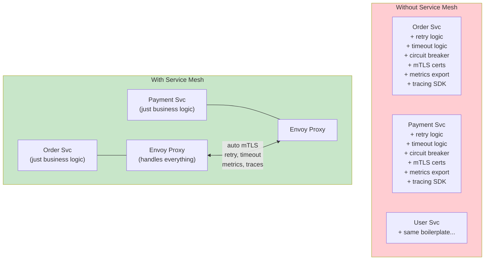
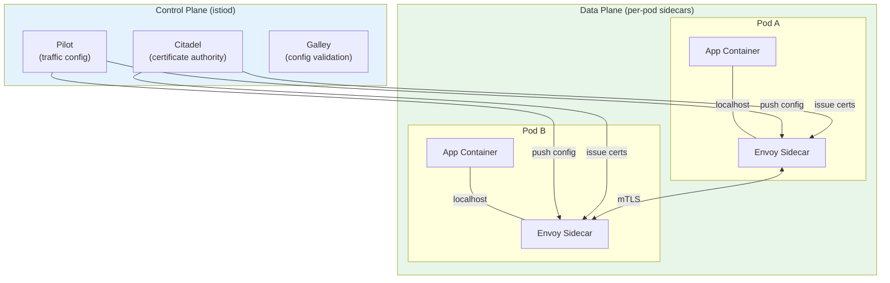
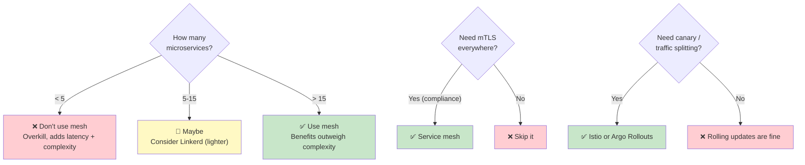

# Service Mesh — When and Why

> **Prerequisites**: [3_Sync_vs_Async_Communication.md](./3_Sync_vs_Async_Communication.md)  
> **Next**: [5_Resilience_Patterns.md](./5_Resilience_Patterns.md)

As your microservices grow, every service needs retries, timeouts, mTLS, tracing, and rate limiting. A service mesh moves all of this out of your application code and into the infrastructure layer.

---

## The Problem: Cross-Cutting Concerns in Every Service



---

## How a Service Mesh Works



**Key concept**: The sidecar proxy is automatically injected into every pod. All traffic flows through the proxy — your app talks to `localhost`, unaware of the mesh.

---

## What a Service Mesh Provides

| Feature | Without Mesh | With Mesh (Istio/Linkerd) |
|---------|-------------|---------------------------|
| **mTLS** | Manual cert management per service | Automatic, zero-config |
| **Retries** | Code in every service (Resilience4j, Polly) | Config in YAML |
| **Circuit breakers** | Code in every service | Config in YAML |
| **Timeouts** | Code in every service | Config in YAML |
| **Traffic splitting** | Complex Ingress rules | VirtualService (10% canary) |
| **Metrics** | Instrument every service | Automatic (Prometheus-ready) |
| **Distributed tracing** | Add SDK to every service | Automatic (trace headers propagated) |
| **Rate limiting** | Ingress or app-level | Config in YAML |
| **Fault injection** | Can't easily test | Inject delays/errors for chaos testing |

---

## Popular Service Meshes

| Mesh | Proxy | Complexity | Best For |
|------|-------|-----------|----------|
| **Istio** | Envoy | High | Large enterprises, full feature set |
| **Linkerd** | Linkerd2-proxy (Rust) | Low | Simpler, lighter, faster startup |
| **Cilium** | eBPF (no sidecar!) | Medium | Performance-critical, eBPF-native |
| **Consul Connect** | Envoy | Medium | HashiCorp ecosystem |

---

## Istio Example: Retry + Timeout + Circuit Breaker

### VirtualService (traffic rules)

```yaml
apiVersion: networking.istio.io/v1beta1
kind: VirtualService
metadata:
  name: payment-vs
spec:
  hosts:
    - payment-svc
  http:
    - route:
        - destination:
            host: payment-svc
      timeout: 3s
      retries:
        attempts: 3
        perTryTimeout: 1s
        retryOn: 5xx,reset,connect-failure
```

### DestinationRule (circuit breaker)

```yaml
apiVersion: networking.istio.io/v1beta1
kind: DestinationRule
metadata:
  name: payment-dr
spec:
  host: payment-svc
  trafficPolicy:
    connectionPool:
      tcp:
        maxConnections: 100
      http:
        h2UpgradePolicy: DEFAULT
        http1MaxPendingRequests: 100
        http2MaxRequests: 1000
    outlierDetection:               # Circuit breaker
      consecutive5xxErrors: 5       # After 5 consecutive 5xx errors
      interval: 10s                 # Check every 10s
      baseEjectionTime: 30s         # Remove pod from pool for 30s
      maxEjectionPercent: 50        # Don't eject more than 50% of pods
```

### Traffic Splitting (Canary)

```yaml
apiVersion: networking.istio.io/v1beta1
kind: VirtualService
metadata:
  name: api-vs
spec:
  hosts:
    - api-svc
  http:
    - route:
        - destination:
            host: api-svc
            subset: stable
          weight: 90
        - destination:
            host: api-svc
            subset: canary
          weight: 10
```

---

## When to Use vs NOT Use a Service Mesh



## Trade-offs

| Benefit | Cost |
|---------|------|
| mTLS everywhere | ~5ms latency per hop (sidecar overhead) |
| No retry/circuit breaker code | Extra memory per pod (~50-100MB for sidecar) |
| Automatic metrics + traces | Steep learning curve (Istio CRDs) |
| Canary deployments | Operational complexity |
| Fault injection for chaos testing | Debugging is harder (2 containers per pod) |

---

## Summary

| Question | Answer |
|----------|--------|
| **What is it?** | Infrastructure layer that handles service-to-service communication |
| **How?** | Sidecar proxy in every pod intercepts all traffic |
| **Why?** | mTLS, retries, circuit breakers, observability — without code changes |
| **When?** | >10 microservices, compliance requirements, complex traffic routing |
| **When NOT?** | <5 services, simple architecture, performance-critical (latency sensitive) |
| **Which one?** | Istio (full featured), Linkerd (simple), Cilium (eBPF, no sidecar) |

---

> **Next**: [5_Resilience_Patterns.md](./5_Resilience_Patterns.md) — Handling failures in distributed systems
