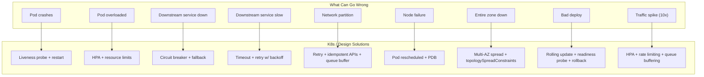
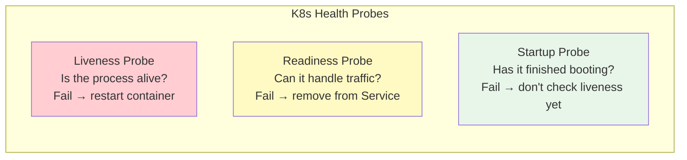
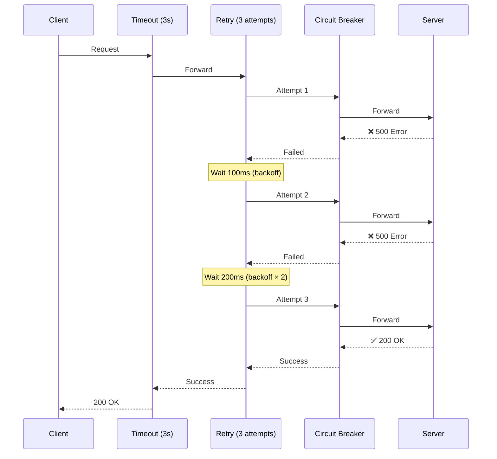
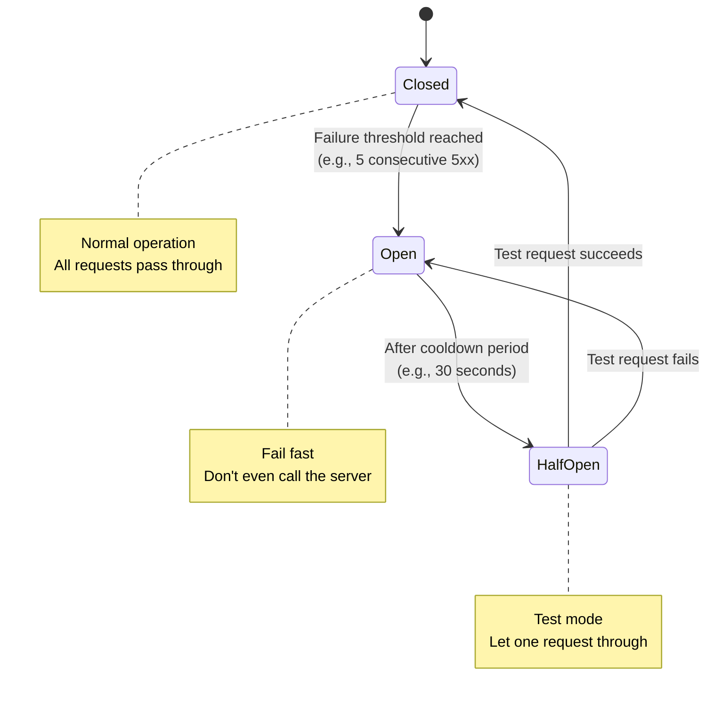
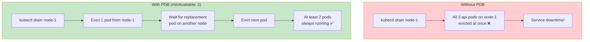
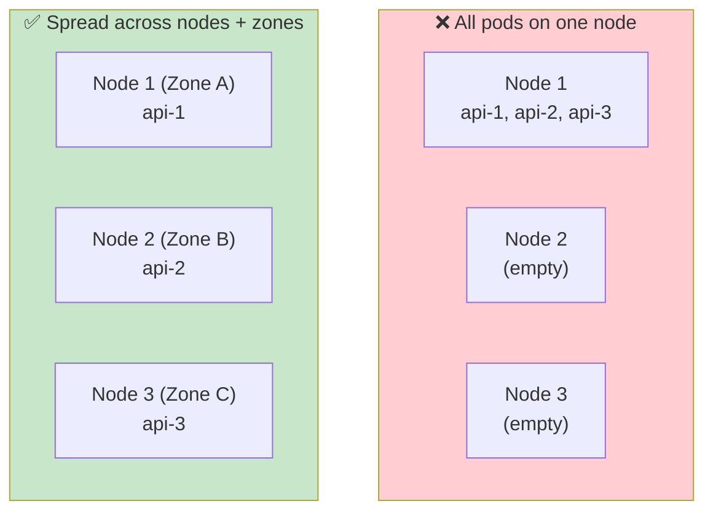
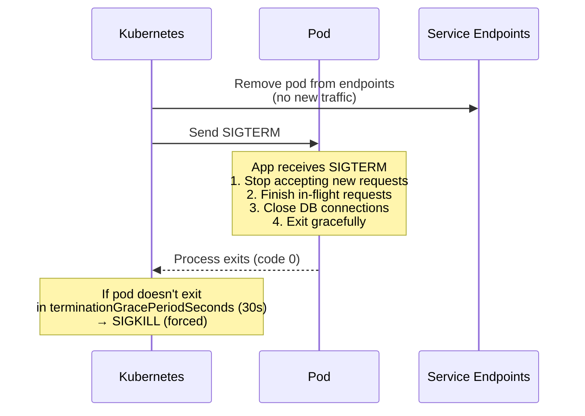

# Resilience Patterns for Distributed Systems

> **Prerequisites**: [3_Sync_vs_Async_Communication.md](./3_Sync_vs_Async_Communication.md), [4_Service_Mesh.md](./4_Service_Mesh.md)  
> **Next**: [6_Zero_Trust_Security.md](./6_Zero_Trust_Security.md)

In distributed systems, **failure is inevitable**. Networks fail, services crash, databases get overloaded. Resilience patterns ensure your system keeps working despite partial failures.

---

## Failure Modes → Solutions



---

# 1. Health Probes — Automatic Recovery



```yaml
spec:
  containers:
    - name: api
      livenessProbe:
        httpGet:
          path: /healthz
          port: 8080
        initialDelaySeconds: 10
        periodSeconds: 10
        failureThreshold: 3      # 3 failures → restart

      readinessProbe:
        httpGet:
          path: /ready
          port: 8080
        initialDelaySeconds: 5
        periodSeconds: 5
        failureThreshold: 2      # 2 failures → remove from endpoints

      startupProbe:
        httpGet:
          path: /healthz
          port: 8080
        failureThreshold: 30
        periodSeconds: 2          # 30 × 2s = 60s max startup time
```

### What Each Probe Should Check

| Probe | Check | Example |
|-------|-------|---------|
| **Liveness** | Is the process healthy? | Simple `/healthz` → 200 OK |
| **Readiness** | Can it handle requests? | DB connected? Cache warm? `/ready` |
| **Startup** | Has it finished booting? | Same as liveness, but generous timeout |

---

# 2. Retry + Timeout + Circuit Breaker — The Holy Trinity



### Timeout

**Never make a call without a timeout.** If the downstream is slow, your threads/connections pile up and your service dies too.

```yaml
# Istio VirtualService
timeout: 3s

# App-level (e.g., HTTP client)
# httpClient.setTimeout(3000)
```

### Retry with Exponential Backoff

Don't hammer a failing service. Wait longer between retries.

```
Attempt 1: wait 100ms
Attempt 2: wait 200ms
Attempt 3: wait 400ms
Attempt 4: wait 800ms + jitter
```

**Jitter** = random delay to prevent all clients retrying at the same time (thundering herd).

```yaml
# Istio VirtualService
retries:
  attempts: 3
  perTryTimeout: 1s
  retryOn: 5xx,reset,connect-failure
```

### Circuit Breaker



| State | Behavior |
|-------|----------|
| **Closed** | Normal — all requests go through |
| **Open** | Blocking — fail immediately, don't overload the failing service |
| **Half-Open** | Testing — let one request through; if it works, close again |

### Where to Implement

| Approach | Tool | When |
|----------|------|------|
| **App-level** | Resilience4j (Java), Polly (.NET), go-circuit | Few services, fine control |
| **Infra-level** | Istio DestinationRule | Many services, no code changes |

---

# 3. Pod Disruption Budgets (PDB) — Survive Node Drains

During node upgrades or scaling, K8s drains nodes (evicts pods). PDB ensures a minimum number of pods stay running.

```yaml
apiVersion: policy/v1
kind: PodDisruptionBudget
metadata:
  name: api-pdb
spec:
  minAvailable: 2              # Always keep at least 2 pods running
  # OR: maxUnavailable: 1      # At most 1 pod can be down
  selector:
    matchLabels:
      app: api
```



---

# 4. Pod Anti-Affinity — Spread Across Nodes/Zones

Don't put all replicas on the same node — if it fails, all pods die.

```yaml
spec:
  affinity:
    podAntiAffinity:
      requiredDuringSchedulingIgnoredDuringExecution:
        - labelSelector:
            matchLabels:
              app: api
          topologyKey: kubernetes.io/hostname     # Different nodes

  topologySpreadConstraints:
    - maxSkew: 1
      topologyKey: topology.kubernetes.io/zone    # Spread across AZs
      whenUnsatisfiable: DoNotSchedule
      labelSelector:
        matchLabels:
          app: api
```



---

# 5. Rate Limiting — Protect from Overload

```yaml
# NGINX Ingress rate limiting
metadata:
  annotations:
    nginx.ingress.kubernetes.io/limit-rps: "100"          # 100 requests/sec per IP
    nginx.ingress.kubernetes.io/limit-burst-multiplier: "5"  # Allow burst of 500
    nginx.ingress.kubernetes.io/limit-connections: "10"      # 10 concurrent connections
```

---

# 6. Graceful Shutdown — Don't Drop In-Flight Requests

When K8s terminates a pod (during scale-down or deploy), it sends SIGTERM. Your app should finish in-flight requests before exiting.



```yaml
spec:
  terminationGracePeriodSeconds: 60     # Give app 60s to finish
  containers:
    - name: api
      lifecycle:
        preStop:
          exec:
            command: ["sh", "-c", "sleep 5"]  # Wait for endpoints to update
```

---

## Summary

| Pattern | Protects Against | K8s Implementation |
|---------|-----------------|-------------------|
| **Liveness Probe** | Stuck/crashed process | `livenessProbe` in pod spec |
| **Readiness Probe** | Serving when not ready | `readinessProbe` in pod spec |
| **Timeout** | Slow downstream calls | Istio VirtualService / app-level |
| **Retry + Backoff** | Transient failures | Istio / app-level |
| **Circuit Breaker** | Cascading failures | Istio DestinationRule / app-level |
| **PDB** | Node drain killing all pods | PodDisruptionBudget |
| **Anti-Affinity** | Node/zone failure | podAntiAffinity / topologySpreadConstraints |
| **HPA** | Traffic spikes | HorizontalPodAutoscaler |
| **Rate Limiting** | DDoS / overload | Ingress annotations |
| **Graceful Shutdown** | Dropped in-flight requests | preStop hook + terminationGracePeriodSeconds |

---

> **Next**: [6_Zero_Trust_Security.md](./6_Zero_Trust_Security.md) — Designing security for distributed systems
