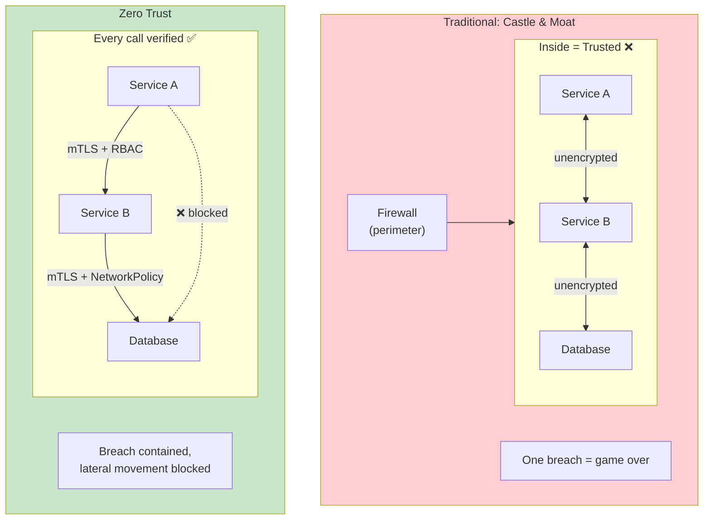
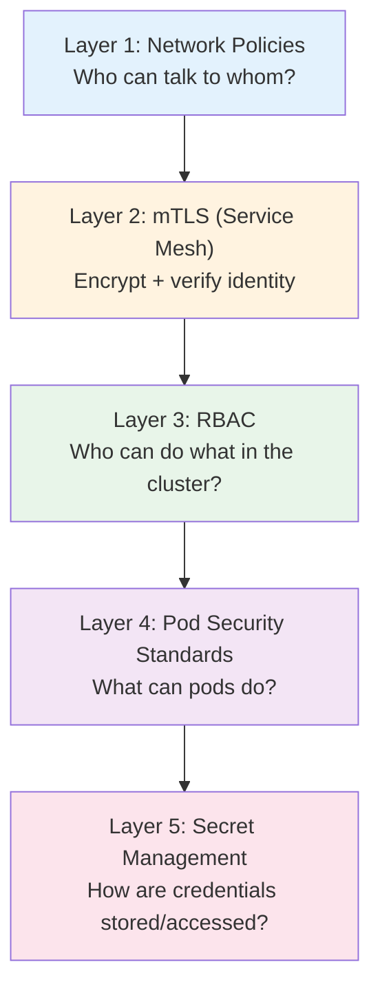
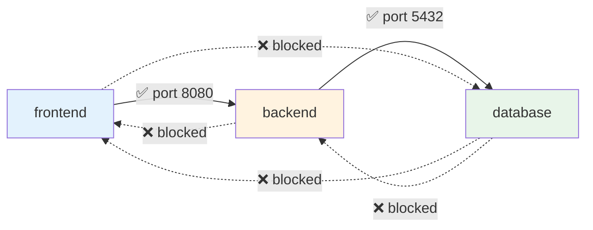
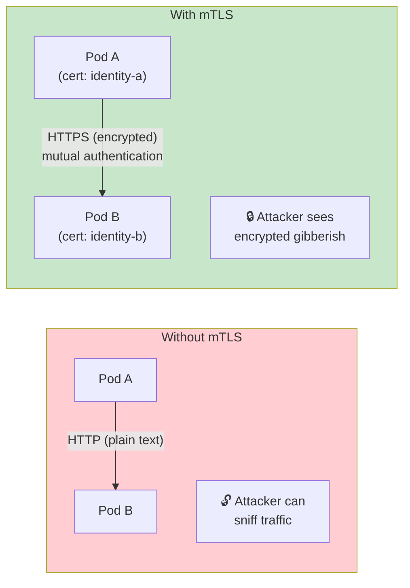
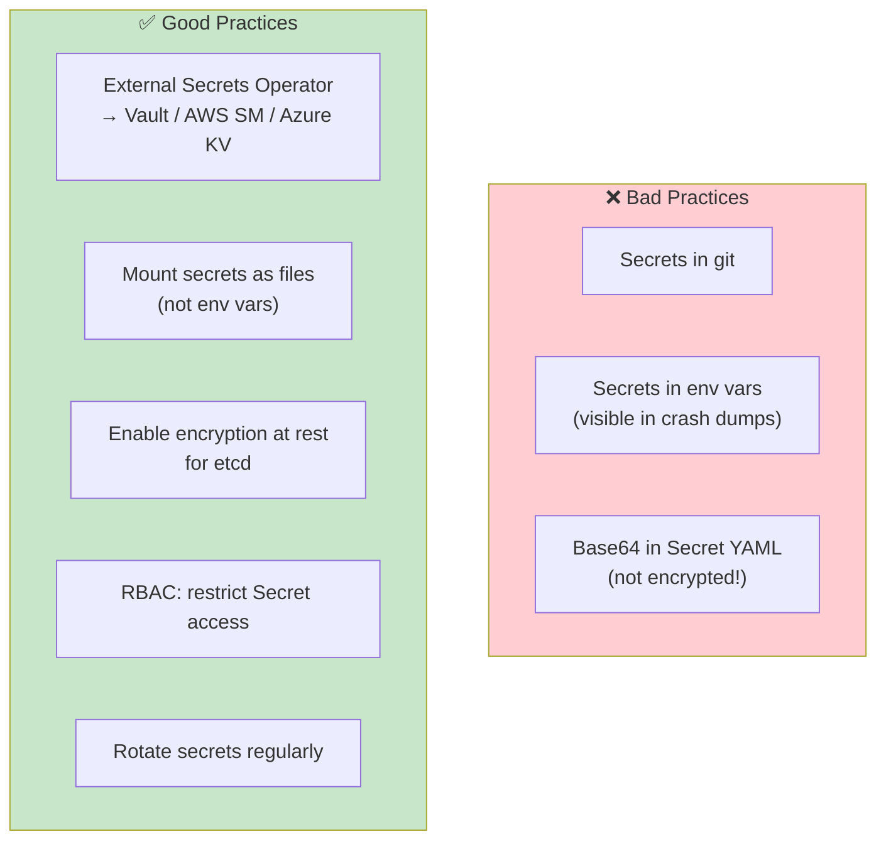
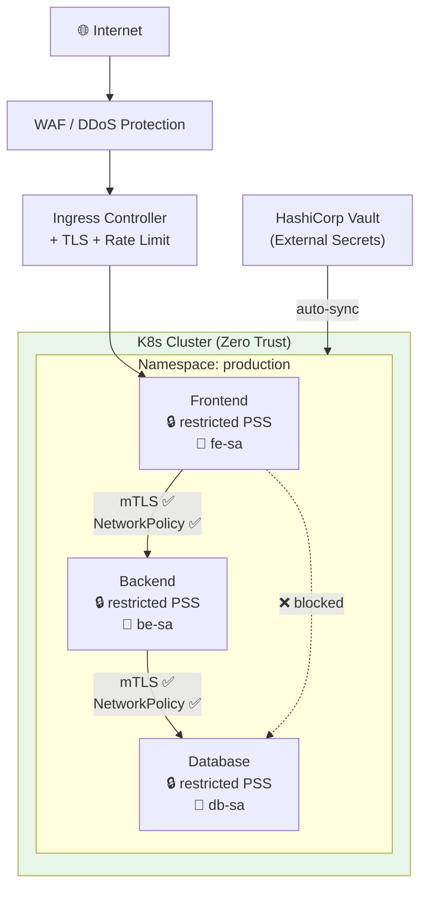

# Zero Trust Security in Kubernetes

> **Prerequisites**: [K8s RBAC](../../Kubernetes/Notes/13_RBAC_Security.md), [4_Service_Mesh.md](./4_Service_Mesh.md)  
> **Next**: [7_System_Design_Example.md](./7_System_Design_Example.md)

Traditional security uses a "castle and moat" approach — one perimeter, trust everything inside. Zero trust says: **never trust, always verify** — even between services in the same cluster.

---

## Castle & Moat vs Zero Trust



---

## The 5 Layers of K8s Security



---

# Layer 1: Network Policies — Pod-Level Firewall

By default, all pods can talk to all pods. **Start with deny-all, then whitelist.**

### Default Deny All

```yaml
apiVersion: networking.k8s.io/v1
kind: NetworkPolicy
metadata:
  name: deny-all
  namespace: production
spec:
  podSelector: {}          # All pods
  policyTypes:
    - Ingress
    - Egress
```

### Allow Specific Traffic

```yaml
# Frontend → Backend (only on port 8080)
apiVersion: networking.k8s.io/v1
kind: NetworkPolicy
metadata:
  name: allow-frontend-to-backend
spec:
  podSelector:
    matchLabels:
      app: backend
  ingress:
    - from:
        - podSelector:
            matchLabels:
              app: frontend
      ports:
        - port: 8080
---
# Backend → Database (only on port 5432)
apiVersion: networking.k8s.io/v1
kind: NetworkPolicy
metadata:
  name: allow-backend-to-db
spec:
  podSelector:
    matchLabels:
      app: database
  ingress:
    - from:
        - podSelector:
            matchLabels:
              app: backend
      ports:
        - port: 5432
---
# Allow DNS for all pods (required!)
apiVersion: networking.k8s.io/v1
kind: NetworkPolicy
metadata:
  name: allow-dns
spec:
  podSelector: {}
  egress:
    - to:
        - namespaceSelector: {}
          podSelector:
            matchLabels:
              k8s-app: kube-dns
      ports:
        - port: 53
          protocol: UDP
        - port: 53
          protocol: TCP
```

### Visual Result



---

# Layer 2: mTLS — Encrypt All Internal Traffic

Without mTLS, traffic between pods is **plain text** on the cluster network. Anyone who compromises a node can sniff all traffic.



### Enable with Istio

```yaml
apiVersion: security.istio.io/v1beta1
kind: PeerAuthentication
metadata:
  name: strict-mtls
  namespace: production
spec:
  mtls:
    mode: STRICT      # All traffic must be mTLS
```

With Istio, each pod gets an auto-rotated X.509 certificate. The Envoy sidecar handles TLS handshake — **zero code changes**.

---

# Layer 3: RBAC — Least Privilege

Every workload should use its own ServiceAccount with minimal permissions.

```yaml
# Dedicated ServiceAccount
apiVersion: v1
kind: ServiceAccount
metadata:
  name: order-service
  namespace: production
---
# Minimal Role — only what it needs
apiVersion: rbac.authorization.k8s.io/v1
kind: Role
metadata:
  name: order-role
  namespace: production
rules:
  - apiGroups: [""]
    resources: ["configmaps"]
    verbs: ["get"]
    resourceNames: ["order-config"]   # Only specific ConfigMap
  - apiGroups: [""]
    resources: ["secrets"]
    verbs: ["get"]
    resourceNames: ["order-secrets"]
---
apiVersion: rbac.authorization.k8s.io/v1
kind: RoleBinding
metadata:
  name: order-binding
  namespace: production
subjects:
  - kind: ServiceAccount
    name: order-service
roleRef:
  kind: Role
  name: order-role
  apiGroup: rbac.authorization.k8s.io
---
# Pod spec
spec:
  serviceAccountName: order-service
  automountServiceAccountToken: false   # Don't mount unless needed
```

---

# Layer 4: Pod Security Standards

Control what pods are allowed to do at the OS level.

```yaml
apiVersion: v1
kind: Namespace
metadata:
  name: production
  labels:
    pod-security.kubernetes.io/enforce: restricted
```

### What "Restricted" Enforces

| Restriction | Why |
|------------|-----|
| Must run as non-root | Prevents container breakout |
| Must drop all capabilities | No kernel-level privileges |
| Read-only root filesystem | Prevents writing malware |
| No hostNetwork/hostPID/hostIPC | Prevents accessing host |
| No privileged containers | Prevents full host access |
| Seccomp profile required | Limits system calls |

### Pod Security Context

```yaml
spec:
  securityContext:
    runAsNonRoot: true
    runAsUser: 1000
    fsGroup: 1000
    seccompProfile:
      type: RuntimeDefault
  containers:
    - name: api
      securityContext:
        allowPrivilegeEscalation: false
        readOnlyRootFilesystem: true
        capabilities:
          drop: ["ALL"]
      volumeMounts:
        - name: tmp
          mountPath: /tmp            # Writable tmp dir
  volumes:
    - name: tmp
      emptyDir: {}
```

---

# Layer 5: Secret Management



### External Secrets Operator

Syncs secrets from Vault/AWS/Azure into K8s Secrets automatically:

```yaml
apiVersion: external-secrets.io/v1beta1
kind: ExternalSecret
metadata:
  name: db-credentials
spec:
  refreshInterval: 1h
  secretStoreRef:
    name: azure-keyvault
    kind: ClusterSecretStore
  target:
    name: db-credentials          # K8s Secret name
  data:
    - secretKey: password
      remoteRef:
        key: production-db-password
```

---

## Complete Zero Trust Architecture



---

## Security Checklist

| Layer | Action | K8s Tool |
|-------|--------|----------|
| **Network** | Default deny + whitelist | NetworkPolicy |
| **Encryption** | Encrypt all pod-to-pod traffic | Service Mesh (mTLS) |
| **Identity** | Dedicated ServiceAccount per workload | RBAC + ServiceAccount |
| **Authorization** | Least-privilege roles | Role + RoleBinding |
| **Pod hardening** | Non-root, read-only FS, drop caps | Pod Security Standards |
| **Secrets** | External manager, mounted as files | External Secrets Operator |
| **Audit** | Log all API access | K8s audit logging |
| **Scanning** | Scan images for CVEs | Trivy / Docker Scout in CI |

---

> **Next**: [7_System_Design_Example.md](./7_System_Design_Example.md) — Full e-commerce platform design on K8s
