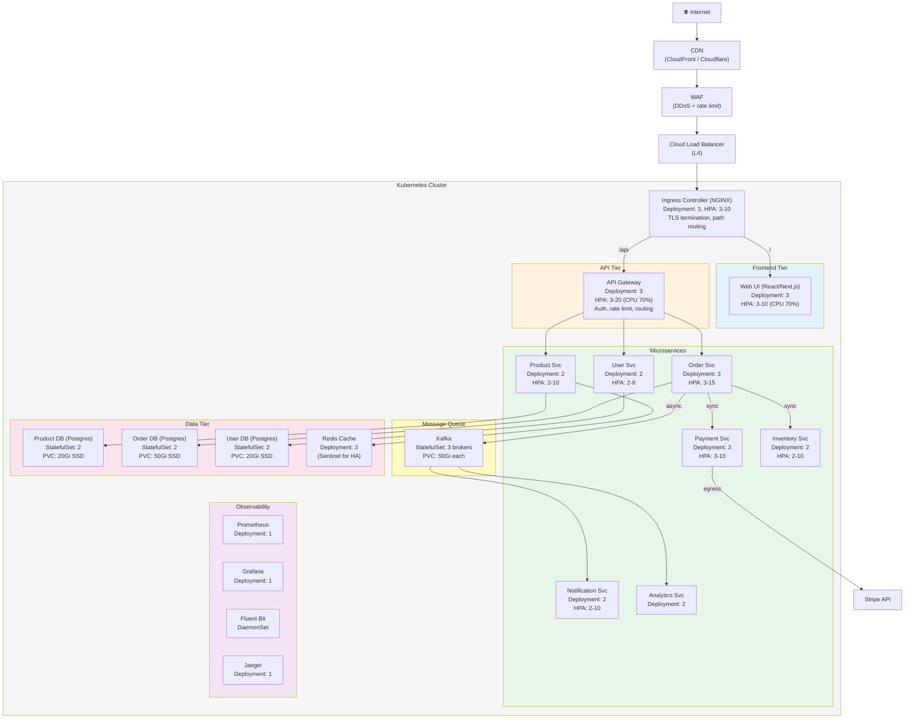
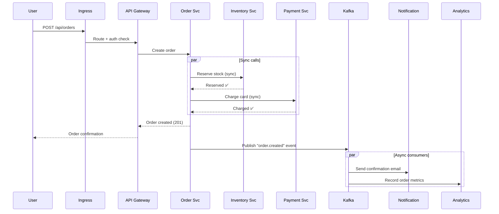
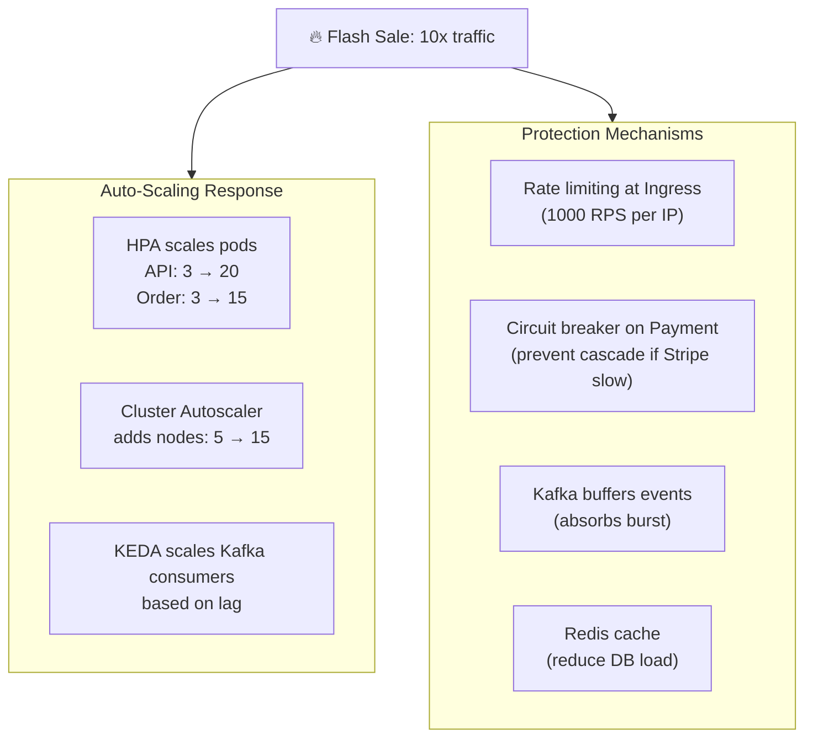

# System Design Example — E-Commerce Platform on K8s

> **Prerequisites**: All previous System Design notes  
> **Next**: [8_Deployment_Strategies.md](./8_Deployment_Strategies.md)

This doc walks through designing a complete **e-commerce platform** on Kubernetes — the kind of exercise you'd do in a system design interview. We map every whiteboard component to specific K8s resources.

---

## Requirements

| Requirement | Details |
|------------|---------|
| **Users** | 100K DAU, 1M registered |
| **Services** | Product catalog, ordering, payments, notifications, inventory, analytics |
| **Data** | Each service owns its data (database per service) |
| **Traffic** | 10K RPS normal, 100K RPS during flash sales |
| **SLA** | 99.9% uptime, <200ms p99 latency |
| **Security** | PCI compliance (payment data), GDPR |

---

## Full Architecture



---

## Component-by-Component Breakdown

### 1. Ingress Layer

```yaml
apiVersion: networking.k8s.io/v1
kind: Ingress
metadata:
  name: ecommerce-ingress
  annotations:
    cert-manager.io/cluster-issuer: letsencrypt-prod
    nginx.ingress.kubernetes.io/rate-limit: "1000"
    nginx.ingress.kubernetes.io/ssl-redirect: "true"
    nginx.ingress.kubernetes.io/proxy-body-size: "10m"
spec:
  ingressClassName: nginx
  tls:
    - hosts: [shop.example.com, api.example.com]
      secretName: ecommerce-tls
  rules:
    - host: shop.example.com
      http:
        paths:
          - path: /
            pathType: Prefix
            backend:
              service: { name: web-svc, port: { number: 80 } }
    - host: api.example.com
      http:
        paths:
          - path: /
            pathType: Prefix
            backend:
              service: { name: api-gateway-svc, port: { number: 80 } }
```

### 2. Stateless Services (Deployment)

```yaml
apiVersion: apps/v1
kind: Deployment
metadata:
  name: order-service
spec:
  replicas: 3
  selector:
    matchLabels:
      app: order-service
  template:
    metadata:
      labels:
        app: order-service
    spec:
      serviceAccountName: order-sa
      securityContext:
        runAsNonRoot: true
        runAsUser: 1000
      containers:
        - name: order
          image: myregistry.azurecr.io/order-service:v2.1.0
          ports:
            - containerPort: 8080
          env:
            - name: KAFKA_BROKERS
              valueFrom:
                configMapKeyRef:
                  name: order-config
                  key: KAFKA_BROKERS
            - name: DB_PASSWORD
              valueFrom:
                secretKeyRef:
                  name: order-secrets
                  key: db-password
          resources:
            requests:
              cpu: 250m
              memory: 256Mi
            limits:
              cpu: "1"
              memory: 512Mi
          livenessProbe:
            httpGet: { path: /healthz, port: 8080 }
            periodSeconds: 10
          readinessProbe:
            httpGet: { path: /ready, port: 8080 }
            periodSeconds: 5
      affinity:
        podAntiAffinity:
          requiredDuringSchedulingIgnoredDuringExecution:
            - labelSelector:
                matchLabels:
                  app: order-service
              topologyKey: kubernetes.io/hostname
      topologySpreadConstraints:
        - maxSkew: 1
          topologyKey: topology.kubernetes.io/zone
          whenUnsatisfiable: DoNotSchedule
          labelSelector:
            matchLabels:
              app: order-service
---
apiVersion: autoscaling/v2
kind: HorizontalPodAutoscaler
metadata:
  name: order-hpa
spec:
  scaleTargetRef:
    apiVersion: apps/v1
    kind: Deployment
    name: order-service
  minReplicas: 3
  maxReplicas: 15
  metrics:
    - type: Resource
      resource:
        name: cpu
        target:
          type: Utilization
          averageUtilization: 70
  behavior:
    scaleDown:
      stabilizationWindowSeconds: 300
---
apiVersion: policy/v1
kind: PodDisruptionBudget
metadata:
  name: order-pdb
spec:
  minAvailable: 2
  selector:
    matchLabels:
      app: order-service
```

### 3. Database (StatefulSet)

```yaml
apiVersion: apps/v1
kind: StatefulSet
metadata:
  name: order-db
spec:
  serviceName: order-db-headless
  replicas: 2                      # Primary + read replica
  selector:
    matchLabels:
      app: order-db
  template:
    metadata:
      labels:
        app: order-db
    spec:
      containers:
        - name: postgres
          image: postgres:16-alpine
          ports:
            - containerPort: 5432
          env:
            - name: POSTGRES_PASSWORD
              valueFrom:
                secretKeyRef:
                  name: order-db-secret
                  key: password
            - name: PGDATA
              value: /var/lib/postgresql/data/pgdata
          volumeMounts:
            - name: data
              mountPath: /var/lib/postgresql/data
          resources:
            requests:
              cpu: 500m
              memory: 512Mi
            limits:
              cpu: "2"
              memory: 2Gi
  volumeClaimTemplates:
    - metadata:
        name: data
      spec:
        accessModes: ["ReadWriteOnce"]
        storageClassName: managed-ssd
        resources:
          requests:
            storage: 50Gi
---
apiVersion: v1
kind: Service
metadata:
  name: order-db-headless
spec:
  clusterIP: None
  selector:
    app: order-db
  ports:
    - port: 5432
# DNS: order-db-0.order-db-headless (primary)
#      order-db-1.order-db-headless (replica)
```

### 4. Network Policies

```yaml
# Default deny in production namespace
apiVersion: networking.k8s.io/v1
kind: NetworkPolicy
metadata:
  name: default-deny
  namespace: production
spec:
  podSelector: {}
  policyTypes: [Ingress, Egress]
---
# Order service can reach: order-db, kafka, payment-svc
apiVersion: networking.k8s.io/v1
kind: NetworkPolicy
metadata:
  name: order-service-policy
spec:
  podSelector:
    matchLabels:
      app: order-service
  policyTypes: [Ingress, Egress]
  ingress:
    - from:
        - podSelector:
            matchLabels:
              app: api-gateway
      ports:
        - port: 8080
  egress:
    - to:
        - podSelector:
            matchLabels:
              app: order-db
      ports:
        - port: 5432
    - to:
        - podSelector:
            matchLabels:
              app: kafka
      ports:
        - port: 9092
    - to:
        - podSelector:
            matchLabels:
              app: payment-service
      ports:
        - port: 8080
    - to:
        - namespaceSelector: {}
          podSelector:
            matchLabels:
              k8s-app: kube-dns
      ports:
        - port: 53
          protocol: UDP
```

---

## Communication Flow: Place Order



---

## Handling Flash Sale (10x Traffic)



---

## Summary Table

| Component | K8s Resource | Replicas | Scaling | Storage |
|-----------|-------------|----------|---------|---------|
| Web UI | Deployment + Ingress | 3 | HPA (CPU 70%) 3-10 | — |
| API Gateway | Deployment + Service | 3 | HPA (CPU 70%) 3-20 | — |
| Order Service | Deployment + Service | 3 | HPA (CPU 70%) 3-15 | — |
| Payment Service | Deployment + Service | 3 | HPA (CPU 70%) 3-10 | — |
| Notification Svc | Deployment | 2 | KEDA (Kafka lag) | — |
| Order DB | StatefulSet + PVC | 2 | Manual | 50Gi SSD |
| Product DB | StatefulSet + PVC | 2 | Manual | 20Gi SSD |
| Redis Cache | Deployment | 3 | Manual | — |
| Kafka | StatefulSet + PVC | 3 | Manual | 50Gi each |
| Fluent Bit | DaemonSet | 1/node | Auto (per node) | — |
| Prometheus | Deployment + PVC | 1 | Manual | 100Gi |

---

> **Next**: [8_Deployment_Strategies.md](./8_Deployment_Strategies.md) — How to ship changes without breaking things
