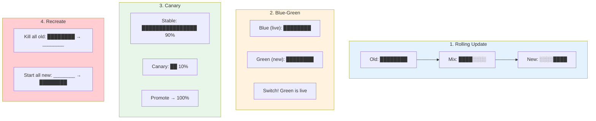
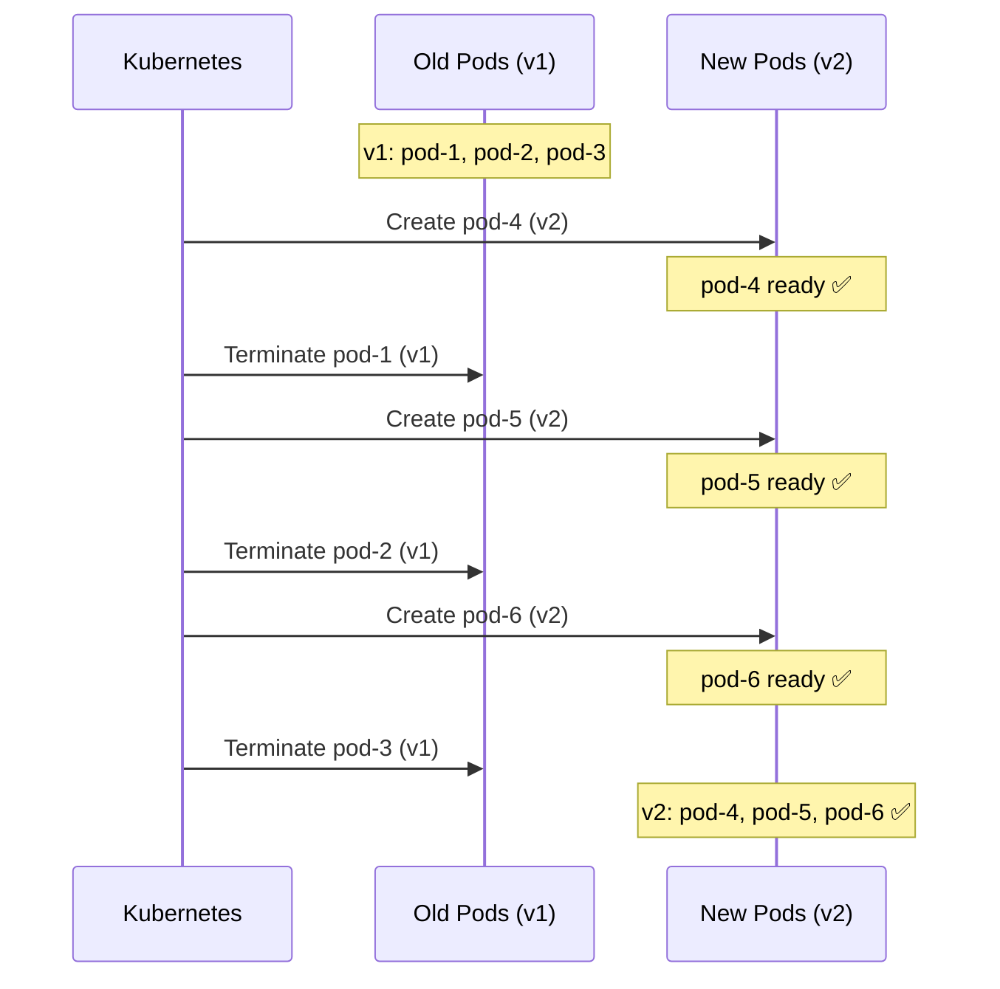
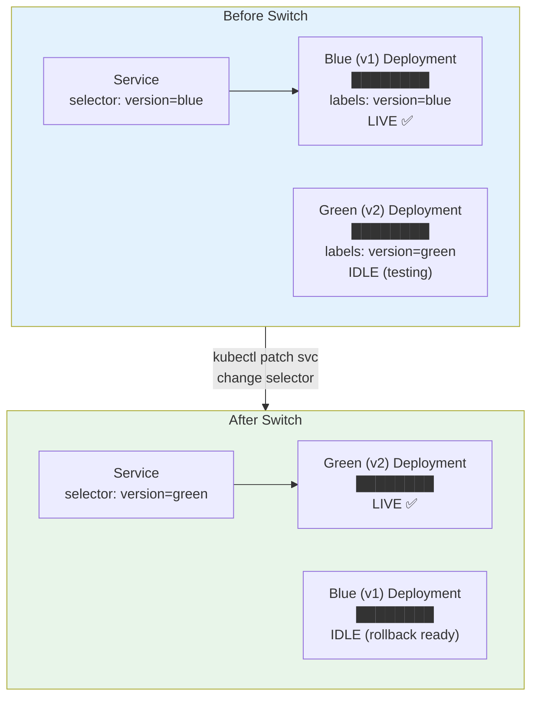
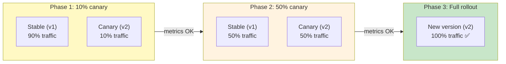
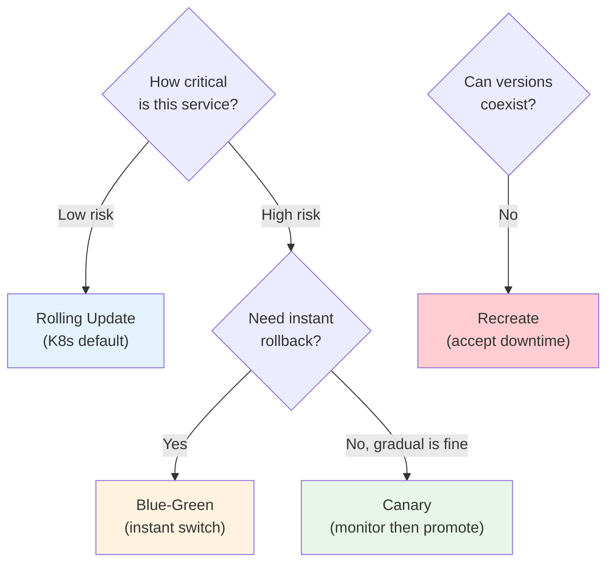

# Deployment Strategies — Shipping Without Breaking Things

> **Prerequisites**: [K8s Deployments](../../Kubernetes/Notes/6_Deployments.md), [5_Resilience_Patterns.md](./5_Resilience_Patterns.md)  
> **Next**: [9_Observability.md](./9_Observability.md)

How you deploy new versions of your code is a critical design decision. The wrong strategy can cause downtime, data corruption, or user-facing errors.

---

## Strategy Overview



---

# 1. Rolling Update (K8s Default)

Gradually replaces old pods with new pods, maintaining availability throughout.



### Configuration

```yaml
apiVersion: apps/v1
kind: Deployment
spec:
  strategy:
    type: RollingUpdate
    rollingUpdate:
      maxSurge: 1              # Create 1 extra pod above desired
      maxUnavailable: 0        # Never have fewer than desired
```

| Setting | What it Means | Effect |
|---------|-------------|--------|
| `maxSurge: 1` | Create 1 new before killing old | Smooth transition |
| `maxSurge: 25%` | Create 25% extra at a time | Faster rollout |
| `maxUnavailable: 0` | All pods must be running | Zero downtime, slower |
| `maxUnavailable: 1` | Allow 1 pod down | Faster, slight capacity drop |

### Pros / Cons

| ✅ Pros | ❌ Cons |
|---------|---------|
| Zero downtime | Two versions run simultaneously |
| Built into K8s (no extra tools) | Can't do instant rollback |
| Gradual, safe | Both v1 and v2 serve traffic during rollout |

### Rollback

```bash
# See rollout status
kubectl rollout status deployment/api

# Undo last deployment
kubectl rollout undo deployment/api

# Rollback to specific revision
kubectl rollout undo deployment/api --to-revision=3

# Pause/resume rollout
kubectl rollout pause deployment/api
kubectl rollout resume deployment/api
```

---

# 2. Blue-Green Deployment

Run two identical environments. Switch traffic instantly by changing the Service selector.



### Implementation

```yaml
# Blue deployment (currently live)
apiVersion: apps/v1
kind: Deployment
metadata:
  name: api-blue
spec:
  replicas: 3
  selector:
    matchLabels:
      app: api
      version: blue
  template:
    metadata:
      labels:
        app: api
        version: blue
    spec:
      containers:
        - name: api
          image: myapi:v1.0.0
---
# Green deployment (new version, idle)
apiVersion: apps/v1
kind: Deployment
metadata:
  name: api-green
spec:
  replicas: 3
  selector:
    matchLabels:
      app: api
      version: green
  template:
    metadata:
      labels:
        app: api
        version: green
    spec:
      containers:
        - name: api
          image: myapi:v2.0.0
---
# Service — points to blue initially
apiVersion: v1
kind: Service
metadata:
  name: api-svc
spec:
  selector:
    app: api
    version: blue              # ← Switch this to "green" to deploy
  ports:
    - port: 80
      targetPort: 8080
```

### Switch Traffic

```bash
# Switch to green (deploy v2)
kubectl patch svc api-svc -p '{"spec":{"selector":{"version":"green"}}}'

# Rollback to blue (instant!)
kubectl patch svc api-svc -p '{"spec":{"selector":{"version":"blue"}}}'
```

### Pros / Cons

| ✅ Pros | ❌ Cons |
|---------|---------|
| Instant switch | 2x resources during deploy |
| Instant rollback | More complex to manage |
| Test green before going live | Database migrations must be backward-compatible |

---

# 3. Canary Deployment

Route a small percentage of traffic to the new version. Monitor metrics. Gradually increase.



### With Argo Rollouts

```yaml
apiVersion: argoproj.io/v1alpha1
kind: Rollout
metadata:
  name: api
spec:
  replicas: 5
  strategy:
    canary:
      steps:
        - setWeight: 10          # 10% traffic to canary
        - pause: { duration: 5m }  # Wait 5 min, check metrics
        - setWeight: 30
        - pause: { duration: 5m }
        - setWeight: 50
        - pause: { duration: 10m }
        - setWeight: 100         # Full rollout
      canaryService: api-canary
      stableService: api-stable
      trafficRouting:
        istio:
          virtualService:
            name: api-vs
```

### With Istio (VirtualService)

```yaml
apiVersion: networking.istio.io/v1beta1
kind: VirtualService
metadata:
  name: api-vs
spec:
  hosts: [api-svc]
  http:
    - route:
        - destination:
            host: api-svc
            subset: stable
          weight: 90
        - destination:
            host: api-svc
            subset: canary
          weight: 10
```

### Pros / Cons

| ✅ Pros | ❌ Cons |
|---------|---------|
| Lowest risk | Requires traffic splitting (Istio/Argo) |
| Real user validation | Slower rollout |
| Gradual confidence building | Need good metrics to decide |

---

# 4. Recreate (Simple but Downtime)

Kill all old pods, then start new ones. **Causes downtime.**

```yaml
spec:
  strategy:
    type: Recreate
```

| ✅ When to Use | ❌ When NOT to Use |
|---------------|-------------------|
| Dev/staging environments | Production |
| Single-instance databases | User-facing services |
| When v1 and v2 can't coexist | When uptime matters |

---

## Decision Guide



---

## Summary

| Strategy | Downtime | Rollback Speed | Resource Cost | Complexity | Best For |
|----------|----------|---------------|---------------|-----------|----------|
| **Rolling** | None | Slow (undo) | 1x + surge | Low | Most apps |
| **Blue-Green** | None | Instant | 2x | Medium | Critical services |
| **Canary** | None | Fast (shift to 0%) | 1x + canary | High | High-traffic services |
| **Recreate** | Yes | Slow | 1x | Low | Dev, incompatible versions |

---

> **Next**: [9_Observability.md](./9_Observability.md) — Monitoring, logging, and tracing in K8s
