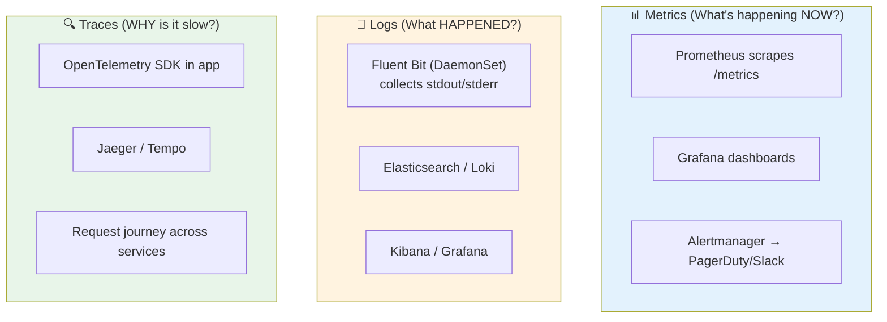
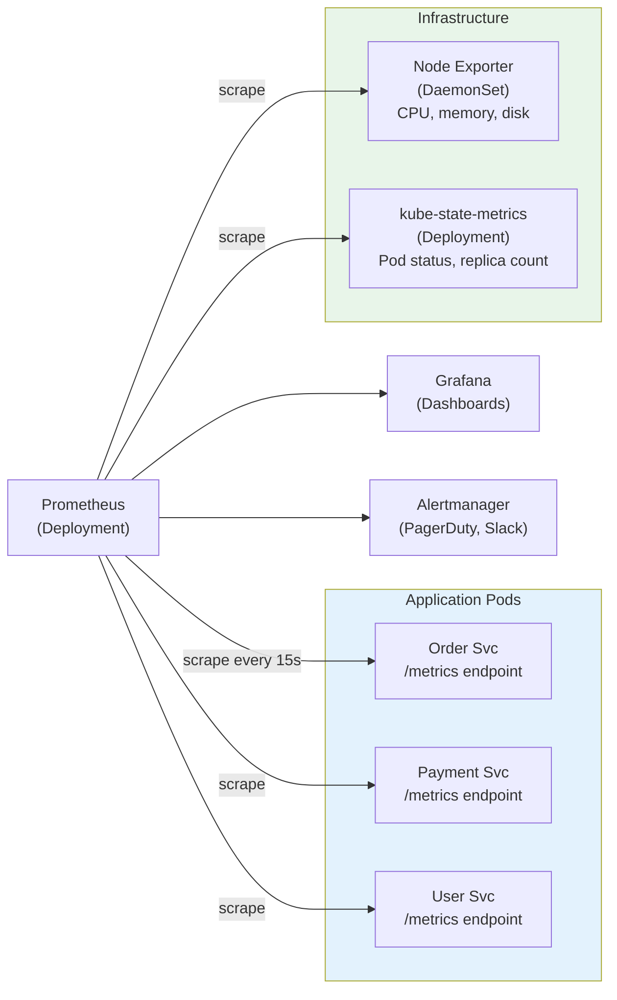
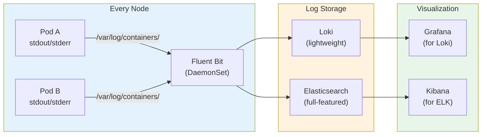
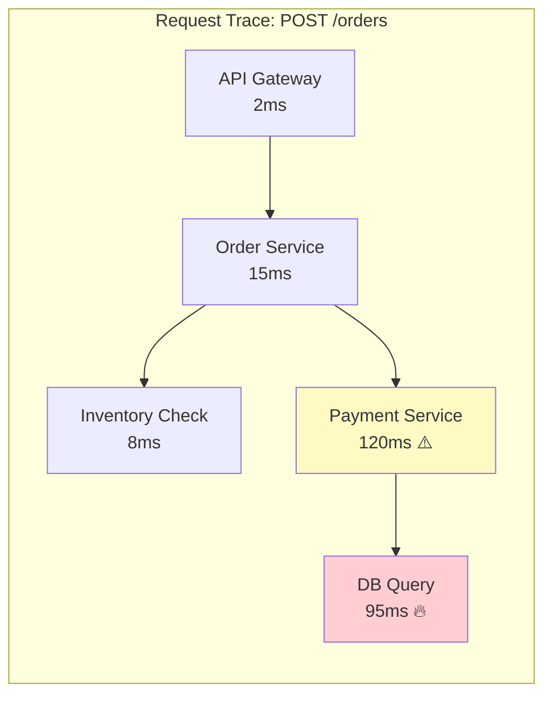
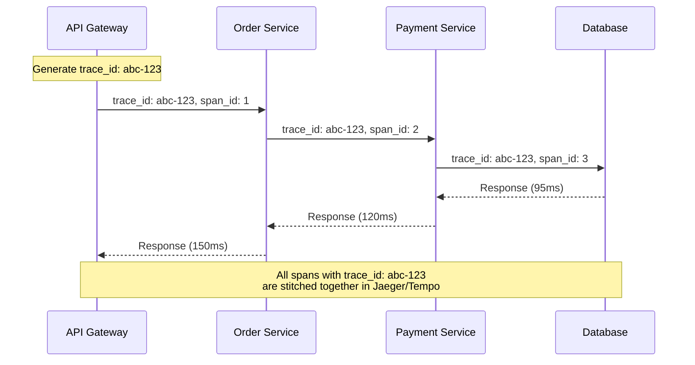
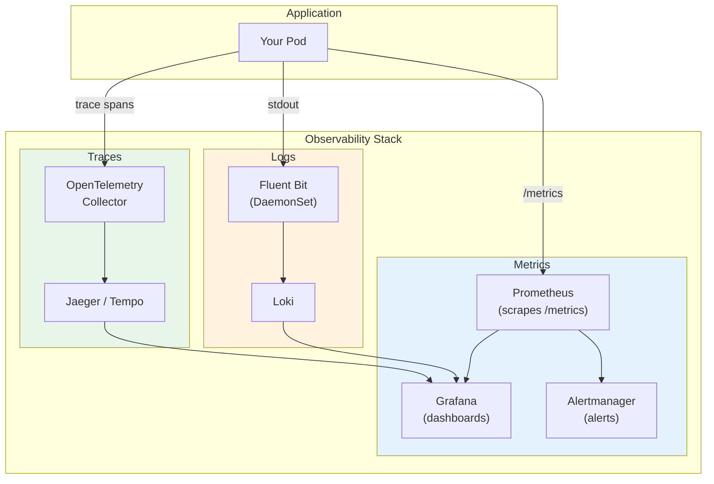

# Observability — Metrics, Logs & Traces in Kubernetes

> **Prerequisites**: [7_System_Design_Example.md](./7_System_Design_Example.md)  
> **Next**: [10_Interview_Scenarios.md](./10_Interview_Scenarios.md)

You can't fix what you can't see. Observability gives you visibility into your distributed system's health, performance, and behavior through **three pillars**: metrics, logs, and traces.

---

## The Three Pillars



---

# Pillar 1: Metrics — Prometheus + Grafana

## How Prometheus Works in K8s



### Key Metrics: The RED Method

| Metric | What it Measures | Alert When |
|--------|-----------------|------------|
| **R**ate | Requests per second | Sudden drop or spike |
| **E**rror | Error rate (5xx / total) | > 1% error rate |
| **D**uration | Latency (p50, p95, p99) | p99 > 500ms |

### Additional Metrics to Monitor

| Metric | Source | Why |
|--------|--------|-----|
| CPU utilization | Node Exporter | Scaling decisions |
| Memory utilization | Node Exporter | OOM risk |
| Pod restart count | kube-state-metrics | Crash loops |
| Pod pending count | kube-state-metrics | Scheduling issues |
| PVC usage | kubelet metrics | Disk full risk |
| HPA current vs desired | kube-state-metrics | Scaling working? |

### Prometheus in K8s (via kube-prometheus-stack)

```bash
# Install the full stack (Prometheus + Grafana + Alertmanager + exporters)
helm repo add prometheus-community https://prometheus-community.github.io/helm-charts
helm install monitoring prometheus-community/kube-prometheus-stack \
  --namespace monitoring --create-namespace
```

### ServiceMonitor — Tell Prometheus to Scrape Your App

```yaml
apiVersion: monitoring.coreos.com/v1
kind: ServiceMonitor
metadata:
  name: order-service-metrics
spec:
  selector:
    matchLabels:
      app: order-service
  endpoints:
    - port: http
      path: /metrics
      interval: 15s
```

### Example Alert Rule

```yaml
apiVersion: monitoring.coreos.com/v1
kind: PrometheusRule
metadata:
  name: order-service-alerts
spec:
  groups:
    - name: order-service
      rules:
        - alert: HighErrorRate
          expr: |
            rate(http_requests_total{app="order-service",status=~"5.."}[5m])
            / rate(http_requests_total{app="order-service"}[5m]) > 0.01
          for: 5m
          labels:
            severity: critical
          annotations:
            summary: "Order service error rate > 1%"

        - alert: HighLatency
          expr: |
            histogram_quantile(0.99,
              rate(http_request_duration_seconds_bucket{app="order-service"}[5m])
            ) > 0.5
          for: 5m
          labels:
            severity: warning
          annotations:
            summary: "Order service p99 latency > 500ms"
```

---

# Pillar 2: Logs — Fluent Bit + Loki/ELK

## Log Collection Architecture



### Best Practices for Logging

| Practice | Why |
|----------|-----|
| **Structured JSON logs** | Machine-parseable, searchable |
| **Correlation IDs** | Trace a request across services |
| **Log to stdout/stderr** | K8s captures automatically |
| **Don't log sensitive data** | Passwords, tokens, PII |
| **Include context** | service, method, user_id, request_id |

### Structured Log Example

```json
{
  "timestamp": "2024-01-15T10:30:00Z",
  "level": "ERROR",
  "service": "order-service",
  "method": "POST /orders",
  "request_id": "abc-123-def",
  "user_id": "user-456",
  "error": "payment declined",
  "duration_ms": 245
}
```

### Fluent Bit DaemonSet

```yaml
apiVersion: apps/v1
kind: DaemonSet
metadata:
  name: fluent-bit
  namespace: logging
spec:
  selector:
    matchLabels:
      app: fluent-bit
  template:
    metadata:
      labels:
        app: fluent-bit
    spec:
      containers:
        - name: fluent-bit
          image: fluent/fluent-bit:latest
          volumeMounts:
            - name: varlog
              mountPath: /var/log
              readOnly: true
            - name: containerlog
              mountPath: /var/log/containers
              readOnly: true
          resources:
            limits:
              cpu: 200m
              memory: 128Mi
      volumes:
        - name: varlog
          hostPath:
            path: /var/log
        - name: containerlog
          hostPath:
            path: /var/log/containers
```

---

# Pillar 3: Distributed Tracing — Jaeger / Tempo

## Why Traces Matter

In a microservice architecture, a single request passes through many services. When it's slow, you need to know WHERE the bottleneck is.



Without tracing, you'd only see "POST /orders took 150ms" and have no idea where the time went.

## How It Works



### OpenTelemetry Setup

```yaml
# OpenTelemetry Collector (Deployment)
apiVersion: apps/v1
kind: Deployment
metadata:
  name: otel-collector
spec:
  replicas: 1
  selector:
    matchLabels:
      app: otel-collector
  template:
    metadata:
      labels:
        app: otel-collector
    spec:
      containers:
        - name: otel
          image: otel/opentelemetry-collector:latest
          ports:
            - containerPort: 4317   # gRPC receiver
            - containerPort: 4318   # HTTP receiver
```

Your app sends traces to the collector, which forwards to Jaeger/Tempo.

---

## Putting It All Together



**Grafana** becomes the single pane of glass — metrics, logs, and traces all in one UI.

---

## Summary

| Pillar | Tool | Deployed As | What It Answers |
|--------|------|-------------|-----------------|
| **Metrics** | Prometheus + Grafana | Deployment + ServiceMonitor | "What's happening now?" |
| **Logs** | Fluent Bit + Loki | DaemonSet + Deployment | "What happened?" |
| **Traces** | OpenTelemetry + Jaeger | SDK in app + Deployment | "Why is it slow?" |
| **Alerts** | Alertmanager | Deployment + PrometheusRule | "Is something wrong?" |

---

> **Next**: [10_Interview_Scenarios.md](./10_Interview_Scenarios.md) — Common system design interview scenarios mapped to K8s
